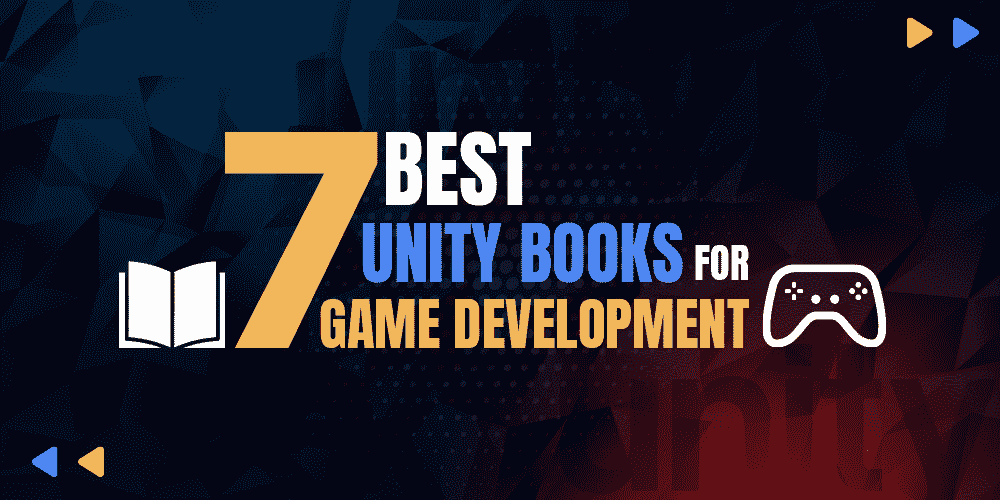

# 7 本游戏开发最佳合一书籍

> 原文:[https://www . geeksforgeeks . org/7-游戏开发最佳合一书籍/](https://www.geeksforgeeks.org/7-best-unity-books-for-game-development/)

你一定听说过这样一个事实，不是所有的手指都是一样的，但是当满足不同的条件时，每个手指都是有用的。同样，在现实生活中，并不是所有的人都有相同的品质，有些人可能擅长体育、学术，有些人可能擅长戏剧等。与此同时，言归正传，会有人知道自己的王牌在游戏开发，他们想学习如何开发一款工作游戏，但对从哪里开始以及如何朝着这个目标迈出第一步感到困惑。

对于这样的人，在这里，我们将提到游戏开发的最佳 Unity 书籍。但在此之前…什么是游戏开发？好吧，游戏开发是几个技能的组合来开发一个游戏。这些技能是游戏设计、编程、音效等等。

作为游戏开发的初学者，你不需要什么都学。随着你在这个领域的成长，你会接触到他们。现在，让我们回到我们的主题:

### 1.Unity 2018 游戏开发 24 小时，Sams 自学

这本书将让您了解 Unity 2018 游戏引擎和编辑器，这将帮助您使用 Unity 的 2D 工具和 Tilemap 创建 2D 游戏。这本书教你从游戏开发的基础到物理概念，如重力、碰撞等。您还将学习动画，并使用 Unity 的图形资产管道高效工作。在这本书里，你会发现 24 个章节将帮助你在最多 24 小时内学习游戏开发。这本书包含各种有趣的测验和练习，有助于提升你的知识，无论你从中学到了什么。你会分阶段学习。

你会学到:

*   物理，动画
*   移动设备部署
*   Unity 2018 游戏引擎和编辑器
*   可重复，可重复使用的游戏对象，带有预置
*   音频集成到您的游戏中
*   通过内置和自定义角色控制器控制玩家

### 2.行动中的统一:用 Unity 5 在 C#中开发多平台游戏

如果你是一个应用程序开发人员，或者没有游戏开发的相关知识，那么这本书是一个很好的学习选择。通过阅读这篇文章，可以帮助你理解 Unity 和 C#编程语言是如何合作制作游戏的。这本书涵盖了一个样本项目，将有助于理解 Unity 的特点和游戏开发策略。通过这本书，您将学习如何使用 C#语言、Unity 直观的工作流工具等等。

这本书包括:

*   如何编写和部署游戏
*   创建图形驱动的 2D 和 3D 游戏应用程序
*   构建管理游戏状态的代码架构
*   更多

当你完成这本书时，你将能够使用 Unity 游戏开发平台创建一个成功的游戏，并在游戏商店中部署该游戏。您还将获得关于 Unity 工具集的丰富知识。

### 3.Unity 5.x 烹饪书

在这本书里，你会带着很酷的食谱到处走，这些食谱会教你游戏开发的概念。它需要你做一些事情，即熟悉 C#编程语言和 Unity 游戏引擎。有了这些食谱，你可以学习 2D 和 3D 游戏开发。它让我们了解游戏开发的核心概念，包括在开发新的图形用户界面系统、新的音频混合器、外部文件和 2D 游戏时为 2D 角色制作动画。它还包含一些增强的有趣概念，例如新的标准着色器、Mecanim 系统、相机和新的照明功能。这本书给出的概念将帮助你复习游戏开发技能，并提高它们。你会发现这些食谱如何给你一步一步的指导和解释这些东西是如何工作的。你是谁并不重要，如果你想学习游戏的开发或者增加游戏开发的知识，你可以去争取。

### 4.游戏设计、原型制作和开发简介

这本书将教你游戏设计理论的概念、扎实的快速原型实践和编程技巧。你知道游戏开发之前需要一个游戏设计吗？一个好的游戏设计会吸引更多的注意力。

当你浏览这本书时，它将帮助你理解使用 unity 和编程概念开发游戏的迭代原型的重要实践。到本书结束时，你将掌握从设计到数字原型的概念。这本书综合了获奖游戏设计师和杰里米·吉布森教授提供的知识。

你会学到:

*   八种不同游戏原型的深入教程
*   开发新的游戏设计概念
*   学习 C#的正确方法
*   调试游戏代码
*   进入竞争激烈、瞬息万变的游戏行业

### 5.从用 Unity 5.x 开发游戏中学习 C#。

是初学者全面学习游戏开发概念的最佳书籍之一。这本书的重点是利用 C#和 Unity 脚本的力量来阐述你的游戏开发技能。这本书将帮助你学习 C#脚本的基础知识，开发游戏对象，还将帮助你掌握 Unity 中新的用户界面系统的基础知识。这本书也帮助你理解 C#和 Unity 使用面向对象编程原理开发 2D 游戏。

你会明白什么？

*   C#中变量、方法和代码语法的基础
*   如何把你的游戏想法变成一个可行的项目
*   如何在 Unity 中有效使用循环和集合来减少代码量
*   游戏内开发的面向对象编程原则
*   还有更多

### 6.用 Unity 开发 2D 游戏:C#独立游戏编程

这本书有助于学习和明确我们围绕 2D 奥运会发展的概念。对了，2D 游戏开发比 3D 游戏开发容易。有了 2D 运动会，你将很容易建立一个完整的跑步模型，从而培养你在这个领域的兴趣和信心。这本书会让你轻松快速地学习一个游戏的部署。

这本书涵盖–

*   2D 游戏开发基础
*   最佳实践和有用的游戏架构模式
*   使用图像资源、动画、相机、碰撞检测和状态管理等概念
*   还有更多

如果你感兴趣，想打造一次游戏开发之旅，那么一定可以去尝试一下。在开始之前，你必须记住一件事，那就是它需要基本的编程知识和技能。

### 7.统一掌握用户界面开发

游戏不仅仅是游戏的逻辑或编程。对于用户来说，满足他们的需求也是更重要的事情，这本书会引导你去做。有了这本书，你将能够学习如何为你的游戏创建最好的用户界面，如何使用 Unity 系统提供的用户界面元素，以及开发一个用户界面来缩放近似不同的分辨率。在本书中，您将找到在顶级游戏流派中创建用户界面组件的分步示例，您还将能够深入了解或了解每个单独的 Unity 组件是如何协同工作的。如果你正在寻找一本书，让你学会如何开发游戏的用户界面，那么这是你的选择。

因此，这些是最好的书籍，将教你在统一游戏开发，也将增加你的统一知识。你可以根据自己的需求和知识兴趣选择其中的任何一个。