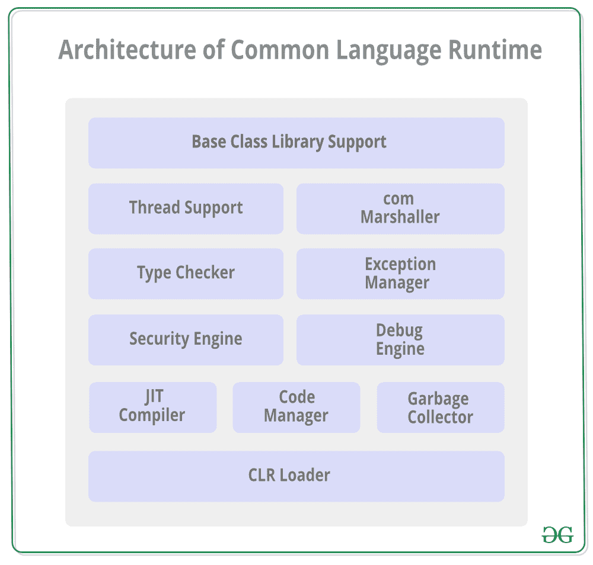

# 公共语言运行时(CLR)的架构

> 原文:[https://www . geesforgeks . org/architecture-of-common-language-runtime-clr/](https://www.geeksforgeeks.org/architecture-of-common-language-runtime-clr/)

[中的](https://www.geeksforgeeks.org/c-sharp-net-framework-basic-architecture-component-stack/)**[公共语言运行库](https://www.geeksforgeeks.org/common-language-runtime-clr-in-c-sharp/)** 。NET Framework 是为 C#、F#、Visual Basic 等各种语言处理程序执行的虚拟机组件。NET 等。托管执行环境通过提供各种服务来提供，如内存管理、安全处理、异常处理、垃圾收集、线程管理等。
公共语言运行库实现了 VES(虚拟执行系统)，这是一个提供托管代码执行环境的运行时系统。VES 是在微软的 CLI(公共语言基础设施)实现中定义的。

#### 公共语言运行库的体系结构

演示公共语言运行库体系结构的图表如下所示:

公共语言运行库的体系结构中有多个组件。关于这些的细节如下:

*   **基类库支持:**公共语言运行库为基类库提供支持。BCL 包含多个库，提供各种功能，如*集合*、*输入/输出*、 *XML* 、*数据类型定义*等。对于多个*。NET* 编程语言。
*   **线程支持:**CLR 为管理多个线程的并行执行提供线程支持。*制度。线程类*用作这个的基类。
*   **COM 封送拆收器:**与中的 COM(组件对象模型)组件的通信。NET 应用程序是使用 COM 封送拆收器提供的。这提供了组件互操作性支持。
*   **类型检查器:**类型安全由类型检查器通过使用公共类型系统(CTS)和公共语言规范(CLS)来提供，它们在 CLR 中提供来验证应用程序中使用的类型。
*   **异常管理器:**不管*如何，CLR 中的异常管理器都会处理异常。创造它们的网络语言*。对于特定的应用程序，异常的 catch 块在异常发生时执行，如果没有 catch 块，则应用程序终止。
*   **安全引擎:**CLR 中的安全引擎处理代码级、文件夹级、机器级等不同级别的安全权限。这是使用*中提供的各种工具完成的。NET* 框架。
*   **调试引擎:**可以在运行时使用调试引擎调试应用程序。有各种 ICorDebug 接口用于跟踪正在调试的应用程序的托管代码。
*   **JIT 编译器:**CLR 中的 [JIT 编译器](https://www.geeksforgeeks.org/what-is-just-in-time-jit-compiler-in-dot-net/)将微软中间语言(MSIL)转换为特定于 JIT 编译器运行的计算机环境的机器代码。存储已编译的 MSIL，以便在需要时可用于后续调用。
*   **代码管理器:**CLR 中的代码管理器管理在中开发的代码。NET 框架，即托管代码。托管代码由特定于语言的编译器转换为中间语言，然后由即时编译器将中间语言转换为机器代码。
*   **垃圾收集器:**使用 CLR 中的垃圾收集器可以实现自动内存管理。垃圾收集器会在不再需要内存空间后自动释放内存空间，以便重新分配。
*   **CLR Loader:** 各种模块、资源、程序集等。由 CLR 加载程序加载。此外，如果实际需要，该加载程序会按需加载模块，这样程序初始化时间更快，消耗的资源更少。