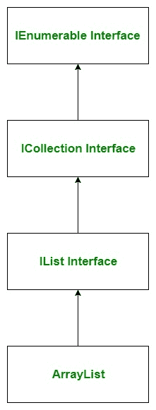

# c#中的数组列表

> 原文:[https://www.geeksforgeeks.org/arraylist-in-c-sharp/](https://www.geeksforgeeks.org/arraylist-in-c-sharp/)

**ArrayList** 是 C#语言的一个强大功能。这是在*系统中定义的非类属类型的集合。集合*命名空间。它用来创建一个动态数组意味着数组的大小是根据你的程序要求自动增减的，没有必要指定数组列表的大小。或者换句话说，数组列表代表一个可以单独索引的对象的有序集合。在数组列表中，可以存储相同类型和不同类型的元素。它属于非泛型集合。下图说明了 [**数组列表类**](https://www.geeksforgeeks.org/c-sharp-arraylist-class/) 的层次结构:

[](https://media.geeksforgeeks.org/wp-content/uploads/arraylist-class-hierarchy-1.jpg)

**要点:**

*   ArrayList 类实现了 *IEnumerable* 、 *ICollection* 、 *IList、*和 ICloneable 接口。
*   数组列表类继承了[对象类](https://www.geeksforgeeks.org/c-sharp-object-class/)。
*   数组列表在*系统下定义。集合*命名空间。所以，当你在程序中使用数组列表时，你必须添加*系统。集合*命名空间。
*   不能使用数组列表实现多维数组。
*   数组列表的容量是数组列表可以容纳的元素数量。
*   您可以在数组列表中使用重复的元素。
*   您可以对数组列表中的元素进行搜索和排序。
*   Arraylist 可以接受 null 作为有效值。

### 如何创建数组列表？

数组列表类有 ***三个构造函数*** ，用于创建数组列表。

*   **ArrayList():** 这个构造函数用来创建一个 ArrayList 类的实例，这个类是空的，没有初始容量。
*   **ArrayList(Int32):** 这个构造函数用来创建一个 ArrayList 类的实例，这个类是空的并且有指定的初始容量。
*   **数组列表(ICollection):** 此构造函数用于创建一个数组列表，该列表使用指定集合中的元素进行初始化，并且具有从集合中复制的相同初始容量。

*我们来看看如何使用 ArrayList()构造函数创建 ArrayList:*

*   **Step 1:** Include *System.Collections* namespace in your program with the help of *using* keyword.

    *语法:*

    ```cs
    using System.Collections;
    ```

*   **步骤 2:** 使用数组列表类创建一个数组列表，如下所示:

    ```cs
    ArrayList list_name = new ArrayList();
    ```

*   **第三步:**如果你想在你的数组列表中添加元素，那么使用 add()方法在你的数组列表中添加元素。如下例所示。
*   **步骤 4:** 数组列表的元素通过使用 foreach 循环、for 循环或索引器来访问。如下例所示，我们使用 foreach 循环访问数组列表。

**示例:**下面的程序展示了如何创建数组列表，向数组列表添加元素，以及如何访问数组列表的元素。

```cs
// C# program to demonstrtate the ArrayList
using System;
using System.Collections;

class GFG {

    // Main Method
    static public void Main()
    {

        // Creating ArrayList
        ArrayList My_array = new ArrayList();

        // Adding elements in the 
        // My_array ArrayList
        // This ArrayList contains elements
        // of different types
        My_array.Add(12.56);
        My_array.Add("GeeksforGeeks");
        My_array.Add(null);
        My_array.Add('G');
        My_array.Add(1234);

        // Accessing the elements 
        // of My_array ArrayList
        // Using foreach loop
        foreach(var elements in My_array)
        {
            Console.WriteLine(elements);
        }
    }
}
```

**Output:**

```cs
12.56
GeeksforGeeks

G
1234

```

### 如何找到数组列表柠檬的容量和数量？

为此，我们可以使用数组列表类的[计数](https://www.geeksforgeeks.org/c-sharp-get-the-number-of-elements-actually-contained-in-the-arraylist/)和[容量](https://www.geeksforgeeks.org/c-sharp-get-or-set-the-number-of-elements-that-the-arraylist-can-contain/)属性，如下所示:

**示例:**

```cs
// C# program to find the number of 
// elements and capacity of ArrayList
using System; 
using System.Collections; 

class GFG { 

// Driver code 
public static void Main() { 

    // Creating an ArrayList 
    ArrayList myList = new ArrayList(); 

    // Adding elements to ArrayList 
    myList.Add(1); 
    myList.Add(2); 
    myList.Add(3); 
    myList.Add(4); 
    myList.Add(5); 

    // Displaying count of elements of ArrayList 
    Console.WriteLine("Number of elements: " + myList.Count); 

    // Displaying Current capacity of ArrayList 
    Console.WriteLine("Current capacity: " + myList.Capacity); 
} 
} 
```

**Output:**

```cs
Number of elements: 5
Current capacity: 8

```

### 如何从数组列表中移除元素？

在数组列表中，您可以从数组列表中移除元素。ArrayList 提供了四种不同的方法来移除元素，这些方法是:

*   **[移除](https://www.geeksforgeeks.org/c-sharp-remove-the-first-occurrence-of-a-specific-object-from-the-arraylist/) :** 此方法用于从数组列表中移除特定对象的第一次出现。
*   **[RemoveAt](https://www.geeksforgeeks.org/c-sharp-remove-the-element-at-the-specified-index-of-the-arraylist/) :** 此方法用于移除数组列表中指定索引处的元素。
*   **[移除范围](https://www.geeksforgeeks.org/c-sharp-remove-a-range-of-elements-from-the-arraylist/) :** 此方法用于从数组列表中移除一系列元素。
*   **[清除](https://www.geeksforgeeks.org/c-sharp-remove-all-elements-from-the-arraylist/) :** 此方法用于从数组列表中移除所有元素。

**示例:**

```cs
// C# program to illustrate how
// to remove elements from the 
// ArrayList
using System;
using System.Collections;

class GFG {

    static public void Main()
    {

        // Creating ArrayList
        ArrayList My_array = new ArrayList();

        // Adding elements in the 
        // My_array ArrayList
        // This ArrayList contains elements
        // of the same types
        My_array.Add('G');
        My_array.Add('E');
        My_array.Add('E');
        My_array.Add('K');
        My_array.Add('S');
        My_array.Add('F');
        My_array.Add('O');
        My_array.Add('R');
        My_array.Add('G');
        My_array.Add('E');
        My_array.Add('E');
        My_array.Add('K');
        My_array.Add('S');

        Console.WriteLine("Initial number of elements : " 
                                       + My_array.Count);

        // Remove the 'G' element 
        // from the ArrayList
        // Using Remove() method
        My_array.Remove('G');
        Console.WriteLine("After Remove() method the "+
              "number of elements: " + My_array.Count);

        // Remove the element present at index 8
        // Using RemoveAt() method
        My_array.RemoveAt(8);
        Console.WriteLine("After RemoveAt() method the "+
                "number of elements: " + My_array.Count);

        // Remove 3 elements starting from index 1
        // using RemoveRange() method
        My_array.RemoveRange(1, 3);
        Console.WriteLine("After RemoveRange() method the"+
                 " number of elements: " + My_array.Count);

        // Remove the all element 
        // present in ArrayList
        // Using Clear() method
        My_array.Clear();
        Console.WriteLine("After Clear() method the "+
            "number of elements: " + My_array.Count);
    }
}
```

**Output:**

```cs
Initial number of elements : 13
After Remove() method the number of elements: 12
After RemoveAt() method the number of elements: 11
After RemoveRange() method the number of elements: 8
After Clear() method the number of elements: 0

```

### 如何对数组列表的元素进行排序？

在数组列表中，可以使用 Sort()方法对给定数组列表中的元素进行排序。该方法使用[快速排序](https://www.geeksforgeeks.org/quick-sort/)算法对数组列表进行排序，元素按升序排列。该方法的使用如下例所示。

**示例:**

```cs
// C# program to illustrate
// sorting of ArrayList
using System;
using System.Collections;

public class GFG {
    static public void Main()
    {

        // Creating ArrayList
        ArrayList My_array = new ArrayList();

        // Adding elements in the 
        // My_array ArrayList
        // This ArrayList contains 
        // elements of the same types
        My_array.Add(1);
        My_array.Add(6);
        My_array.Add(40);
        My_array.Add(10);
        My_array.Add(5);
        My_array.Add(3);
        My_array.Add(2);
        My_array.Add(4);

        // ArrayList before sorting
        Console.WriteLine("ArrayList before using Sort() method:");

        foreach(var elements in My_array)
        {
            Console.WriteLine(elements);
        }

        // Sort the elements of the ArrayList
        // Using sort() method
        My_array.Sort();

        // ArrayList after sorting
        Console.WriteLine("ArrayList after using Sort() method:");
        foreach(var elements in My_array)
        {
            Console.WriteLine(elements);
        }
    }
}
```

**Output:**

```cs
ArrayList before using Sort() method:
1
6
40
10
5
3
2
4
ArrayList after using Sort() method:
1
2
3
4
5
6
10
40

```

**注:**

*   You can also create the object of ArrayList class using the *IEnumerable*, *ICollection*, and *IList* interfaces but some methods of ArrayList class will not be applicable on them as they are not the members of these interfaces.

    **示例:**

    ```cs
    // using IList Interface
    IList arrlist1 = new ArrayList();

    // using ICollection Interface
    ICollection arrlist2 = new ArrayList();

    // using IEnumerable Interface
    IEnumerable arrlist3 = new ArrayList();

    ```

    但是在这里，您不能应用像 Reverse()，AddRange()等方法。

*   要了解更多关于数组列表类的构造函数、属性和方法，请参考 **[数组列表类](https://www.geeksforgeeks.org/c-sharp-arraylist-class/)** 。
*   要了解数组和数组列表的区别，请参考 C# 中的 **[数组和数组列表。](https://www.geeksforgeeks.org/c-sharp-array-vs-arraylist/)**