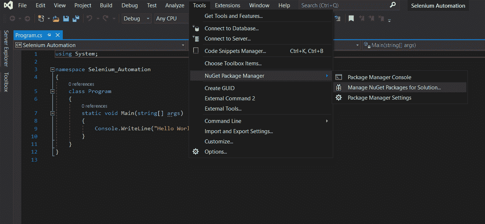
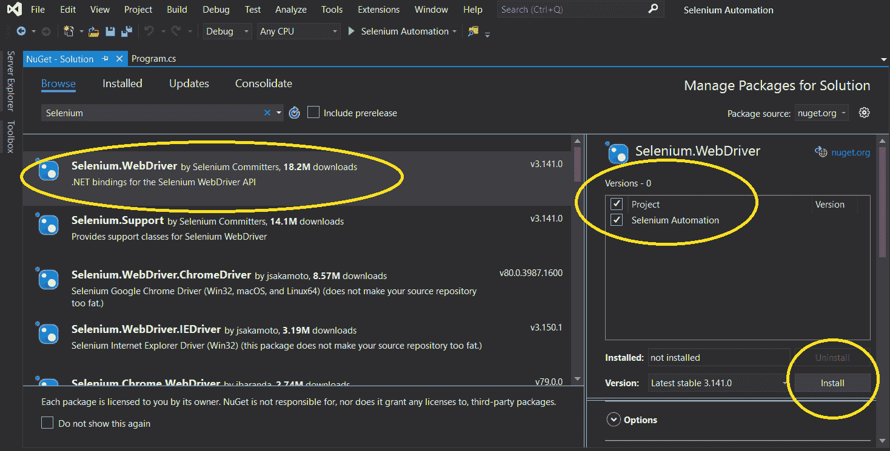
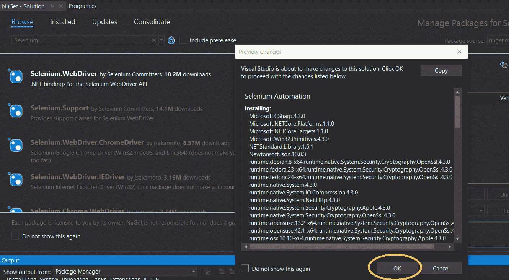
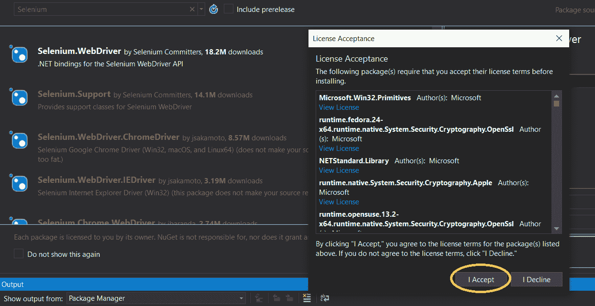
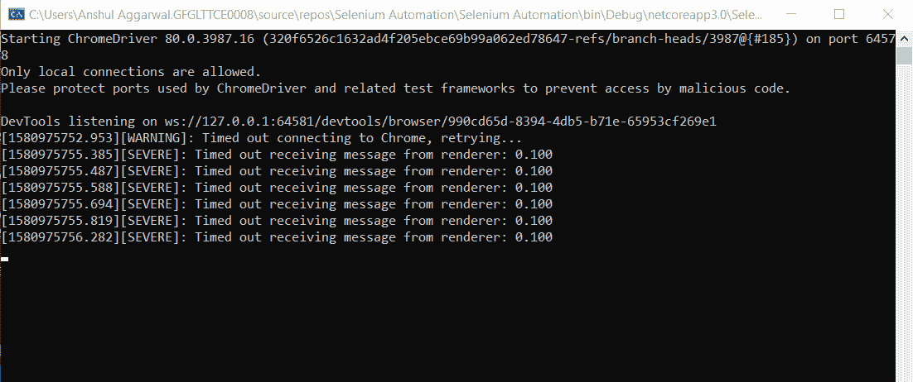
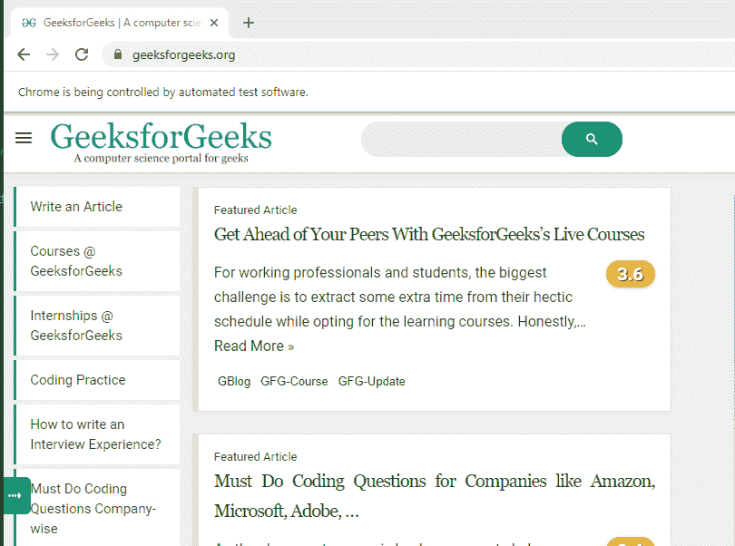

# 在 C# 中使用硒的自动化示例

> 原文:[https://www . geesforgeks . org/automation-use-selenium-in-c-sharp-with-example/](https://www.geeksforgeeks.org/automation-using-selenium-in-c-sharp-with-example/)

Selenium 是一个开源的 Web UI 自动化测试套件。它是由杰森·哈金斯在 2004 年开发的，作为思想工厂的内部工具。它支持跨不同浏览器、平台和编程语言的自动化，包括 [Java](https://www.geeksforgeeks.org/java/) 、 [Python](https://www.geeksforgeeks.org/python-programming-language/) 、 [C# ](https://www.geeksforgeeks.org/csharp-programming-language/) 等。它可以很容易地部署在视窗、Linux、Solaris 和麦金塔操作系统上。它还为 iOS、windows mobile 和 android 等移动应用程序提供不同操作系统的支持。
Selenium 由每种语言特有的驱动程序组成。Selenium Web 驱动程序大多与 Java 和 C# 一起使用。测试脚本可以用任何支持的编程语言用硒进行编码，并且可以直接在大多数现代网络浏览器中运行，包括互联网浏览器、Mozilla Firefox、谷歌 Chrome、Safari 等。

### C# 中使用硒实现自动化的步骤

Selenium WebDriver 是为 C# 设置的，其中测试用例是为测试而生成的。首先，在 visual studio 中用 C# 创建一个新项目。关于 Visual Studio 的安装和设置，可以阅读文章[如何为 C# 安装和设置 Visual Studio？](https://www.geeksforgeeks.org/how-to-install-and-setup-visual-studio-for-c-sharp/)。我们将这个项目命名为*硒自动化*，并将其作为 C# 应用程序。按照以下步骤进行:
**步骤 1:** 首先下载硒网驱动程序。要下载网络驱动程序，请转到*工具*选项，然后选择*获取软件包管理器*，然后选择*管理获取软件包*获取解决方案。



**第二步:**在顶部的搜索栏中，搜索*硒*。选择*硒。网络驱动*勾选*项目*复选框，这里是*硒自动化*点击*安装*。



**第三步:**之后，会打开一个对话框，要求接受许可。这将启动安装过程并安装 selenium 网络驱动程序。





一旦 Visual Studio 成功安装了 Selenium 网络驱动程序，它将在日志中显示输出

### 编写第一个硒 C# 测试

在 C# 上设置好硒后，就可以工作了。在下面的步骤中，它是制作第一个测试用例的指南。在项目的顶部，导入两个名称空间，如下所示:

```cs
using OpenQA.Selenium;
using OpenQA.Selenium.ChromeDriver;
```

根据 Chrome 浏览器版本从 [**ChromeWebDriver**](https://chromedriver.chromium.org/downloads) 下载 Chrome 驱动。解压缩文件，并将文件路径复制到下面代码中的“ChromeDriver”构造函数中。在静态 void Main 部分添加以下代码来测试它。最终代码看起来像:

## c sharp . c sharp . c sharp . c sharp

```cs
using OpenQA.Selenium;
using OpenQA.Selenium.Chrome;
using System;

namespace Selenium_Automation
{
    class Program
    {
        static void Main(string[] args)
        {
            IWebDriver driver = new ChromeDriver("Path to Chrome Driver");

            // This will open up the URL
            driver.Url = "https://www.geeksforgeeks.org/";
        }
    }
}
```

**输出:**





在上述过程之后，运行测试用例。请注意，除非系统上没有下载和解压缩硒的 Chrome 驱动程序，否则不会执行此代码。