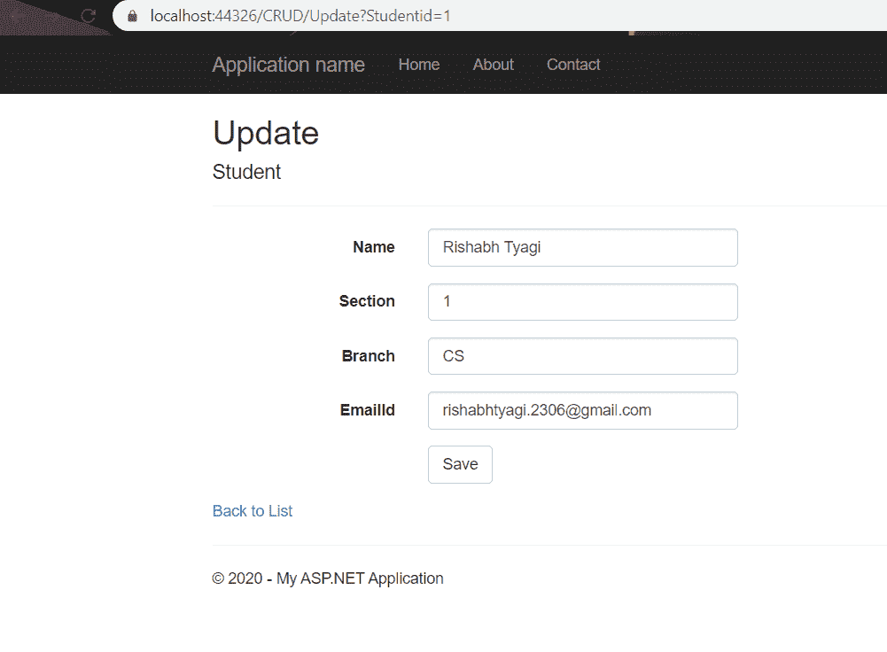

# 使用 C#和实体框架的 ASP.NET MVC 中的基本 CRUD(创建、读取、更新、删除)

> 原文:[https://www . geesforgeks . org/basic-crud-create-read-update-delete-in-ASP-net-MVC-using-c-sharp-and-entity-framework/](https://www.geeksforgeeks.org/basic-crud-create-read-update-delete-in-asp-net-mvc-using-c-sharp-and-entity-framework/)

**先决条件:**

*   [下载安装微软 SQL Server 管理工作室](https://docs.microsoft.com/en-us/sql/ssms/download-sql-server-management-studio-ssms?view=sql-server-ver15)
*   [下载并设置 Visual Studio 社区版](https://www.geeksforgeeks.org/how-to-install-and-setup-visual-studio-for-c-sharp/)

MVC 代表模型视图控制器。这是一种用于分离业务逻辑、表示逻辑和数据的设计模式。基本上，它提供了一种样式化 web 应用程序的模式。根据 MVC，您可以将应用程序分为如下 3 层:

**1。模型层:**模型组件对应于用户使用的所有或任何数据相关逻辑。这将表示视图和控制器组件之间传输的信息或其他业务逻辑相关数据。例如，客户对象将从数据库中检索客户信息，对其进行操作，并将其数据更新回数据库或使用它来呈现数据。

**2。视图层:**视图组件用于设备的所有用户界面逻辑。例如，客户视图将包括所有用户界面组件，如文本框、下拉列表等。最终用户与之交互。

**3。控制器:**控制器充当模型和考虑组件之间的接口，以处理所有业务逻辑和传入请求，使用模型组件操作数据，并与视图交互以呈现最终输出。例如，客户控制器将处理来自客户视图的所有交互和输入，并使用客户模型更新数据库。等效的控制器是

将习惯于查看客户数据。

ASP.NET 是一个服务器端的网络应用程序框架，由微软创建，运行在视窗系统上，开始于 21 世纪初。ASP.NET 允许开发者制作网络应用程序、网络服务和动态内容驱动的网站。ASP.NET 的最新版本是 4.7.1

要了解如何在 visual studio 中设置项目以及如何创建数据库，请参考下面给出的链接:

*   [在 MS-SQL Server 管理工作室创建数据库](https://docs.microsoft.com/en-us/sql/relational-databases/databases/create-a-database?view=sql-server-ver15)
*   [在 visual studio 中创建项目](https://docs.microsoft.com/en-us/aspnet/mvc/overview/getting-started/introduction/getting-started)

**1。创建一个包含以下几列的数据库:**这只是一个演示，让您理解文章中的代码。您可以根据需要创建自己的数据库。


**2。在 Visual Studio 中创建项目**按照上面提供的链接中给出的指导方针创建项目。创建项目后，添加实体数据模型以将连接字符串添加到您的 *web.config* 文件中，为此，请遵循本文[将实体数据模型添加到您的 ASP.NET 项目](https://www.entityframeworktutorial.net/entityframework6/create-entity-data-model.aspx)中。下面的 EDMX 图将显示在您的解决方案窗口中。


### ASP.NET CRUD(创建、读取、更新、删除)

**1。创建**现在要在数据库中创建新记录，请在新创建的控制器中编写以下代码。

```cs
using System;
using System.Collections.Generic;
using System.Linq;
using System.Web;
using System.Web.Mvc;

namespace CRUDDemo.Controllers
{
    public class CRUDController : Controller
    {
        // To create View of this Action result
        public ActionResult create() 
        {
            return View();
        }

        // Specify the type of attribute i.e.
        // it will add the record to the database
        [HttpPost] 
        public ActionResult create(Student model)
        {

            // To open a connection to the database
            using(var context = new demoCRUDEntities()) 
            {
                // Add data to the particular table
                context.Student.Add(model); 

                // save the changes
                context.SaveChanges(); 
            }
            string message = "Created the record successfully";

            // To display the message on the screen
            // after the record is created successfully
            ViewBag.Message = message;     

            // write @Viewbag.Message in the created
            // view at the place where you want to
            // display the message
            return View(); 
        }
    }
}
```

写完后，点击第一个操作结果，点击添加视图，然后选择模板作为创建，模型类作为您自己创建的模型，数据上下文类作为您自己创建的 EDMX 模型。然后运行项目并转到网址 https://localhost:端口号/控制器名/操作方法名

例如，https://localhost:44326/CRUD/create


**2。阅读:**现在要查看屏幕上添加的数据，请遵循下面给出的代码

```cs
using System;
using System.Collections.Generic;
using System.Linq;
using System.Web;
using System.Web.Mvc;

namespace CRUDDemo.Controllers
{
    public class CRUDController : Controller {
        [HttpGet] // Set the attribute to Read
            public ActionResult
            Read()
        {
            using(var context = new demoCRUDEntities())
            {

                // Return the list of data from the database
                var data = context.Student.ToList(); 
                return View(data);
            }
        }
    }
}
```

之后，添加视图，但记得将模板更改为列表。然后运行项目，转到 URL
https://localhost:port _ number/Controller _ name/Action _ Method _ name
例如 https://localhost:44326/CRUD/Read


**3。更新:**现在，按照下面给出的代码更新现有记录

```cs
using System;
using System.Collections.Generic;
using System.Linq;
using System.Web;
using System.Web.Mvc;

namespace CRUDDemo.Controllers
{
    public class CRUDController : Controller
    {

        // To fill data in the form 
        // to enable easy editing
        public ActionResult Update(int Studentid) 
        {
            using(var context = new demoCRUDEntities())
            {
                var data = context.Student.Where(x => x.StudentNo == Studentid).SingleOrDefault();
                return View(data);
            }
        }

        // To specify that this will be 
        // invoked when post method is called
        [HttpPost]
        [ValidateAntiForgeryToken] 
        public ActionResult Update(int Studentid, Student model)
        {
            using(var context = new demoCRUDEntities())
            {

                // Use of lambda expression to access
                // particular record from a database
                var data = context.Student.FirstOrDefault(x => x.StudentNo == Studentid); 

                // Checking if any such record exist 
                if (data != null) 
                {
                    data.Name = model.Name;
                    data.Section = model.Section;
                    data.EmailId = model.EmailId;
                    data.Branch = model.Branch;
                    context.SaveChanges();

                    // It will redirect to 
                    // the Read method
                    return RedirectToAction("Read"); 
                }
                else
                    return View();
            }
        }
    }
}
```

在此之后，添加视图与之前类似，但是记住将模板更改为编辑。然后运行项目，转到网址 https://localhost:port _ number/Controller _ name/Action _ Method _ name？想要编辑

比如 https://localhost:44326/CRUD/Update？Studentid=1



**4。删除**现在，按照下面给出的代码从数据库中删除一条记录

```cs
using System;
using System.Collections.Generic;
using System.Linq;
using System.Web;
using System.Web.Mvc;

namespace CRUDDemo.Controllers
{
    public class CRUDController : Controller {
        public ActionResult Delete()
        {
            return View();
        }

        [HttpPost]
        [ValidateAntiForgeryToken] public ActionResult
        Delete(int Studentid)
        {
            using(var context = new demoCRUDEntities())
            {
                var data = context.Student.FirstOrDefault(x = > x.StudentNo == Studentid);
                if (data != null) {
                    context.Student.Remove(data);
                    context.SaveChanges();
                    return RedirectToAction("Read");
                }
                else
                    return View();
            }
        }
    }
}
```

如前所述添加视图后，请记住将模板更改为删除。然后运行项目，转到网址 https://localhost:port _ number/Controller _ name/Action _ Method _ name？ID _ U _ want _ Delete
例如 https://localhost:44326/CRUD/Delete？Studentid=1


**注:**

*   自动生成的 HTML 可以根据您的选择进行修改。
*   如果你想看看完整的源代码和它是如何工作的，你可以点击 [GitHub 链接](https://github.com/rishabhtyagi2306/CRUD-Demo)来查看我的 GitHub 资源库。