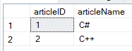

# 使用 C# 的基本数据库操作

> 原文:[https://www . geesforgeks . org/basic-database-operations-use-c-sharp/](https://www.geeksforgeeks.org/basic-database-operations-using-c-sharp/)

在本文中，您将学习如何使用 C# 中的 *system.data.SqlClient* 命名空间来执行基本的数据库操作。基本操作是插入、更新、选择和删除。虽然目标数据库系统是 SQL Server Database，但是同样的技术也可以应用于其他数据库系统，因为使用的查询语法是所有关系数据库系统通常都支持的标准 SQL。
**先决条件:**微软 SQL Server 管理工作室
打开微软 SQL Server 管理工作室，编写以下脚本，在其中创建数据库和表。

```cs
create database Demodb;

use Demodb;

CREATE TABLE demo(
    articleID varchar(30) NOT NULL PRIMARY KEY,
    articleName varchar(30) NOT NULL,
);

insert into demo values(1, 'C#');
insert into demo values(2, 'C++');
```

执行上述脚本后，创建了名为 demo 的下表，其中包含如下截图所示的数据。


**连接 C# 和数据库:**要使用数据库，首先需要一个连接。与数据库的连接通常由以下参数组成。

*   *数据库名称或数据源:*需要建立连接并建立连接的数据库名称，也可以说一次只能使用一个数据库。
*   *凭证:*需要用来建立数据库连接的用户名和密码。
*   *可选参数:*对于每种数据库类型，您可以指定可选参数，以提供更多信息。NET 应该连接到数据库来处理数据。

**注意:**在这里，我们使用命令提示符来执行这些代码。要查看结果，您可以使用 Microsoft SQL Server 管理工作室。
**代码 1#** :用 C#
连接数据库

## c sharp . c sharp . c sharp . c sharp

```cs
// C# code to connect the database
using System;
using System.Data.SqlClient;

namespace Database_Operation {

class DBConn {

    // Main Method
    static void Main()
    {
        Connect();
        Console.ReadKey();
    }

    static void Connect()
    {
        string constr;

        // for the connection to
        // sql server database
        SqlConnection conn;

        // Data Source is the name of the
        // server on which the database is stored.
        // The Initial Catalog is used to specify
        // the name of the database
        // The UserID and Password are the credentials
        // required to connect to the database.
        constr = @"Data Source=DESKTOP-GP8F496;Initial Catalog=Demodb;User ID=sa;Password=24518300";

        conn = new SqlConnection(constr);

        // to open the connection
        conn.Open();

        Console.WriteLine("Connection Open!");

        // to close the connection
        conn.Close();
    }
}
}
```

**输出:**

```cs
Connection Open !
```

**代码# 2:** 使用 Select 语句和 SqlDataReader 访问 C# 中的数据

## c sharp . c sharp . c sharp . c sharp

```cs
// C# code to demonstrate how
// to use select statement
using System;
using System.Data.SqlClient;

namespace Database_Operation {

class SelectStatement{

    // Main Method
    static void Main()
    {
        Read();
        Console.ReadKey();
    }

    static void Read()
    {
        string constr;

        // for the connection to
        // sql server database
        SqlConnection conn;

        // Data Source is the name of the
        // server on which the database is stored.
        // The Initial Catalog is used to specify
        // the name of the database
        // The UserID and Password are the credentials
        // required to connect to the database.
        constr = @"Data Source=DESKTOP-GP8F496;Initial Catalog=Demodb;User ID=sa;Password=24518300";

        conn = new SqlConnection(constr);

        // to open the connection
        conn.Open();

        // use to perform read and write
        // operations in the database
        SqlCommand cmd;

        // use to read a row in
        // table one by one
        SqlDataReader dreader;

        // to sore SQL command and
        // the output of SQL command
        string sql, output = "";

         // use to fetch rows from demo table
        sql = "Select articleID, articleName from demo";

        // to execute the sql statement
        cmd = new SqlCommand(sql, conn);

        // fetch all the rows
        // from the demo table
        dreader = cmd.ExecuteReader();

        // for one by one reading row
        while (dreader.Read()) {
            output = output + dreader.GetValue(0) + " - " +
                                dreader.GetValue(1) + "\n";
        }

        // to display the output
        Console.Write(output);

        // to close all the objects
        dreader.Close();
        cmd.Dispose();
        conn.Close();
    }
}
}
```

**输出:**

```cs
1 - C#
2 - C++
```

**代码# 3:** 使用 C# 中的 Insert 语句将数据插入数据库

## c sharp . c sharp . c sharp . c sharp

```cs
// C# code for how to use Insert Statement
using System;
using System.Data.SqlClient;

namespace Database_Operation {

class InsertStatement {

    // Main Method
    static void Main()
    {
        Insert();
        Console.ReadKey();
    }

    static void Insert()
    {
         string constr;

        // for the connection to
        // sql server database
        SqlConnection conn;

        // Data Source is the name of the
        // server on which the database is stored.
        // The Initial Catalog is used to specify
        // the name of the database
        // The UserID and Password are the credentials
        // required to connect to the database.
        constr = @"Data Source=DESKTOP-GP8F496;Initial Catalog=Demodb;User ID=sa;Password=24518300";

        conn = new SqlConnection(constr);

        // to open the connection
        conn.Open();

        // use to perform read and write
        // operations in the database
        SqlCommand cmd;

        // data adapter object is use to
        // insert, update or delete commands
        SqlDataAdapter adap = new SqlDataAdapter();

        string sql = "";

        // use the defined sql statement
        // against our database
        sql = "insert into demo values(3, 'Python')";

        // use to execute the sql command so we
        // are passing query and connection object
        cmd = new SqlCommand(sql, conn);

        // associate the insert SQL
        // command to adapter object
        adap.InsertCommand = new SqlCommand(sql, conn);

        // use to execute the DML statement against
        // our database
        adap.InsertCommand.ExecuteNonQuery();

        // closing all the objects
        cmd.Dispose();
        conn.Close();
    }
}
}
```

**输出:**


**代码# 4:** 使用 C# 中的 Update 语句将数据更新到数据库中

## c sharp . c sharp . c sharp . c sharp

```cs
// C# code for how to use Update Statement
using System;
using System.Data.SqlClient;

namespace Database_Operation {

class UpdateStatement {

    // Main Method
    static void Main()
    {
        Update();
        Console.ReadKey();
    }

    static void Update()
    {
       string constr;

        // for the connection to
        // sql server database
        SqlConnection conn;

        // Data Source is the name of the
        // server on which the database is stored.
        // The Initial Catalog is used to specify
        // the name of the database
        // The UserID and Password are the credentials
        // required to connect to the database.
        constr = @"Data Source=DESKTOP-GP8F496;Initial Catalog=Demodb;User ID=sa;Password=24518300";

        conn = new SqlConnection(constr);

        // to open the connection
        conn.Open();

        // use to perform read and write
        // operations in the database
        SqlCommand cmd;

        // data adapter object is use to
        // insert, update or delete commands
        SqlDataAdapter adap = new SqlDataAdapter();

        string sql = "";

        // use the define sql
        // statement against our database
        sql = "update demo set articleName='django' where articleID=3";

        // use to execute the sql command so we
        // are passing query and connection object
        cmd = new SqlCommand(sql, conn);

        // associate the insert SQL
        // command to adapter object
        adap.InsertCommand = new SqlCommand(sql, conn);

        // use to execute the DML statement against
        // our database
        adap.InsertCommand.ExecuteNonQuery();

        // closing all the objects
        cmd.Dispose();
        conn.Close();
    }
}
}
```

**输出:**


**代码# 5:** 使用 C# 中的 Delete 语句删除数据库中的数据

## c sharp . c sharp . c sharp . c sharp

```cs
// C# code for how to use Delete Statement
using System;
using System.Data.SqlClient;

namespace Database_Operation {

class DeleteStatement {

    // Main Method
    static void Main()
    {
        Delete();
        Console.ReadKey();
    }

    static void Delete()
    {
       string constr;

        // for the connection to
        // sql server database
        SqlConnection conn;

        // Data Source is the name of the
        // server on which the database is stored.
        // The Initial Catalog is used to specify
        // the name of the database
        // The UserID and Password are the credentials
        // required to connect to the database.
        constr = @"Data Source=DESKTOP-GP8F496;Initial Catalog=Demodb;User ID=sa;Password=24518300";

        conn = new SqlConnection(constr);

        // to open the connection
        conn.Open();

        // use to perform read and write
        // operations in the database
        SqlCommand cmd;

        // data adapter object is use to
        // insert, update or delete commands
        SqlDataAdapter adap = new SqlDataAdapter();

        string sql = "";

        // use the define SQL statement
        // against our database
        sql = "delete from demo where articleID=3";

        // use to execute the sql command so we
        // are passing query and connection object
        cmd = new SqlCommand(sql, conn);

        // associate the insert SQL
        // command to adapter object
        adap.InsertCommand = new SqlCommand(sql, conn);

        // use to execute the DML statement
        // against our database
        adap.InsertCommand.ExecuteNonQuery();

        // closing all the objects
        cmd.Dispose();
        conn.Close();
    }
}
}
```

**输出:**

