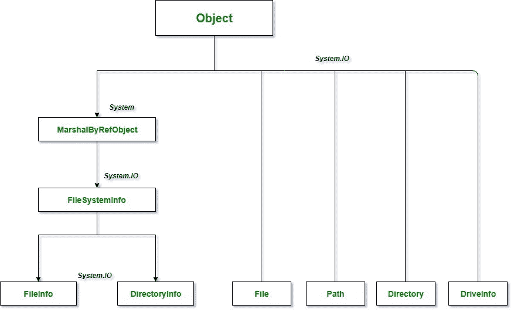
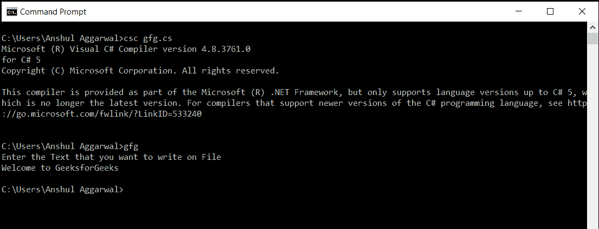
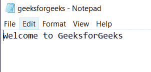
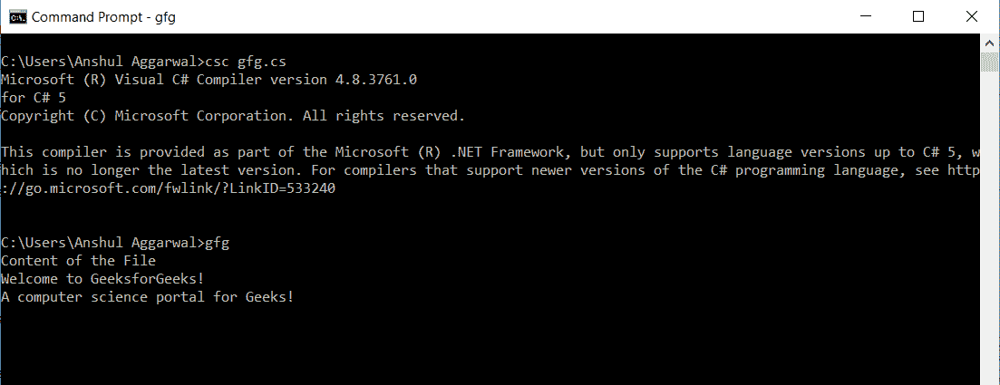

# c# 中文件处理的基础知识

> 原文:[https://www . geesforgeks . org/c-sharp 文件处理基础知识/](https://www.geeksforgeeks.org/basics-of-file-handling-in-c-sharp/)

通常，文件用于存储数据。术语“文件处理”指的是各种操作，如创建文件、读取文件、写入文件、追加文件等。文件处理中最常用的两个基本操作是文件的读取和写入。当我们打开文件进行读写时，文件就变成了流。流是用于通信的字节序列。文件可以形成两个流，一个是用于读取文件的输入流，另一个是用于写入文件的输出流。在 c#*[系统中。IO](https://docs.microsoft.com/en-us/dotnet/api/system.io?view=netframework-4.8)* 命名空间包含处理输入和输出流的类，并提供关于文件和目录结构的信息。



文件处理类层次结构

在这里，我们将讨论两个类，它们对文本文件的写入和读取都很有用。

#### 流编写器类

StreamWriter 类实现了文本编写器，用于以特定格式向流中写入字符。该类包含以下最常用的方法。

| 方法 | 描述 |
| --- | --- |
| 关闭() | 关闭当前 StreamWriter 对象和与之关联的流。 |
| 齐平() | 清除缓冲区中的所有数据，并将其写入与之关联的流中。 |
| 写() | 向流中写入数据。对于要写入流的不同数据类型，它有不同的重载。 |
| WriteLine() | 它与 Write()相同，但它在数据的末尾添加了换行符。 |

**示例:**

```cs
// C# program to write user input 
// to a file using StreamWriter Class
using System;
using System.IO;

namespace GeeksforGeeks {

class GFG {

    class WriteToFile {

        public void Data()
        {
            // This will create a file named sample.txt
            // at the specified location 
            StreamWriter sw = new StreamWriter("H://geeksforgeeks.txt");

            // To write on the console screen
            Console.WriteLine("Enter the Text that you want to write on File"); 

            // To read the input from the user
            string str = Console.ReadLine(); 

            // To write a line in buffer
            sw.WriteLine(str); 

            // To write in output stream
            sw.Flush(); 

            // To close the stream
            sw.Close(); 
        }
    }

    // Main Method
    static void Main(string[] args)
    {
        WriteToFile wr = new WriteToFile();
        wr.Data();
        Console.ReadKey();
    }
}
}
```

**输入:**



**输出:**您会在指定位置找到包含以下内容的文件:



#### 流阅读器类

StreamReader 类实现了文本阅读器，用于以特定格式从流中读取字符。该类包含以下最常用的方法。

| 方法 | 描述 |
| --- | --- |
| 关闭() | 关闭当前的 StreamReader 对象和与之关联的流。 |
| Peek() | 返回下一个可用字符，但不使用它。 |
| 已读() | 读取输入流中的下一个字符，并将字符在流中的位置增加 1 |
| 读行（） | 从输入流中读取一行，并以字符串形式返回数据 |
| 寻求() | 它用于在文件的特定位置读/写 |

**示例:**

```cs
// C# program to read from a file
// using StreamReader Class
using System;
using System.IO;

namespace GeeksforGeeks {

class GFG {

    class ReadFile {

        public void DataReading()
        {
            // Takinga a new input stream i.e. 
            // geeksforgeeks.txt and opens it
            StreamReader sr = new StreamReader("H://geeksforgeeks.txt");

            Console.WriteLine("Content of the File"); 

            // This is use to specify from where 
            // to start reading input stream
            sr.BaseStream.Seek(0, SeekOrigin.Begin);

            // To read line from input stream
            string str = sr.ReadLine(); 

            // To read the whole file line by line
            while (str != null) 
            {
                Console.WriteLine(str);
                str = sr.ReadLine();
            }
            Console.ReadLine(); 

            // to close the stream
            sr.Close(); 
        }
    }

    // Main Method
    static void Main(string[] args)
    {
        ReadFile wr = new ReadFile();
        wr.DataReading();
    }
}
}
```

**输出:**

