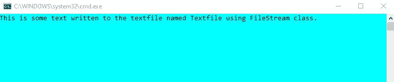

# c#中文件流的基础知识

> 原文:[https://www . geesforgeks . org/basic-of-filestream-in-c-sharp/](https://www.geeksforgeeks.org/basics-of-filestream-in-c-sharp/)

FileStream 是一个用于在 C#中读写文件的类。它是系统的一部分。IO 命名空间。要使用 FileStream 操作文件，需要创建一个 FileStream 类的对象。该对象有四个参数；文件名、文件模式、文件访问和文件共享。

声明文件流对象的语法如下

> 文件流文件对象=新文件流(文件名/路径，文件模式.字段，文件访问.字段，文件共享.字段)；

| 参数 | 描述 | 菲尔茨 |
| --- | --- | --- |
| 文件的名称 | 您要使用的文件名及其扩展名或文件的完整路径。 | 例如:文件名. txt，@“C:\用户\用户名\文档\文件名. txt” |
| file mode-档案模式 | 它指定文件必须以哪种模式打开。 | **–**打开–打开现有文件
**–**创建–创建新文件如果已经存在相同的文件名，它将被覆盖
**–**打开或创建–打开文件如果存在，否则创建新文件如果不存在
**–**创建–专门创建新文件
**–**追加–打开现有文件并在文件末尾追加更多信息。如果文件不存在，将创建一个新文件
**–**截断–打开一个现有文件，将其大小截断为零字节 |
| 文件访问 | 它指定对文件的访问。 | –读取–从文件中读取数据
–写入–向文件中写入数据
–读写–向文件中读取和写入数据 |
| 文件共享 | 它指定了其他 FileStream 对象对此特定文件的访问权限 | –无–拒绝文件共享。在文件关闭之前，任何访问请求都将失败。
–读取–允许后续读取文件。
–写入–允许后续写入文件。
–读写–允许文件的后续读写。
–删除–允许后续删除文件。
–可继承–允许子进程继承文件句柄。 |

**示例:**在下面给出的代码中，我们向文本文件中写入和读取一些文本。要写入文本，首先在创建模式下创建文件流类的对象，并进行写访问。将您要编写的文本存储在 var 类型的变量中，这是一个用于声明隐式类型的关键字。

接下来，创建一个字节数组，并将文本编码为 UTF8，UTF8 是一种能够以 Unicode 编码所有 1，112，064 个有效字符代码点的编码标准。然后使用 Write()方法写入文本文件。Write()方法的参数是要写入的字节数组、文本文件的偏移量和文本的长度。最后，使用 close()关闭 FileStream 对象。

为了读取文本文件，我们在打开模式和读取访问中创建一个文件流对象。声明一个从文本文件中读取的字节数组和一个保持字节计数的整数。使用 Read()方法从文本文件中读取。Read()方法的参数是字节数组、文本文件从哪里开始读取的偏移量以及必须读取的文本长度。最后，使用 GetString()将读取的文本从字节数组写入控制台。

```
// C# program to write and read from 
// a text file using FileStream class
using System;
using System.IO;
using System.Text;

namespace FileStreamWriteRead {

class GFG {

    static void Main(string[] args)
    {
        // Create a FileStream Object
        // to write to a text file
        // The parameters are complete 
        // path of the text file in the 
        // system, in Create mode, the
        // access to this process is 
        // Write and for other 
        // processes is None
        FileStream fWrite = new FileStream(@"M:\Documents\Textfile.txt",
                     FileMode.Create, FileAccess.Write, FileShare.None);

        // Store the text in the variable text
        var text = "This is some text written to the textfile "+
                       "named Textfile using FileStream class.";

        // Store the text in a byte array with
        // UTF8 encoding (8-bit Unicode 
        // Transformation Format)
        byte[] writeArr = Encoding.UTF8.GetBytes(text);

        // Using the Write method write
        // the encoded byte array to
        // the textfile
        fWrite.Write(writeArr, 0, text.Length);

        // Closee the FileStream object
        fWrite.Close();

        // Create a FileStream Object
        // to read from a text file
        // The parameters are complete
        // path of the text file in 
        // the system, in Open mode,
        // the access to this process is
        // Read and for other processes
        // is Read as well
        FileStream fRead = new FileStream(@"M:\Documents\Textfile.txt", 
                       FileMode.Open, FileAccess.Read, FileShare.Read);

        // Create a byte array 
        // to read from the 
        // text file
        byte[] readArr = new byte[text.Length];
        int count;

        // Using the Read method 
        // read until end of file
        while ((count = fRead.Read(readArr, 0, readArr.Length)) > 0) {
            Console.WriteLine(Encoding.UTF8.GetString(readArr, 0, count));
        }

        // Close the FileStream Object
        fRead.Close();
        Console.ReadKey();
    }
}
}
```

**输出:**

