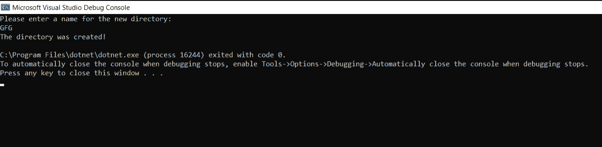
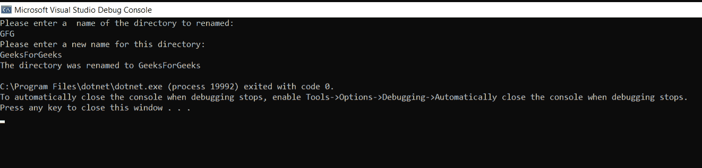

# c#中文件和目录的基本操作

> 原文:[https://www . geesforgeks . org/basic-c-sharp 中文件和目录的操作/](https://www.geeksforgeeks.org/basics-operations-of-file-and-directory-in-c-sharp/)

在本文中，我们将介绍如何创建、删除和重命名目录，以及如何删除和重命名文件。

#### 创建目录

我们可以使用目录类中的 *CreateDirectory()* 方法创建目录。

## c sharp . c sharp . c sharp . c sharp

```
// C# program to create a directory
using System;
using System.IO;

class Program {

    // Main Method
    static void Main(string[] args)
    {
        Console.WriteLine("Please enter a name for the new directory:");

        string DirName = Console.ReadLine();

        // Checking if string is empty or not
        if (DirName != String.Empty)
        {
            // Creating the Directory
            Directory.CreateDirectory(DirName);

            // Checking Directory is created
            // Successfully or not
            if (Directory.Exists(DirName))
            {
                Console.WriteLine("The directory was created!");
                Console.ReadKey();
            }
        }
    }
}
```

**输出:**



您将在特定位置找到具有给定名称的目录。

#### 重命名目录

## c sharp . c sharp . c sharp . c sharp

```
using System;
using System.IO;

class GFG {

    // Main Method
    static void Main(string[] args)
    {
        Console.WriteLine("Please enter a  name of the directory to renamed:");
        string DirName = Console.ReadLine();

        // checking directory exist or not
        if (Directory.Exists(DirName))
        {
            Console.WriteLine("Please enter a new name for this directory:");
            string newDirName = Console.ReadLine();

            if (newDirName != String.Empty) {

                // to rename directory
                Directory.Move(DirName, newDirName);

                // checking directory has
                // been renamed or not
                if (Directory.Exists(newDirName))
                {
                    Console.WriteLine("The directory was renamed to " + newDirName);
                    Console.ReadKey();
                }
            }
        }
    }
}
```

**输出:**



您将在特定位置找到更新后的目录名称。没有所谓的重命名()方法，所以我们使用 Move()方法来重命名目录。移动和重命名是 C#中相同的操作。

#### 删除目录

## c sharp . c sharp . c sharp . c sharp

```
using System;
using System.IO;

class GFG {

    // Main Method
    static void Main(string[] args)
    {
        Console.WriteLine("Enter the directory name you want to delete:");

        string DirName = Console.ReadLine();

        // Checking if Directory Exist or not
        if (Directory.Exists(DirName))
        {

            // This will delete the
            // Directory if it is empty
            Directory.Delete(DirName);

            // checking if directory if
            // deleted successfully or not
            if (Directory.Exists(DirName) == false)
                Console.WriteLine("Directory deleted successfully...");
        }
        else
            Console.WriteLine("Directory {0} does not exist!", DirName);
        Console.ReadKey();
    }
}
```