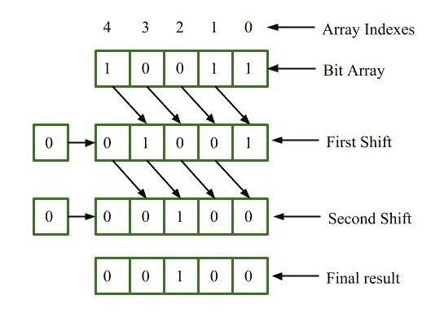
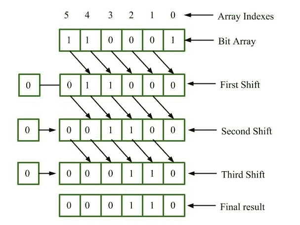

# BitArray。C# 中的 RightShift()方法，示例

> 原文:[https://www . geesforgeks . org/bitarray-right shift-method-in-c-sharp-with-examples/](https://www.geeksforgeeks.org/bitarray-rightshift-method-in-c-sharp-with-examples/)

**BitArray** 类管理一个位值数组，表示为**布尔**，其中真表示位为 1，假表示位为 0。这个类包含在命名空间*系统中。收藏*。 **BitArray。RightShift(Int32)** 方法用于将位数组的位向右移动一个位置，并在移动的位置上添加零。执行**右移**操作时，将修改原始数组对象。

> **语法:**公共系统。collections . Bitarray right shift(int count)；
> 
> **参数:**
> **count** 是一个不可变的值类型，表示值范围从负 2，147，483，648 到正 2，147，483，647 的有符号整数。
> 
> **返回值:**返回位数组。

**例 1:** 假设我们有位数组 10011，我们想把它右移两个位置。



最终结果是 00100。

```cs
// C# program to illustrate the 
// RightShift(Int32) Method
using System;
using System.Collections;

class GeeksforGeeks {

    // Main Method
    public static void Main()
    {

        // Creating a BitArray of 
        // size 5 named BitArr
        BitArray BitArr = new BitArray(5);

        // Initializing values in BitArr
        BitArr[0] = true;
        BitArr[1] = true;
        BitArr[2] = false;
        BitArr[3] = false;
        BitArr[4] = true;

        // function calling
        Display(BitArr.RightShift(2));
    }

    // Displaying the result
    public static void Display(IEnumerable myList)
    {
        foreach(Object obj in myList)
        {
            Console.WriteLine(obj);
        }
    }
}
```

**Output:**

```cs
False
False
True
False
False

```

**例 2:** 假设我们有位数组 100011，我们想把它右移三个位置。



最终结果是 011000。

```cs
// C# program to illustrate the 
// RightShift(Int32) Method
using System;
using System.Collections;

class GeeksforGeeks {

    // Main Method
    public static void Main()
    {

        // Creating a BitArray
        BitArray BitArr = new BitArray(6);

        // Initializing values in BitArr
        BitArr[0] = true;
        BitArr[1] = false;
        BitArr[2] = false;
        BitArr[3] = false;
        BitArr[4] = true;
        BitArr[5] = true;

        // function calling
        Display(BitArr.RightShift(3));
    }

    // Displaying the result
    public static void Display(IEnumerable myList)
    {
        foreach(Object obj in myList)
        {
            Console.WriteLine(obj);
        }
    }
}
```

**Output:**

```cs
False
True
True
False
False
False

```

**参考:**

*   [https://docs . Microsoft . com/en-us/dotnet/API/system . collections . bitarray . right shift？视图=netcore-2.2](https://docs.microsoft.com/en-us/dotnet/api/system.collections.bitarray.rightshift?view=netcore-2.2)