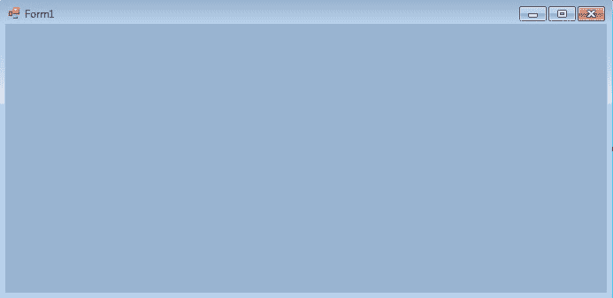
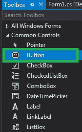
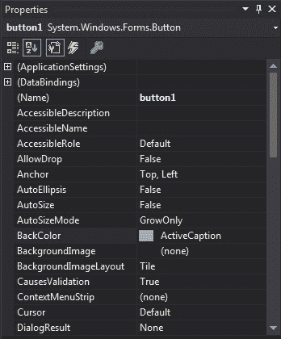
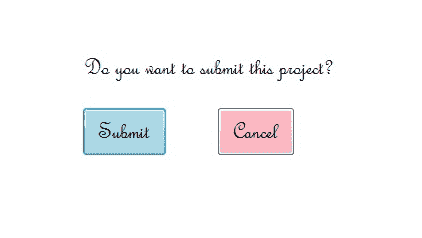

# c# 中的按钮

> 原文:[https://www.geeksforgeeks.org/button-in-c-sharp/](https://www.geeksforgeeks.org/button-in-c-sharp/)

按钮是应用程序、软件或网页的重要组成部分。它允许用户与应用程序或软件交互。例如，如果用户希望退出当前应用程序，他/她可以点击退出按钮关闭应用程序。它可以用来执行许多操作，如提交、上传、下载等。根据你的程序的要求。它可以有不同的形状、大小、颜色等。您可以在不同的应用程序中重用它们。在[中。NET Framework](https://www.geeksforgeeks.org/introduction-to-net-framework/) ，按钮类用于表示窗口按钮控件，继承自*按钮基类*。在*系统下定义。Windows.Forms* 命名空间。
在 C# 中，可以通过两种不同的方式在 windows 窗体上创建按钮:
**1。设计时:**创建按钮是最简单的方法。使用以下步骤:

*   **第一步:**创建如下图所示的 windows 窗体:
    **Visual Studio->File->New->Project->windows formpp**



*   **步骤 2:** 从工具箱中拖动按钮控件，并将其放到窗口窗体上。您可以根据需要将按钮控件放置在窗口窗体的任何位置。



*   **第 3 步:**拖放后，您将进入按钮控件的属性来设置按钮的属性。



**2。运行时:**比上面的方法稍微复杂一点。在这种方法中，您可以使用 Button 类创建自己的 Button。

*   **步骤 1:** 使用 button 类提供的 Button()构造函数创建按钮。

```cs
// Creating Button using Button class
Button MyButton = new Button();
```

*   **第二步:**创建按钮后，设置按钮类提供的按钮属性。

```cs
// Set the location of the button
Mybutton.Location = new Point(225, 198);

// Set text inside the button
Mybutton.Text = "Submit";

// Set the AutoSize property of the button
 Mybutton.AutoSize = true;

// Set the background color of the button
Mybutton.BackColor = Color.LightBlue;

// Set the padding of the button
Mybutton.Padding = new Padding(6);

// Set font of the text present in the button
Mybutton.Font = new Font("French Script MT", 18);
```

*   **第 3 步:**最后使用 add()方法将该按钮控件添加到表单中。

```cs
// Add this Button to form
this.Controls.Add(Mybutton);
```

*   **例:**

## c sharp . c sharp . c sharp . c sharp

```cs
using System;
using System.Collections.Generic;
using System.ComponentModel;
using System.Data;
using System.Drawing;
using System.Linq;
using System.Text;
using System.Threading.Tasks;
using System.Windows.Forms;

namespace WindowsFormsApp8 {

public partial class Form1 : Form {

    public Form1()
    {
        InitializeComponent();
    }

    private void Form1_Load(object sender, EventArgs e)
    {

        // Creating and setting the properties of label
        Label l = new Label();
        l.AutoSize = true;
        l.Text = "Do you want to submit this project?";
        l.Location = new Point(222, 145);
        l.Font = new Font("French Script MT", 18);
        // Adding this label to form
        this.Controls.Add(l);

        // Creating and setting the properties of Button
        Button Mybutton = new Button();
        Mybutton.Location = new Point(225, 198);
        Mybutton.Text = "Submit";
        Mybutton.AutoSize = true;
        Mybutton.BackColor = Color.LightBlue;
        Mybutton.Padding = new Padding(6);
        Mybutton.Font = new Font("French Script MT", 18);

        // Adding this button to form
        this.Controls.Add(Mybutton);

        // Creating and setting the properties of Button
        Button Mybutton1 = new Button();
        Mybutton1.Location = new Point(360, 198);
        Mybutton1.Text = "Cancel";
        Mybutton1.AutoSize = true;
        Mybutton1.BackColor = Color.LightPink;
        Mybutton1.Padding = new Padding(6);
        Mybutton1.Font = new Font("French Script MT", 18);

        // Adding this button to form
        this.Controls.Add(Mybutton1);
    }
}
}
```

*   **输出:**



#### 按钮的重要属性

<figure class="table">

| 财产 | 描述 |
| [**后场**](https://www.geeksforgeeks.org/how-to-set-the-background-color-of-the-button-in-c-sharp/) | 使用 BackColor 属性可以设置按钮的背景颜色。 |
| **背景影像** | 使用 BackgroundImage 属性可以在按钮上设置背景图像。 |
| **自体发光** | 使用自动省略号属性可以设置一个值，该值显示省略号字符(…)是否出现在控件的右边缘，这表示按钮文本超出了按钮的指定长度。 |
| [**【自动化】**](https://www.geeksforgeeks.org/how-to-set-the-size-of-the-button-in-c-sharp/) | 使用“自动调整大小”属性，您可以设置一个值来显示按钮是否根据其内容调整大小。 |
| **启用** | 使用 Enabled 属性，您可以设置一个值，该值显示按钮是否可以响应用户交互。 |
| **事件** | 使用事件属性，您可以获得应用于给定按钮的事件处理程序列表。 |
| [**字体**](https://www.geeksforgeeks.org/how-to-set-the-font-of-the-button-in-c-sharp/) | 使用字体属性，您可以设置按钮的字体。 |
| **字体高度** | 使用字体高度属性，您可以设置字体的高度。 |
| **前颜色** | 使用 ForeColor 属性，您可以设置按钮的前景色。 |
| **高度** | 使用“高度”属性，您可以设置按钮的高度。 |
| **图像** | 使用图像属性，您可以设置按钮上的图像。 |
| [**保证金**](https://www.geeksforgeeks.org/how-to-set-the-margin-of-the-buttons-in-c-sharp/) | 使用“边距”属性，可以设置控件之间的边距。 |
| [**名称**](https://www.geeksforgeeks.org/how-to-set-the-name-of-the-button-in-c-sharp/) | 使用名称属性，您可以设置按钮的名称。 |
| [](https://www.geeksforgeeks.org/how-to-set-the-padding-of-the-button-in-c-sharp/) | 使用“填充”属性，您可以设置按钮内的填充。 |
| [**可见**](https://www.geeksforgeeks.org/how-to-set-the-visibility-of-the-button-in-c-sharp/) | 使用可见属性，您可以设置一个值，该值显示按钮及其所有子按钮是否显示。 |

</figure>

#### 按钮上的重要事件

<figure class="table">

| 事件 | 描述 |
| **点击** | 单击按钮时会发生此事件。 |
| **双击** | 当用户双击按钮时，会发生此事件。 |
| **进入** | 输入控件时会发生此事件。 |
| **键击键** | 当控件具有焦点时按下字符、空格或退格键时，会发生此事件。 |
| **离开** | 当输入焦点离开控件时，会发生此事件。 |
| **慕容克** | 当您在按钮上单击鼠标指针时，会发生此事件。 |
| **鼠标点击** | 当您双击按钮上的鼠标指针时，会发生此事件。 |
| **鼠标悬停** | 当鼠标指针放在按钮上时，会发生此事件。 |
| moueleve | 当鼠标指针离开按钮时，会发生此事件。 |

</figure>