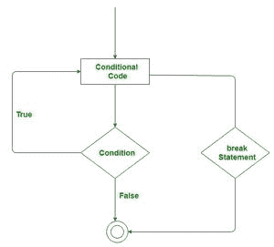

# c#–中断声明

> 原文:[https://www.geeksforgeeks.org/c-break-statement/](https://www.geeksforgeeks.org/c-break-statement/)

在 C# 中，break 语句用于终止循环(for、if、while 等)。)或某个条件下的开关语句。A 在终止控制后，控制将传递给中断语句后出现的语句(如果可用)。如果 break 语句存在于嵌套循环中，那么它将只终止那些包含break 语句的循环。

**语法:**

```cs
break;
```

**流程图:**



**现在我们来看看 break 语句的用法:**

1.  **简单循环**
2.  **嵌套循环**
3.  **无限循环**
4.  **开关-案例陈述**

**1。简单循环:**

这里我们将讨论 break 语句在简单 for 循环中的使用。如下例所示，for 循环被编程为从 0 到 20 执行，但本例的输出是“0 1 2 3 4 5 6”。因为这里我们打破了当 x 的值等于 7 时的循环。如果我们不使用 break 语句，那么这个循环将打印 0…20 个数字。

## C#

```cs
// C# program to illustrate the use of
// break statement in loop
using System;

class GFG{

static public void Main ()
{

    // Here, the break statement
    // terminates the loop when x = 7
    for(int x = 0; x <= 20; x++)
    {
        if (x == 7)
        {
            break;
        }
        Console.WriteLine(x);
    }
}
}
```

**输出:**

```cs
0
1
2
3
4
5
6
```

**2。嵌套循环:**

我们也可以在嵌套循环中使用 break 语句。如果在最里面的循环中使用 break 语句，那么控制将只从最里面的循环中出来。让我们借助一个例子来讨论 break 语句在嵌套循环中的使用:

## C#

```cs
// C# program to illustrate the use of
// break statement in nested loop
using System;

class GFG{

static public void Main ()
{

    // Outer Loop
    for(int x = 0; x < 4; x++)
    { 
        // Inner Loop
        for(int y = 1; y < 4; y++)
        {
            if (y > 2)
            {
                break;
            }
            Console.Write("#");
        }
        Console.Write("\n");
    }
}
}
```

**输出:**

```cs
##
##
##
##
```

在上面的例子中，内部循环被编程为执行 4 次迭代，但是当 y 的值大于 2 时，内部循环停止执行，因为我们使用 a break 语句将内部循环的迭代次数限制为 2 次。然而，外环不受影响。

**3。我**T3**无限循环:**

我们也可以在无限循环中使用 break 语句来终止无限循环的执行。让我们借助一个例子来讨论 break 语句在无限循环中的使用:

## C#

```cs
// C# program to illustrate
// infinite loop
using System;

class GFG{

static public void Main ()
{
    int x = 1;

    // Creating infinite loop
    // using while loop
    while (true)
    {
        // This statement will be printed
        // infinite times
        Console.WriteLine("Hey GeeksforGeeks");
          x++;
    }
}
}
```

在上述示例中，循环终止所基于的循环条件始终为真。所以，这个循环将执行  一次无限次，或者我们可以说永不终止。因此，这里我们使用break 语句在 x 的值等于 7 时终止循环

## C#

```cs
// C# program to illustrate the use of
// break statement in the infinite loop
using System;

class GFG{

static public void Main ()
{
    int x = 1;

    while (true)
    {
        if (x == 7)
            break;

        Console.WriteLine("Hey GeeksforGeeks");
        x++;
    }
}
}
```

**输出:**

```cs
Hey GeeksforGeeks
Hey GeeksforGeeks
Hey GeeksforGeeks
Hey GeeksforGeeks
Hey GeeksforGeeks
Hey GeeksforGeeks
```

**4。开关情况说明:**

我们知道 switch 语句有一个缺点，即当找到匹配值时，它将执行所有语句，直到 switch 块结束。为了避免这类问题，我们在每种情况下都使用 break 语句。因此 break 语句终止了对不匹配语句的 switch 语句的执行。如下例所示:

## C#

```cs
// C# program to illustrate the use of
// break statement in switch-case statement
using System;

class GFG{

static public void Main ()
{

    // Enter the value
    Console.Write("Select option(1, 2, 3): ");
    string str = Console.ReadLine();
    int x = Int32.Parse(str);

    // Using break statement in the switch-case
    // statemets
     switch(x)
    {
        case 1:
            Console.WriteLine("You select group A");
            break;
        case 2:
            Console.WriteLine("You select group B");
            break;
        case 3:
            Console.WriteLine("You select group C");
            break;
        default:
            Console.WriteLine("Sorry, Not a valid selection!");
            break;
    }
}
}
```

**输出:**

```cs
Select option(1, 2, 3): 2
You select group B
```