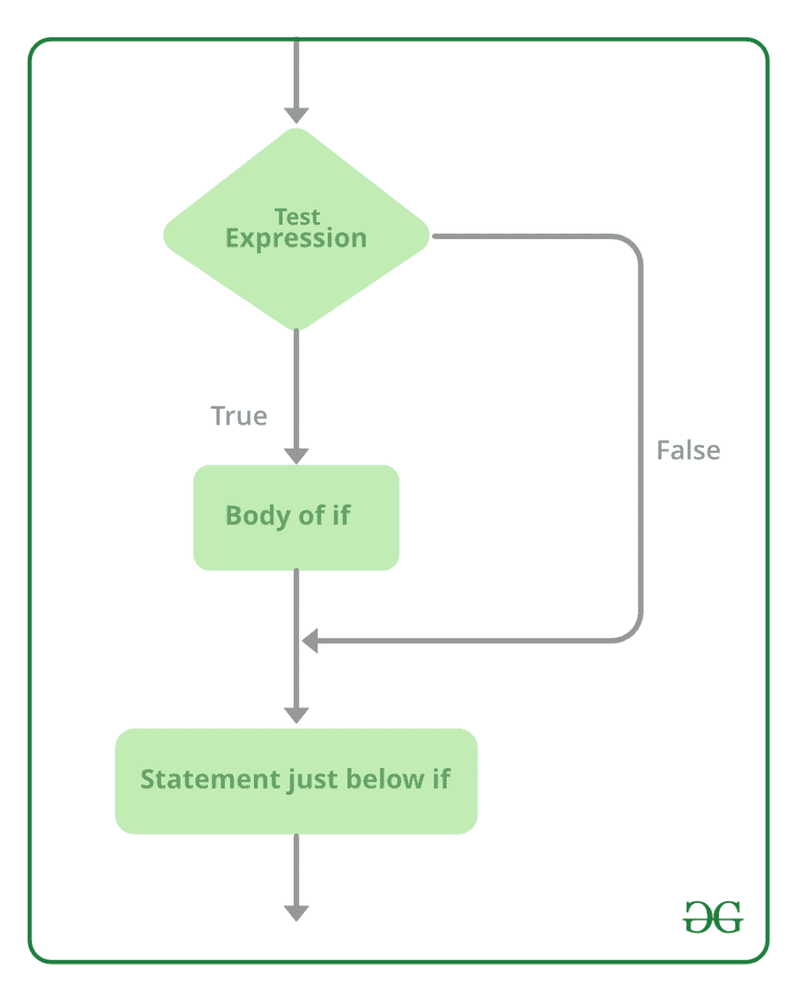

# c#–if 语句

> 原文:[https://www.geeksforgeeks.org/c-if-statement/](https://www.geeksforgeeks.org/c-if-statement/)

在 C#中，if 语句用于指示根据给定布尔表达式的值将执行哪个语句。当布尔表达式的值为真时，if 语句将执行给定的 then 语句，否则它将把控件返回到 if 语句之后的下一条语句。

*   在 C#中，您可以根据自己的需要将 if 语句与 then 语句或 else 语句一起使用。
*   然后语句包含单个或多个语句，这些语句用大括号({})括起来。对于单个语句，大括号可以是可选的，如果花括号{}不与 if 语句一起使用，则紧挨着它的语句仅被认为与 if 语句相关联。
*   那么语句可以是任何类型的，就像它可以包含另一个 if-else 语句。

**语法:**

```
if(condition)
{
    then statement;
}

```

**流程图:**



让我们借助给定的例子来讨论 if 语句:

**例 1:**

## C#

```
// C# program to demonstrate
// if statement
using System;

class GFG{

static public void Main()
{

    // Declaring and initializing variables
    string x = "GeeksforGeeks";
    string y = "GeeksforGeeks";

    // If statement
    if (x == y)
    {
        Console.WriteLine("Both strings are equal..!!");
    }

    // If statement
    if (x != y)
    {
         Console.WriteLine("Both strings are not equal..!!");
    }
}
}
```

**输出:**

```
Both strings are equal..!!

```

**说明:**在上面的例子中，我们有两个字符串，即 x 和 y，现在在第一个 if 语句中，我们将字符串 x 与字符串 y 进行比较，比较的结果为真。因此，然后块执行并打印“两个字符串相等..！! "。现在在第二个 if 语句中，我们检查两个字符串是否相等，但是字符串是相等的，所以这个 if 语句的 then 块不会执行。

**例 2:**

## C#

```
// C# program to demonstrate nested
// if statement 
using System;

class GFG{
static public void Main()
{

    // Declaring and initializing variables
    string emp_name = "Rohit";
    int salary = 10000;

    // If statement
    // Here if condition checks 
    // the employee name is equal to rohit
    if (emp_name == "Rohit")
    {

        // Nested if statement
        // Here if the salary of Rohit 
        // is greater than 50000 then 
        // he is eligible to pay tax
        // Otherwise not eligible
        if (salary > 50000)
        {
            Console.WriteLine("Eligible to pay tax");
        }
        else
        {
            Console.WriteLine("Not Eligible");
        }
    }
}
}
```

**输出:**

```
Not Eligible

```

**例 3:**

## C#

```
// C# program to illustrate if statement 
// Using AND, OR, NOT operators
using System;

class GFG{

static public void Main()
{

    // Declaring and initializing variables
    int x1 = 15;
    int x2 = 18;
    int x3 = 20;

    // If statement
    // Using AND operator
    if (x1 > 20 && x2 > 20)
    {
        Console.WriteLine("Enter group A");
    }

    // If statement
    // Using OR operator
    if (x1 < 30 || x3 == 20)
    {
        Console.WriteLine("Enter group B");
    }

    // If statement
    // Using NOT operator
    if (!(x1 > 20 && x2 > 20))
    {
        Console.WriteLine("Enter group C");
    }
}
}
```

**输出:**

```
Enter group B
Enter group C

```