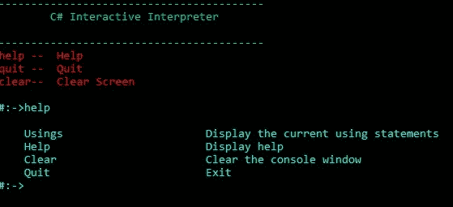
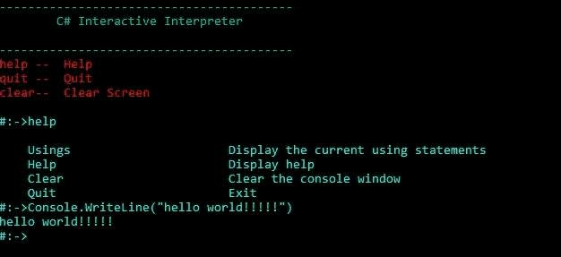

# C#交互解释器

> 原文:[https://www.geeksforgeeks.org/c-interactive-interpreter/](https://www.geeksforgeeks.org/c-interactive-interpreter/)

本文旨在展示交互 C#解释器开发借助[的分步实现。NET 框架](https://www.geeksforgeeks.org/introduction-to-net-framework/) codeDOM API，它使我们能够动态评估 [C#](https://www.geeksforgeeks.org/csharp-programming-language/) 代码表达式和语句，以测试迷你代码片段或脚本，或多或少类似于 Python 解释器。然而， [visual studio](https://www.geeksforgeeks.org/introduction-to-visual-studio/) 有足够的能力做到这一点，那么问题来了，我们为什么需要它？visual studio IDE 编译器通常每次都编译整个应用程序类，而不是在需要时编译一大块代码段。因此，该过程相对繁琐、耗时，并给文件系统带来过度的额外开销。
在这方面，有多个类将被雕刻出各种各样的功能。这个野心家应该精通。NET 技术，因为这个项目是一个基于控制台的应用程序，解释器给我们一个命令行方式的印象来操作命令。因此，下面的 C#代码片段是应用程序的入口点，通过合并所有其他辅助基本类的调用，从这里开始实际执行。在名为“程序”的入口点类中，我们发现横幅与自定义异常处理功能一起显示。
**program.cs**

## c sharp . c sharp . c sharp . c sharp

```cs
// Entry Point
class Program {

    static void Main(string[] args)
    {
        // verbose entry checking
        if (args.Length > 0 && args[0].Equals("--verbose",
           StringComparison.InvariantCultureIgnoreCase)) {
            Interactive.Context.VerboseTrace = true;
        }

        Trace.Listeners.Add(new ConsoleTraceListener());
        // Method call for welcome message
        Program.WriteWelcomeMessage();

        // Display #:-> on the shell
        while (Interactive.Context.Continue) {

            Console.Write("#:->");

            string text = Console.ReadLine();
            if (text == null) {
                return;
            }
            // Start the interactive shell by the function call
            try {
                string text2 = Interactive.Interpret(text);

                if (text2 != null) {
                    Console.WriteLine(text2);
                }
            }
            catch (TargetInvocationException ex) {
                Program.WriteExceptionMessage(ex.InnerException);
            }
            catch (Exception ex2) {
                Program.WriteExceptionMessage(ex2);
            }
        }
    }
    // Starts the Interactive shell, and display the welcome message
    private static void WriteWelcomeMessage()
    {
        Version version = Assembly.GetExecutingAssembly().GetName().Version;
        Console.ForegroundColor = ConsoleColor.Green;
        Console.WriteLine("-----------------------------------------");
        Console.WriteLine("\tC# Interactive Interpreter\n");
        Console.WriteLine("-----------------------------------------");
        Console.ForegroundColor = ConsoleColor.Red;
        Console.WriteLine("help --  Help");
        Console.WriteLine("quit --  Quit");
        Console.WriteLine("clear--  Clear Screen");
        Console.ForegroundColor = ConsoleColor.Cyan;
        Console.WriteLine();
    }
    // Exception handling section
    private static void WriteExceptionMessage(Exception ex)
    {
        Console.WriteLine("Exception of type '"
          + ex.GetType().Name + "' was thrown: "
                                  + ex.Message);
        if (Interactive.Context.VerboseTrace) {
            Console.WriteLine("StackTrace:");
            Console.WriteLine(ex.StackTrace);
            if (ex.InnerException != null) {
                Console.WriteLine("Inner Exception:");
                Console.WriteLine(ex.InnerException.Message);
                Console.WriteLine(ex.InnerException.StackTrace);
            }
        }
    }
}
```

**OutLong . cs**OutLong 类负责 essentials 变量的初始化，这将有助于在 shell 上打印结果。

## c sharp . c sharp . c sharp . c sharp

```cs
public class outString {
    // Properties declaration
    public string Value
    {
        get;
        private set;
    }
    public outString(string value)
    {
        this.Value = value;
    }
    public override string ToString()
    {
        return this.Value;
    }
}
```

**Interactive . cs**Interactive 类封装了导入 API、调用执行会话、正则表达式处理中所有必需的代码，并通过调用 CodeDOM 类来处理编译器和解释器 API 以及方法。总的来说，这是解释语句的唯一类，就像引擎一样。

## c sharp . c sharp . c sharp . c sharp

```cs
public static class Interactive {
    private static readonly CodeDomProvider Compiler;
    public static exeContext Context;
    static Interactive()
    {
        // C# API calling
        Interactive.Compiler = CodeDomProvider.CreateProvider("C#");
        Interactive.Context = new exeContext();
    }
    // empty the context
    public static void Reset()
    {
        Interactive.Context = new exeContext();
    }
    // Invoke the interpreter shell
    public static string Interpret(string sourceCode)
    {
        return sourceCode.CompileCodeSnippet().Invoke();
    }
    // Compile the bunch input C# code
    private static compiledCode CompileCodeSnippet(this string code)
    {
        if (Interactive.Context.MultiLine) {
            exeContext expr_11 = Interactive.Context;
            expr_11.MultiLineStatement += code;
            code = Interactive.Context.MultiLineStatement;
        }
        return code.Statement() || code.TypeMember();
    }
    // Compile the Particular C# statement
    private static compiledCode Statement(this string code)
    {
        return code.ExpressionStatement() || code.UsingStatement() || code.GenericStatement();
    }
    // Compile the "Using" statements
    private static compiledCode UsingStatement(this string code)
    {
        compiledCode result = null;
        if (code.TrimStart(new char[0]).StartsWith("using ")) {
            string text = code.TrimEnd(new char[0]);
            if (!text.EndsWith(";")) {
                text += ";";
            }
            string usingStatement = text;
            string source = Interactive.Program(null, null, null, null, usingStatement);
            custStatement statement = new custStatement(code, source.CompileFromSource());
            if (!statement.HasErrors) {
                Interactive.Context.UsingStatements.Add(text);
                result = statement;
            }
        }
        return result;
    }
    // In case custom statment compilation
    private static compiledCode GenericStatement(this string code)
    {
        compiledCode result = null;
        string statement = code + ";";
        string source = Interactive.Program(null, statement, null, null, null);
        custStatement statement2 = new custStatement(code, source.CompileFromSource());
        if (!statement2.HasErrors) {
            Interactive.Context.CallStack.Add(code + ";");
            result = statement2;
        }
        else {

            if (!Interactive.Context.MultiLine && (statement2.Errors[0].ErrorNumber == "CS1513" || statement2.Errors[0].ErrorNumber == "CS1528")) {
                Interactive.Context.MultiLine = true;
                exeContext expr_A2 = Interactive.Context;
                expr_A2.MultiLineStatement += code;
            }
        }
        return result;
    }
    // Section to execute "Clear" command
    private static compiledCode ExpressionStatement(this string expr)
    {
        string returnStatement = custProBuilds.ReturnStatement(expr);
        custExpression expression = new custExpression(expr, Interactive.Program(null, null, returnStatement, null, null).CompileFromSource());
        if (!expression.HasErrors && !expr.Trim().Equals("clear", StringComparison.OrdinalIgnoreCase)) {
            string text = "__" + Guid.NewGuid().ToString().Replace("-", "");
            Interactive.Context.CallStack.Add(string.Concat(new string[] {
                "var ",
                text,
                " = ",
                expr,
                ";" }));
        }
        return expression;
    }
    // Incorporate the "Program" class code
    public static string Program(string typeDeclaration = null, string statement = null, string returnStatement = null, string memberDeclaration = null, string usingStatement = null)
    {
        return custProBuilds.Build(Interactive.Context, typeDeclaration, statement, returnStatement, memberDeclaration, usingStatement);
    }
    // Incorporate the class type defined members code
    private static compiledCode TypeMember(this string source)
    {
        return source.TypeDeclaration() || source.MemberDeclaration() || source.FieldDeclaration();
    }
    // Incorporate the member declaration code
    private static compiledCode MemberDeclaration(this string code)
    {
        custMemDecl memberDeclaration = new custMemDecl(code, Interactive.Program(null, null, null, code, null).CompileFromSource());
        if (!memberDeclaration.HasErrors) {
            Interactive.Context.MemberDeclarations.Add(code);
        }
        return memberDeclaration;
    }
    // Incorporate the type declaration code and add them
    private static compiledCode TypeDeclaration(this string source)
    {
        string source2 = Interactive.Program(source, null, null, null, null);
        custTypeDecl typeDeclaration = new custTypeDecl(source, source2.CompileFromSource());
        if (!typeDeclaration.HasErrors) {
            Interactive.Context.TypeDeclarations.Add(source);
        }
        return typeDeclaration;
    }
    // Incorporate the class fields code
    private static compiledCode FieldDeclaration(this string code)
    {
        string text = code + ";";
        string memberDeclaration = text;
        custMemDecl memberDeclaration2 = new custMemDecl(code, Interactive.Program(null, null, null, memberDeclaration, null).CompileFromSource());
        if (!memberDeclaration2.HasErrors) {
            Interactive.Context.MemberDeclarations.Add(text);
        }
        return memberDeclaration2;
    }
    // Gather exception traces
    private static string Invoke(this compiledCode compiledCode)
    {
        if (Interactive.Context.MultiLine && !compiledCode.HasErrors) {
            Interactive.Context.MultiLine = false;
            Interactive.Context.MultiLineStatement = "";
        }
        if (!Interactive.Context.MultiLine && compiledCode.HasErrors) {
            Interactive.TraceErrorMessage(compiledCode);
        }
        if (!Interactive.Context.MultiLine && !compiledCode.HasErrors && (compiledCode is custExpression || compiledCode is custStatement)) {
            Interactive.Context.MultiLine = false;
            Interactive.Context.MultiLineStatement = "";
            object result = Interactive.InvokeCompiledResult(compiledCode.Results);
            if (compiledCode is custExpression) {
                return result.FormatOutput();
            }
        }
        return null;
    }
    // determine the error number in the code
    private static void TraceErrorMessage(compiledCode compiledCode)
    {
        Trace.TraceError(compiledCode.Errors[0].ErrorText);
        if (Interactive.Context.VerboseTrace) {
            Trace.TraceError(compiledCode.Errors[0].ErrorNumber);
        }
    }
    // Finally, invoke the concatenated code
    private static object InvokeCompiledResult(CompilerResults results)
    {
        Assembly compiledAssembly = results.CompiledAssembly;
        Type type = compiledAssembly.GetType("Wrapper");
        object obj = Activator.CreateInstance(type, null);
        MethodInfo method = type.GetMethod("Eval");
        return method.Invoke(obj, null);
    }
    // method to compile the whole code by incorporating the library class
    private static CompilerResults CompileFromSource(this string source)
    {
        CompilerParameters compilerParameters = new CompilerParameters{
            GenerateExecutable = false,
            GenerateInMemory = true
        };
        compilerParameters.ReferencedAssemblies.Add("System.Core.dll");
        compilerParameters.ReferencedAssemblies.Add(Assembly.GetExecutingAssembly().Location);
        compilerParameters.ReferencedAssemblies.Add("System.Xml.dll");
        compilerParameters.ReferencedAssemblies.Add("System.Xml.Linq.dll");
        compilerParameters.ReferencedAssemblies.Add("System.Windows.Forms.dll");
        foreach(string current in exeContext.Assemblies)
        {
            compilerParameters.ReferencedAssemblies.Add(current);
        }
        return Interactive.Compiler.CompileAssemblyFromSource(compilerParameters, new string[] {
                                                                                      source });
    }
}
```

**exeContext . cs**exeContext 将所有类型声明、使用语句中的类、程序集和调用堆栈加载到当前上下文中。

## c sharp . c sharp . c sharp . c sharp

```cs
public class exeContext {
    // Loads using, assembly, type declaration, and member function in linked list
    public static List<string> Assemblies = new List<string>();
    public IList<string> CallStack = new List<string>();
    public IList<string> TypeDeclarations = new List<string>();
    public List<string> MemberDeclarations = new List<string>();
    public List<string> UsingStatements = new List<string>();

    // properties for single, multiline, verbose, and context handling
    public bool MultiLine
    {
        get;
        set;
    }
    public string MultiLineStatement
    {
        get;
        set;
    }
    public bool VerboseTrace
    {
        get;
        set;
    }
    public bool Continue
    {
        get;
        set;
    }
    public exeContext()
    {
        this.Continue = true;
        this.MultiLineStatement = "";
    }
    // Load the executed assembly into the current context
    public static void LoadAssembly(string name)
    {
        FileInfo fileInfo = new FileInfo(name);
        FileInfo fileInfo2 = new FileInfo(Assembly.GetExecutingAssembly().Location);
        if (fileInfo.DirectoryName != fileInfo2.DirectoryName) {
            if (fileInfo2.DirectoryName != null) {
                if (!File.Exists(Path.Combine(fileInfo2.DirectoryName, fileInfo.Name))) {
                    fileInfo.CopyTo(Path.Combine(fileInfo2.DirectoryName, fileInfo.Name), true);
                }
                exeContext.Assemblies.Add(fileInfo.Name);
                return;
            }
        }
        else {
            exeContext.Assemblies.Add(name);
        }
    }
}
```

**custproubuild . cs**交互编译中另一个重要的类，它以字符串模式获取代码指令，并将它们串联起来，最后以内联详细模式进行解释。

## c sharp . c sharp . c sharp . c sharp

```cs
public class exeContext
{
    // Loads using, assembly, type declaration, and member function in linked list
    public static List<string> Assemblies = new List<string>();
    public IList<string> CallStack = new List<string>();
    public IList<string> TypeDeclarations = new List<string>();
    public List<string> MemberDeclarations = new List<string>();
    public List<string> UsingStatements = new List<string>();
    // properties for single, multiline, verbose, and context handling
    public bool MultiLine
    {
        get;
        set;
    }

    public string MultiLineStatement
    {
        get;
        set;
    }

    public bool VerboseTrace
    {
        get;
        set;
    }

    public bool Continue
    {
        get;
        set;
    }

    public exeContext()
    {
        this.Continue = true;
        this.MultiLineStatement = "";
    }

    // Load the executed assembly into the current context
    public static void LoadAssembly(string name)
    {
        FileInfo fileInfo = new FileInfo(name);
        FileInfo fileInfo2 = new FileInfo(Assembly.GetExecutingAssembly().Location);
        if (fileInfo.DirectoryName != fileInfo2.DirectoryName)
        {
            if (fileInfo2.DirectoryName != null)
            {
                if (!File.Exists(Path.Combine(fileInfo2.DirectoryName, fileInfo.Name)))
                {
                    fileInfo.CopyTo(Path.Combine(fileInfo2.DirectoryName, fileInfo.Name), true);
                }

                exeContext.Assemblies.Add(fileInfo.Name);
                return;
            }
        }
        else
        {
            exeContext.Assemblies.Add(name);
        }
    }
}
```

**cust output . cs**cust output 类通过生成计算结果的 XML 文件来显示解释的 C#代码的输出，然后以有效的形式打印输出。此类接受各种类型的输入，包括数组、字典、XML、可枚举、字符串，并根据传递的值生成输出。

## c sharp . c sharp . c sharp . c sharp

```cs
// Abstract class for an exception related properties declaration
public abstract class compiledCode
{
    public string Source
    {
        get;
        set;
    }

    public CompilerResults Results
    {
        get;
        set;
    }

    public CompilerErrorCollection Errors
    {
        get;
        set;
    }

    public bool HasErrors
    {
        get
        {
            return this.Errors.HasErrors;
        }
    }

    protected compiledCode(string source, CompilerResults results)
    {
        this.Source = source;
        this.Results = results;
        this.Errors = this.Results.Errors;
    }

    public static compiledCode operator |(compiledCode a, compiledCode b)
    {
        if (a == null)
        {
            return b;
        }

        if (b == null)
        {
            return a;
        }

        if (!b.HasErrors)
        {
            return b;
        }

        return a;
    }

    public static bool operator false (compiledCode a)
    {
        return false;
    }

    public static bool operator true (compiledCode a)
    {
        return a != null && !a.HasErrors;
    }
}
```

**compileCode.cs**
此外，compileCode 类用于声明一些有助于代码解释和处理意外异常发生的基本属性。

## c sharp . c sharp . c sharp . c sharp

```cs
// Abstract class for an exception related properties declaration
public abstract class compiledCode {

    public string Source
    {
        get;
        set;
    }
    public CompilerResults Results
    {
        get;
        set;
    }
    public CompilerErrorCollection Errors
    {
        get;
        set;
    }
    public bool HasErrors
    {
        get
        {
            return this.Errors.HasErrors;
        }
    }
    protected compiledCode(string source, CompilerResults results)
    {
        this.Source = source;
        this.Results = results;
        this.Errors = this.Results.Errors;
    }
    public static compiledCode operator | (compiledCode a, compiledCode b)
    {
        if (a == null) {
            return b;
        }
        if (b == null) {
            return a;
        }
        if (!b.HasErrors) {
            return b;
        }
        return a;
    }
    public static bool operator false(compiledCode a)
    {
        return false;
    }
    public static bool operator true(compiledCode a)
    {
        return a != null && !a.HasErrors;
    }
}
```

**其他类**除了上面的重要类之外，还有其他一些和自定义表达式、自定义成员以及下面声明的类型相关的琐碎类代码，它们是相互继承的。

## c sharp . c sharp . c sharp . c sharp

```cs
// Custom Expression Handling
public class custExpression : custStatement {
    public custExpression(string source, CompilerResults results)
        : base(source, results)
    {
    }
}
// Custom Member Declaration
public class custMemDecl : cusTypeMem {
    public custMemDecl(string source, CompilerResults results)
        : base(source, results)
    {
    }
}
// For Custom statement handling
public class custStatement : compiledCode {
    public custStatement(string source, CompilerResults results)
        : base(source, results)
    {
    }
}
// For custom type declaration
public class custTypeDecl : cusTypeMem {
    public custTypeDecl(string source, CompilerResults compilerResults)
        : base(source, compilerResults)
    {
    }
}
// Custom Members Declaration
public class cusTypeMem : compiledCode {

    protected cusTypeMem(string source, CompilerResults results)
        : base(source, results)
    {
    }
}
```

在将上述类声明合并到 visual studio 2015 或更高版本的内聚项目解决方案中后。成功构建和编译项目后，以下命令将显示为结果，如下所示。



最后，现在我们可以享受 C#代码指令的即时执行(就像我们执行 python 指令代码一样)，我们编写代码并按 enter 键的动作如下；



这个构造是一个简单的 C#解释器，支持独立命令的命令行编译。它接受内联 C#代码指令，然后动态编译它，最后像 Python 解释器一样当场执行生成的程序集。