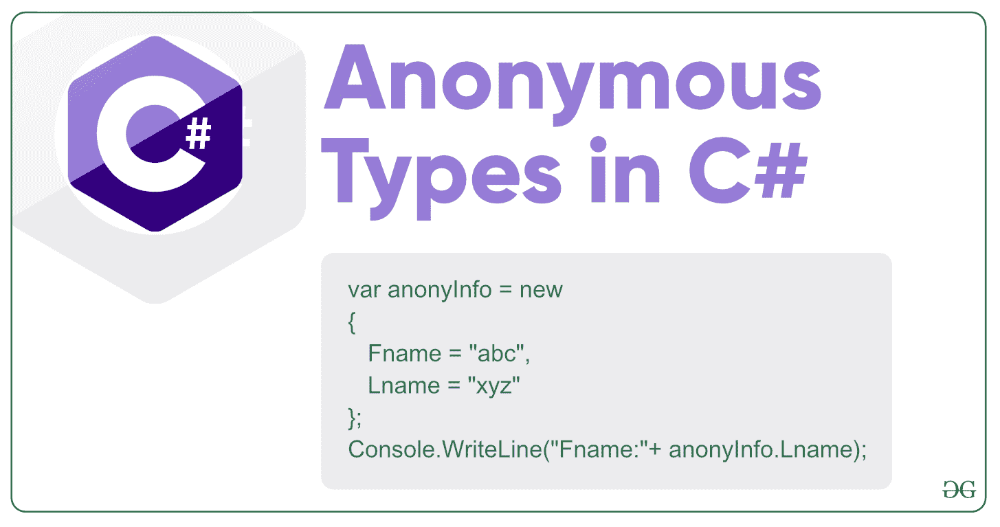

# 什么是 C#中的匿名类型？

> 原文:[https://www.geeksforgeeks.org/c-sharp-anonymous-types/](https://www.geeksforgeeks.org/c-sharp-anonymous-types/)

C#中的匿名类型是没有名称的类型，或者你可以说创建了新的类型而没有定义它们。在 *C# 3.0* 中介绍。它是一种临时数据类型，是根据您在对象初始值设定项中插入的数据推断出来的。或者换句话说，匿名类型提供了一种将一组只读对象组合成一个没有任何显式类型的对象的有效方法。匿名类型的类型由编译器根据分配给其属性的值自动生成。这些最适合*使用和投掷*类型。



在上图中，我们通过在对象初始化器中使用“ *new* ”关键字来创建匿名类型

**要点:**

*   源自**系统。对象**类，也是密封类。因此，匿名类型的属性是只读的，这意味着您不能更改它们的值。
*   它在 Visual Studio 中也有智能感知支持。
*   它可以包含一个或多个只读属性。
*   它不包含类成员，如事件、方法等。
*   用于初始化属性的表达式不是 null、匿名方法或指针类型。
*   您也可以创建匿名类型数组。
*   除了对象之外，它不能被强制转换为任何其他类型。
*   它是引用类型。
*   不允许创建匿名类型的字段、属性、事件或方法的返回类型。
*   不允许将方法、属性、构造函数、索引器的形式参数声明为匿名类型。
*   The **scope of the anonymous type** is always limited to the method in which they are defined. Due to their local scope, you are not allowed to pass an anonymous type to another method, but you can pass it to those methods which can accept dynamic type parameters. As shown in the below example.

    **注意:**一般不建议使用动态类型传递匿名类型。

    **示例:**

    ```
    // C# program to illustrate how a 
    // method accept anonymous type as 
    // a parameter using dynamic type
    using System;

    public class GFG {

        // Anonymous type object is passed in the 
        // method which has dynamic type parameters
        static public void mymethod(dynamic val)
        {
            Console.WriteLine(val.s_id);
            Console.WriteLine(val.s_name);
            Console.WriteLine(val.language);
        }

        // Main method
        static public void Main()
        {

            // Anonymous type object
            var anony_object = new {s_id = 134, 
                                    s_name = "Siya", 
                                 language = "Ruby"};

            // Calling mymethod
            mymethod(anony_object);
        }
    }
    ```

    **输出:**

    ```
    134
    Siya
    Ruby

    ```

在 C#中，您可以创建一个带有 **new** 关键字的匿名类型对象，而不需要它的类定义，并且 **var** 用于保存匿名类型的引用。如下例所示， *anony_object* 是一个匿名类型的对象，它包含三个属性，分别是 *s_id* 、 *s_name* 、*语言*。

**示例:**

```
// C# program to illustrate the
// concept of anonymous types
using System;

public class GFG {

    // Main method
    static public void Main()
    {

        // Creating and initializing anonymous object
        var anony_object = new {s_id = 109,
                                s_name = "Sohan", 
                               language = "C#" };

        // Accessing the object properties
        Console.WriteLine("Student id: " + anony_object.s_id);
        Console.WriteLine("Student name: " + anony_object.s_name);
        Console.WriteLine("Language: " + anony_object.language);
    }
}
```

**Output:**

```
Student id: 109
Student name: Sohan
Language: C#

```

#### 嵌套匿名类型

在 C#中，一个匿名类型可以有另一个匿名类型作为属性。嵌套匿名类型在 Visual Studio 中具有智能感知支持。如下例所示， *anony_object* 是一个匿名类型对象，它包含另一个匿名类型对象，即 *anony_ob* :

**示例:**

```
// C# program to illustrate the concept
// of nested anonymous types
using System;

public class GFG {

    // Main method
    static public void Main()
    {

        // Creating and initializing nested anonymous object
        var anony_object = new {s_id = 149, s_name = "Soniya", language = "C#",
                                anony_ob = new { email = "soniya45@gmail.com"}};

        // Accessing the object properties
        Console.WriteLine("Student id: " + anony_object.s_id);
        Console.WriteLine("Student name: " + anony_object.s_name);
        Console.WriteLine("Language: " + anony_object.language);
        Console.WriteLine("Email: " + anony_object.anony_ob.email);
    }
}
```

**Output:**

```
Student id: 149
Student name: Soniya
Language: C#
Email: soniya45@gmail.com

```

#### LINQ 的匿名类型

在 LINQ，你可以使用匿名类型。在 LINQ， *select* 子句生成匿名类型，这样在查询中就可以包含类中没有定义的属性。如下例所示，极客类包含四个属性:A_no、Aname、语言和年龄。但是结果我们只需要 *A_no* 、 *Aname* 和*语言*，所以我们使用一个选择查询来创建一个匿名类型的结果，该结果只包含 A_no、Aname 和语言。

**示例:**

```
// C# program to illustrate the 
// concept of anonymous type in LINQ
using System;
using System.Collections.Generic;
using System.Linq;

class Geeks {

    public int A_no;
    public string Aname;
    public string language;
    public int age;
}

class GFG {

    // Main method
    static void Main()
    {
        List<Geeks> g = new List<Geeks> 
        {

            new Geeks{ A_no = 123, Aname = "Shilpa",
                        language = "C#", age = 23 },
            new Geeks{ A_no = 124, Aname = "Shilpi",
                        language = "C#", age = 20 },
            new Geeks{ A_no = 125, Aname = "Soniya", 
                        language = "C#", age = 22 },
            new Geeks{ A_no = 126, Aname = "Sonaly", 
                        language = "C#", age = 25 },

        };

        // select query showing result
        // using anonymous type
        var anony_ob = from geek in g select new {geek.A_no, geek.Aname, geek.language};
        foreach(var i in anony_ob)
        {
            Console.WriteLine("Author id = " + i.A_no + "\nAuthor name = " 
                                 + i.Aname + "\nLanguage = " + i.language);
            Console.WriteLine();
        }
    }
}
```

**Output:**

```
Author id = 123
Author name = Shilpa
Language = C#

Author id = 124
Author name = Shilpi
Language = C#

Author id = 125
Author name = Soniya
Language = C#

Author id = 126
Author name = Sonaly
Language = C#

```