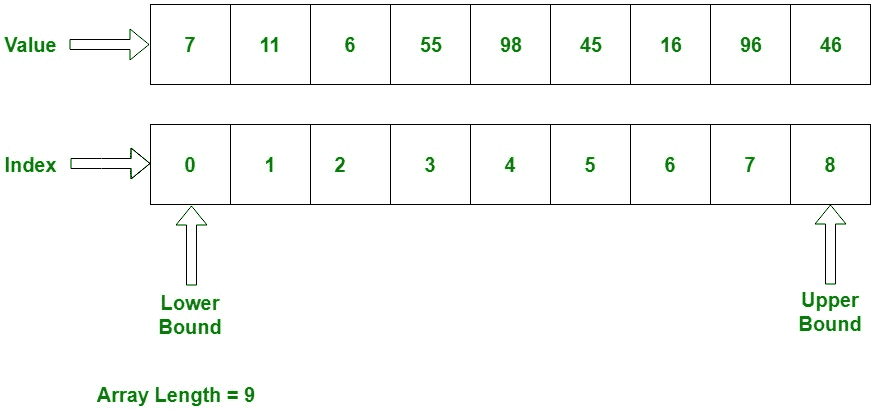

# C# |数组

> 原文:[https://www.geeksforgeeks.org/c-sharp-arrays/](https://www.geeksforgeeks.org/c-sharp-arrays/)

数组是一组相似类型的变量，由一个通用名称引用。每个数据项被称为数组的一个元素。元素的数据类型可以是任何有效的数据类型，如 char、int、float 等。并且元素被存储在连续的位置。**数组的长度**指定数组中存在的元素数量。在 **[C# ](https://www.geeksforgeeks.org/introduction-to-c-sharp/)** 中，数组的内存分配是动态完成的。数组是对象的一种，因此使用预定义的函数很容易找到它们的大小。数组中的变量是有序的，每个变量都有一个从 0 开始的索引。C# 中的数组与 C/C++中的不同。

#### 

C# 中关于数组需要记住的要点

*   在 C# 中，所有数组都是动态分配的。
*   因为数组是 C# 中的对象，所以我们可以使用成员长度来找到它们的长度。这与 C/C++不同，在 C/c++中，我们使用 sizeof 运算符来查找长度。
*   C# 数组变量也可以像其他变量一样在数据类型后用[]声明。
*   数组中的变量是有序的，每个变量都有一个从 0 开始的索引。
*   C# 数组是基类型**系统的对象。阵列**。
*   数值数组和引用类型元素的默认值分别设置为零和空。
*   交错数组元素是引用类型，初始化为 null。
*   数组元素可以是任何类型，包括数组类型。
*   数组类型是从抽象基类型 Array 派生的引用类型。这些类型实现了 **IEnumerable** ，为此，它们对 C# 中的所有数组使用 foreach 迭代。

根据数组的定义，数组可以包含基元数据类型以及类的对象。每当使用原语数据类型时，实际值必须存储在连续的内存位置。对于类的对象，实际的对象存储在堆段中。

下图显示了数组如何按顺序存储值:
[](https://media.geeksforgeeks.org/wp-content/uploads/C-Arrays.jpg)

**说明:**
指数从 0 开始，存储数值。我们还可以在数组中存储固定数量的值。每当数组索引未达到数组大小时，它将按顺序增加 1。

#### 

数组声明

**语法:**

```cs
< Data Type > [ ] < Name_Array >

```

**这里，**
<数据类型>:定义数组的元素类型。
[ ]:定义数组的大小。
<名 _ 阵>:是阵名。

**示例:**

```cs
int[] x;  // can store int values
string[] s; // can store string values
double[] d; // can store double values
Student[] stud1; // can store instances of Student class which is custom class

```

**注意:**只有数组的声明不会给数组分配内存。对于那个数组必须初始化。

#### 

数组初始化

如前所述，数组是一种引用类型，因此 **new** 关键字用于创建数组的实例。我们可以在索引的帮助下赋值初始化单个数组元素。

**语法:**

```cs
type [ ] < Name_Array > = new < datatype > [size];

```

在这里，类型指定正在分配的数据类型，大小指定数组中的元素数量，名称 _ 数组是数组变量的名称。而**新的**会根据数组的大小给数组分配内存。

**示例:展示数组声明和初始化的不同方式**

**例 1 :**

```cs
// defining array with size 5\. 
// But not assigns values
int[] intArray1 = new int[5]; 

```

上面的语句声明并初始化了可以存储五个 int 值的 int 类型数组。数组大小在方括号([])中指定。

**例 2 :**

```cs
// defining array with size 5 and assigning
// values at the same time
int[] intArray2 = new int[5]{1, 2, 3, 4, 5};

```

上面的语句与相同，但它为{}中的每个索引赋值。

**例 3 :**

```cs
// defining array with 5 elements which 
// indicates the size of an array
int[] intArray3 = {1, 2, 3, 4, 5};

```

在上面的语句中，直接初始化数组的值，而不取其大小。因此，数组大小将自动是直接取值的数量。

#### 

声明后数组的初始化

数组可以在声明后初始化。不需要使用 **new** 关键字同时声明和初始化。但是，在声明后初始化数组时，必须使用新的关键字进行初始化。它不能仅通过赋值来初始化。

**示例:**

> //数组
> 字符串[] str1，str2 的声明；
> 
> //数组
> 的初始化 str1 =新字符串[5]{“元素 1”、“元素 2”、“元素 3”、“元素 4”、“元素 5”}；
> 
> str2 =新字符串[5]{“元素 1”、“元素 2”、“元素 3”、“元素 4”、“元素 5”}；

**注意:**未给出大小的初始化在 C# 中无效。它会给出编译时错误。

**示例:初始化数组的声明错误**

> //编译时错误:必须给出数组的大小
> int[]intArray = new int[]；
> 
> //错误:数组
> 字符串[] str1 初始化错误；
> str1 = {“元素 1”、“元素 2”、“元素 3”、“元素 4”}；

#### 

访问数组元素

在初始化时，我们可以赋值。但是，我们也可以在声明和初始化之后，使用数组的索引随机分配数组的值。我们可以通过索引来访问数组值，将元素的索引放在方括号内，数组名为
**示例:**

```cs
//declares & initializes int type array
int[] intArray = new int[5];

// assign the value 10 in array on its index 0
intArray[0] = 10; 

// assign the value 30 in array on its index 2
intArray[2] = 30;

// assign the value 20 in array on its index 1
intArray[1] = 20;

// assign the value 50 in array on its index 4
intArray[4] = 50;

// assign the value 40 in array on its index 3
intArray[3] = 40;

// Accessing array elements using index
intArray[0];  //returns 10
intArray[2];  //returns 30

```

**实现:** **使用不同的循环访问数组元素**

```cs
// C# program to illustrate creating an array
// of integers, puts some values in the array,
// and prints each value to standard output.
using System;
namespace geeksforgeeks {

class GFG {

    // Main Method
    public static void Main()
    {

        // declares an Array of integers.
        int[] intArray;

        // allocating memory for 5 integers.
        intArray = new int[5];

        // initialize the first elements
        // of the array
        intArray[0] = 10;

        // initialize the second elements
        // of the array
        intArray[1] = 20;

        // so on...
        intArray[2] = 30;
        intArray[3] = 40;
        intArray[4] = 50;

        // accessing the elements
        // using for loop
        Console.Write("For loop :");
        for (int i = 0; i < intArray.Length; i++)
            Console.Write(" " + intArray[i]);

        Console.WriteLine("");
        Console.Write("For-each loop :");

        // using for-each loop
        foreach(int i in intArray)
            Console.Write(" " + i);

        Console.WriteLine("");
        Console.Write("while loop :");

        // using while loop
        int j = 0;
        while (j < intArray.Length) {
            Console.Write(" " + intArray[j]);
            j++;
        }

        Console.WriteLine("");
        Console.Write("Do-while loop :");

        // using do-while loop
        int k = 0;
        do
        {
            Console.Write(" " + intArray[k]);
            k++;
        } while (k < intArray.Length);
    }
}
}
```

**输出:**

```cs
For loop : 10 20 30 40 50
For-each loop : 10 20 30 40 50
while loop : 10 20 30 40 50
Do-while loop : 10 20 30 40 50

```

#### 

一维数组

在这个数组中只包含一行用于存储值。该数组的所有值从 0 到数组大小连续存储。例如，声明 5 个整数的一维数组:

```cs
int[] arrayint = new int[5];

```

上述数组包含从 arrayint[0]到 arrayint[4]的元素。在这里，新的操作符必须创建数组，并通过它们的默认值初始化它的元素。上例中，所有元素都由零初始化，因为它是 int 类型。

**示例:**

```cs
// C# program to creating an array
// of the string as week days, store 
// day values in the weekdays,
// and prints each value.
using System;
namespace geeksforgeeks {

class GFG {

    // Main Method
    public static void Main()
    {

        // declares a 1D Array of string.
        string[] weekDays;

        // allocating memory for days.
        weekDays = new string[] {"Sun", "Mon", "Tue", "Wed", 
                                       "Thu", "Fri", "Sat"};

        // Displaying Elements of array
        foreach(string day in weekDays)
            Console.Write(day + " ");
    }
}
}
```

**输出:**

```cs
Sun Mon Tue Wed Thu Fri Sat 

```

#### 

多维数组

多维数组包含多行来存储值。它在 [C# ](https://www.geeksforgeeks.org/introduction-to-c-sharp/) 中也被称为**矩形阵列**，因为它的每行长度都是相同的。可以是 **2D 阵**或 **3D 阵**或更多。要存储和访问数组的值，需要嵌套循环。多维数组的声明、初始化和访问如下:

```cs
// creates a two-dimensional array of 
// four rows and two columns.
int[, ] intarray = new int[4, 2];

//creates an array of three dimensions, 4, 2, and 3
int[,, ] intarray1 = new int[4, 2, 3];

```

**示例:**

```cs
// C# program to illustrate creating
// an multi- dimensional array
// puts some values in the array,
// and print them
using System;
namespace geeksforgeeks {

class GFG {

    // Main Method
    public static void Main()
    {

        // Two-dimensional array
        int[, ] intarray = new int[, ] { { 1, 2 },
                                         { 3, 4 }, 
                                         { 5, 6 }, 
                                         { 7, 8 } };

        // The same array with dimensions 
        // specified 4 row and 2 column.
        int[, ] intarray_d = new int[4, 2] { { 1, 2 }, { 3, 4 }, 
                                             { 5, 6 }, { 7, 8 } };

        // A similar array with string elements.
        string[, ] str = new string[4, 2] { { "one", "two" }, 
                                            { "three", "four" }, 
                                            { "five", "six" }, 
                                            { "seven", "eight" } };

        // Three-dimensional array.
        int[,, ] intarray3D = new int[,, ] { { { 1, 2, 3 }, 
                                             { 4, 5, 6 } },
                                             { { 7, 8, 9 }, 
                                           { 10, 11, 12 } } };

        // The same array with dimensions 
        // specified 2, 2 and 3.
        int[,, ] intarray3Dd = new int[2, 2, 3] { { { 1, 2, 3 }, 
                                                  { 4, 5, 6 } }, 
                                                  { { 7, 8, 9 }, 
                                                { 10, 11, 12 } } };

        // Accessing array elements.
        Console.WriteLine("2DArray[0][0] : " + intarray[0, 0]);
        Console.WriteLine("2DArray[0][1] : " + intarray[0, 1]);
        Console.WriteLine("2DArray[1][1] : " + intarray[1, 1]);
        Console.WriteLine("2DArray[2][0] " + intarray[2, 0]);

        Console.WriteLine("2DArray[1][1] (other) : " 
                                 + intarray_d[1, 1]);

        Console.WriteLine("2DArray[1][0] (other)" 
                             + intarray_d[1, 0]);

        Console.WriteLine("3DArray[1][0][1] : " 
                           + intarray3D[1, 0, 1]);

        Console.WriteLine("3DArray[1][1][2] : " 
                          + intarray3D[1, 1, 2]);

        Console.WriteLine("3DArray[0][1][1] (other): " 
                             + intarray3Dd[0, 1, 1]);

        Console.WriteLine("3DArray[1][0][2] (other): " 
                             + intarray3Dd[1, 0, 2]);

        // using nested loop show string elements
        Console.WriteLine("To String element");
        for (int i = 0; i < 4; i++)
            for (int j = 0; j < 2; j++)
                Console.Write(str[i, j] + " ");
    }
}
}
```

**输出:**

```cs
2DArray[0][0] : 1
2DArray[0][1] : 2
2DArray[1][1] : 4
2DArray[2][0] 5
2DArray[1][1] (other) : 4
2DArray[1][0] (other)3
3DArray[1][0][1] : 8
3DArray[1][1][2] : 12
3DArray[0][1][1] (other): 5
3DArray[1][0][2] (other): 9
To String element
one two three four five six seven eight 

```

#### 

交错数组

元素为数组的数组称为交错数组，意思是“**数组的数组**”。交错的数组元素可以具有不同的尺寸和大小。下面是展示如何声明、初始化和访问交错数组的示例。

**示例:**

```cs
// C# program to single-dimensional jagged array
// that contains two single-dimensional array
// elements of different sizes.
using System;
namespace geeksforgeeks {

class GFG {

    // Main Method
    public static void Main()
    {

        /*----------2D Array---------------*/
        // Declare the array of two elements:
        int[][] arr = new int[2][];

        // Initialize the elements:
        arr[0] = new int[5] { 1, 3, 5, 7, 9 };
        arr[1] = new int[4] { 2, 4, 6, 8 };

        // Another way of Declare and
        // Initialize of elements
        int[][] arr1 = { new int[] { 1, 3, 5, 7, 9 },
                         new int[] { 2, 4, 6, 8 } };

        // Display the array elements:
        for (int i = 0; i < arr.Length; i++)
        {
            System.Console.Write("Element [" + i + "] Array: ");
            for (int j = 0; j < arr[i].Length; j++)
                Console.Write(arr[i][j] + " ");
            Console.WriteLine();
        }

        Console.WriteLine("Another Array");

        // Display the another array elements:
        for (int i = 0; i < arr1.Length; i++) 
        {
            System.Console.Write("Element [" + i + "] Array: ");
            for (int j = 0; j < arr1[i].Length; j++)
                Console.Write(arr1[i][j] + " ");
            Console.WriteLine();
        }
    }
}
}
```

**输出:**

```cs
Element [0] Array: 1 3 5 7 9 
Element [1] Array: 2 4 6 8 
Another Array
Element [0] Array: 1 3 5 7 9 
Element [1] Array: 2 4 6 8 

```

交错数组和多维数组可以混合使用。交错数组是数组的数组，因此它的元素是引用类型，并且被初始化为 null。
**示例:**声明并初始化包含三个不同大小的二维数组元素的一维交错数组。

```cs
// C# program to single-dimensional jagged array
// that contains three two-dimensional array
// elements of different sizes.
using System;
namespace geeksforgeeks {

class GFG {

// Main Method
public static void Main()
{

    int[][, ] arr = new int[3][, ] {new int[, ] {{1, 3}, {5, 7}},
                                    new int[, ] {{0, 2}, {4, 6}, {8, 10}},
                                    new int[, ] {{11, 22}, {99, 88}, {0, 9}}};

    // Display the array elements:
    for (int i = 0; i < arr.Length; i++)
    {
        int x = 0;
        for (int j = 0; j < arr[i].GetLength(x); j++) 
        {
            for (int k = 0; k < arr[j].Rank; k++)
                Console.Write(" arr[" + i + "][" + j + ", " + k + "]:" 
                                               + arr[i][j, k] + " ");
            Console.WriteLine();
        }
        x++;
        Console.WriteLine();
    }
}
}
}
```

**输出:**

```cs
 arr[0][0, 0]:1  arr[0][0, 1]:3 
 arr[0][1, 0]:5  arr[0][1, 1]:7 

 arr[1][0, 0]:0  arr[1][0, 1]:2 
 arr[1][1, 0]:4  arr[1][1, 1]:6 
 arr[1][2, 0]:8  arr[1][2, 1]:10 

 arr[2][0, 0]:11  arr[2][0, 1]:22 
 arr[2][1, 0]:99  arr[2][1, 1]:88 
 arr[2][2, 0]:0  arr[2][2, 1]:9 

```

**需要记住的要点:**

*   GetLength(int):返回数组第一维的元素个数。
*   当使用交错数组时，如果索引不存在，那么它会抛出一个异常，即 IndexOutOfRange。