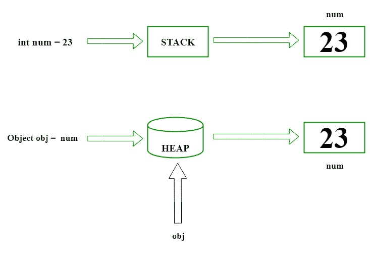
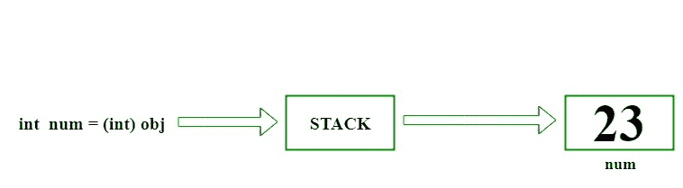

# C# |装箱拆箱

> 原文:[https://www.geeksforgeeks.org/c-sharp-boxing-unboxing/](https://www.geeksforgeeks.org/c-sharp-boxing-unboxing/)

#### 前提条件:[c#中的数据类型](https://www.geeksforgeeks.org/c-data-types-2/)

拳击和拆箱是[**【c#**](https://www.geeksforgeeks.org/introduction-to-c-sharp/)中的一个重要概念。C# Type 系统包含 [**三种数据类型**](https://www.geeksforgeeks.org/c-data-types-2/) : **值类型(int、char 等)**、**引用类型(object)** 和**指针类型**。基本上，它将值类型转换为引用类型，反之亦然。装箱和取消装箱实现了类型系统的统一视图，其中任何类型的值都可以被视为对象。

### 

**c#打拳**

*   转换一个 **[值类型](https://www.geeksforgeeks.org/c-data-types-2/)(字符，整型等)的过程。)到一个[参考型](https://www.geeksforgeeks.org/c-data-types-2/)(物体)**叫做**拳**。
*   装箱是使用对象类型(超类型)的隐式转换过程。
*   值类型始终存储在堆栈中。引用的类型存储在堆中。
*   **例:**

    ```cs
    int num = 23; // 23 will assigned to num
    Object Obj = num; // Boxing

    ```

*   **Description :** First declare a value type variable (num), which is integer type and assigned it with value 23\. Now create a references object type (obj) and applied Explicit operation which results in num value type to be copied and stored in object reference type obj as shown in below figure :

    [](https://media.geeksforgeeks.org/wp-content/uploads/Boxing.jpg)

*   让我们用 C#编程代码来理解**拳击**:

    ```cs
    // C# implementation to demonstrate
    // the Boxing
    using System;
    class GFG {

        // Main Method
        static public void Main()
        {

            // assigned int value
            // 2020 to num
            int num = 2020;

            // boxing
            object obj = num;

            // value of num to be change
            num = 100;

            System.Console.WriteLine
            ("Value - type value of num is : {0}", num);
            System.Console.WriteLine
            ("Object - type value of obj is : {0}", obj);
        }
    }
    ```

    **输出:**

    ```cs
    Value - type value of num is : 100
    Object - type value of obj is : 2020

    ```

### 

**在 C#** 中脱氧

*   将 **[参考类型](https://www.geeksforgeeks.org/c-data-types-2/)转换为[值类型](https://www.geeksforgeeks.org/c-data-types-2/)** 的过程称为**拆箱**。
*   它是显式的转换过程。
*   **例:**

    ```cs
    int num = 23;         // value type is int and assigned value 23
    Object Obj = num;    // Boxing
    int i = (int)Obj;    // Unboxing

    ```

*   **Description :** Declaration a value type variable (num), which is integer type and assigned with integer value 23\. Now, create a reference object type (obj).The explicit operation for boxing create an value type integer i and applied casting method. Then the referenced type residing on Heap is copy to stack as shown in below figure :

    [](https://media.geeksforgeeks.org/wp-content/uploads/Unboxing.jpg)

*   让我们来理解**用 C#编程代码打开**的锁:

    ```cs
    // C# implementation to demonstrate
    // the Unboxing
    using System;
    class GFG {

        // Main Method
        static public void Main()
        {

            // assigned int value
            // 23 to num
            int num = 23;

            // boxing
            object obj = num;

            // unboxing
            int i = (int)obj;

            // Display result
            Console.WriteLine("Value of ob object is : " + obj);
            Console.WriteLine("Value of i is : " + i);
        }
    }
    ```

    **输出:**

    ```cs
    Value of ob object is : 23
    Value of i is : 23

    ```