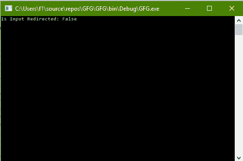

# C# |检查控制台上的输入是否重定向

> 原文:[https://www . geesforgeks . org/c-sharp-检查输入是否在控制台上重定向/](https://www.geeksforgeeks.org/c-sharp-check-if-input-is-redirected-on-the-console-or-not/)

给定 C#中的正常控制台，任务是检查输入是否在控制台上被重定向。

**方法:**这可以使用 C#中系统包的**控制台**类中的【This 腐败属性来完成。此属性返回一个布尔值，说明输入是否被重定向。

**程序:**

```
// C# program to illustrate the
// Console.IsInputRedirected Property
using System;
using System.Collections.Generic;
using System.Linq;
using System.Text;
using System.Threading.Tasks;

namespace GFG {

class Program {

    static void Main(string[] args)
    {

        // Check if Input is Redirected
        Console.WriteLine("Is Input Redirected: {0}",
                          Console.IsInputRedirected);
    }
}
}
```

**输出:**

