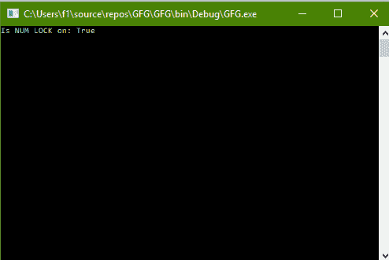
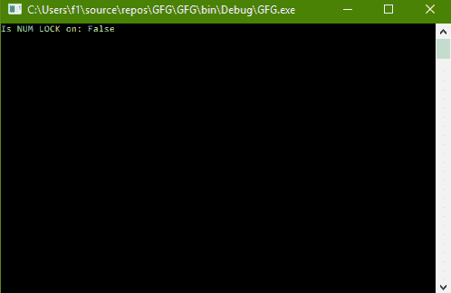

# C# |通过控制台

检查 Num Lock 是开还是关

> 原文:[https://www . geesforgeks . org/c-sharp-check-if-num-lock-on-or-off-through-console/](https://www.geeksforgeeks.org/c-sharp-check-if-num-lock-is-on-or-off-through-console/)

给定 C#中的正常控制台，任务是通过控制台检查 NUM LOCK 是打开还是关闭。

**方法:**这可以使用 C#中系统包的**控制台**类中的 **NumberLock** 属性来完成。此属性获取一个值，该值指示数字锁定键盘开关是打开还是关闭。

**程序 1:** 当数字锁定开启时

```
// C# program to illustrate the
// Console.NumberLock Property
using System;
using System.Collections.Generic;
using System.Linq;
using System.Text;
using System.Threading.Tasks;

namespace GFG {

class Program {

    static void Main(string[] args)
    {

        // Check if NUM LOCK is on or off
        Console.WriteLine("Is NUM LOCK on: {0}",
                          Console.NumberLock);
    }
}
}
```

**输出:**



**程序 2:** 当数字锁定关闭时

```
// C# program to illustrate the
// Console.NumberLock Property
using System;
using System.Collections.Generic;
using System.Linq;
using System.Text;
using System.Threading.Tasks;

namespace GFG {

class Program {

    static void Main(string[] args)
    {

        // Check if NUM LOCK is on or off
        Console.WriteLine("Is NUM LOCK on: {0}",
                          Console.NumberLock);
    }
}
}
```

**输出:**

