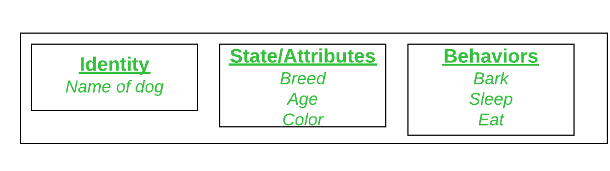
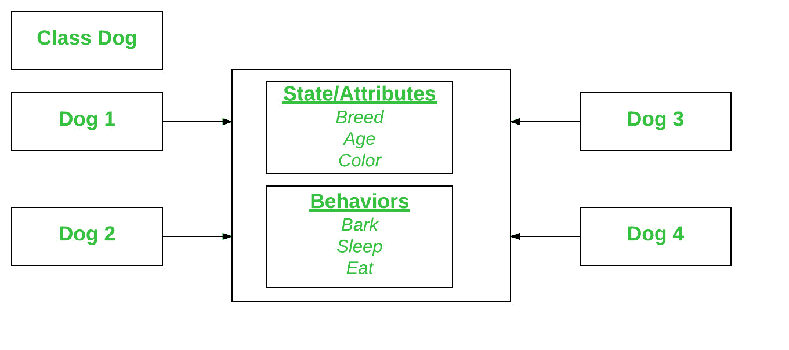
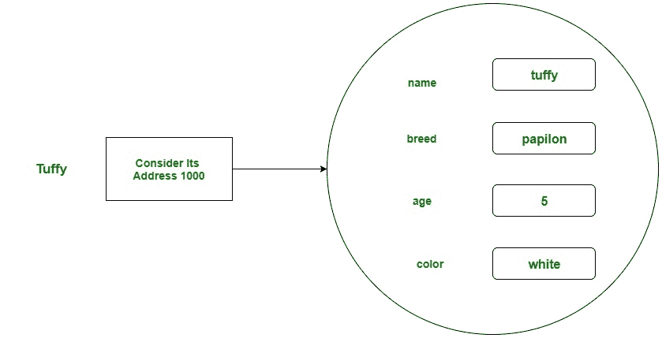

# C# |类和对象

> 原文:[https://www.geeksforgeeks.org/c-sharp-class-and-object/](https://www.geeksforgeeks.org/c-sharp-class-and-object/)

***类和对象*** 是面向对象编程的基本概念，围绕现实生活中的实体展开。类是用户定义的蓝图或原型，从中创建对象。基本上，一个类将字段和方法(定义动作的成员函数)组合成一个单元。在 C#中，类支持多态、继承，还提供了派生类和基类的概念。

#### 

阶级宣言

一般来说，类声明只包含关键字**类**，后面跟一个该类的**标识符(名称)**。但是根据应用程序的需求，有一些可选的属性可以与类声明一起使用。一般来说，类声明可以包含这些组件，顺序如下:

*   **修饰语:**一个类可以是公共的，也可以是内部的等等。默认类的修改器是*内部*。
*   **关键字类:** A *类*关键字用于声明类型类。
*   **类标识符:**提供类型类的变量。标识符(或类名)应该以首字母开头，按照惯例应该大写。
*   **基类或超类:**类的父类(超类)的名称，如果有的话，前面加*:(冒号)*。这是可选的。
*   **接口:**类实现的接口的逗号分隔列表，如果有的话，前面加**:(冒号)**。一个类可以实现多个接口。这是可选的。
*   **Body:** 类体被{ }包围(花括号)。

类中的构造函数用于初始化新对象。字段是提供类及其对象状态的变量，方法用于实现类及其对象的行为。

**示例:**

```cs
// declaring public class
public class Geeks
{

    // field variable
    public int a, b;

      // member function or method
      public void display()
      {
          Console.WriteLine(“Class & Objects in C#”);
      }
}

```

#### 

目标

它是面向对象编程的基本单元，代表现实生活中的实体。一个典型的 C#程序创建许多对象，正如你所知道的，这些对象通过调用方法进行交互。一个对象包括:

*   **状态:**由对象的属性表示。它还反映了对象的属性。
*   **行为:**用一个对象的方法来表示。它还反映了一个对象与其他对象的反应。
*   **身份:**它为一个对象赋予唯一的名称，并使一个对象能够与其他对象交互。

将狗视为一个对象，并查看下图的身份、状态和行为。



物体与现实世界中发现的事物相对应。例如，图形程序可以具有诸如“圆形”、“正方形”、“菜单”之类的对象。在线购物系统可能有“购物车”、“顾客”和“产品”等对象。

#### 

声明对象(也称为实例化类)

当一个类的对象被创建时，这个类被称为实例化。所有实例共享类的属性和行为。但是这些属性值，即状态对于每个对象都是唯一的。一个类可以有任意数量的实例。

**示例:**



就像我们声明变量一样(类型名；).这将通知编译器，我们将使用该名称来引用类型为 type 的数据。对于一个原始变量，这个声明也为变量保留了适当的内存量。所以对于引用变量，类型必须是严格的具体类名。

```cs
Dog tuffy;
```

如果我们像这样声明一个引用变量(tuffy)，它的值将是未确定的(null)，直到一个对象被实际创建并分配给它。简单地声明一个引用变量不会创建一个对象。

#### 

初始化对象

新运算符通过为新对象分配内存并返回对该内存的引用来实例化一个类。新运算符还调用类构造函数。

**示例:**

```cs
// C# program to illustrate the
// Initialization of an object
using System;

// Class Declaration
public class Dog {

    // Instance Variables
    String name;
    String breed;
    int age;
    String color;

    // Constructor Declaration of Class
    public Dog(String name, String breed,
                  int age, String color)
    {
        this.name = name;
        this.breed = breed;
        this.age = age;
        this.color = color;
    }

    // Property 1
    public String getName()
    {
        return name;
    }

    // Property 2
    public String getBreed()
    {
        return breed;
    }

    // Property 3
    public int getAge()
    {
        return age;
    }

    // Property 4
    public String getColor()
    {
        return color;
    }

    // Method 1
    public String toString()
    {
        return ("Hi my name is " + this.getName()
                + ".\nMy breed, age and color are " + this.getBreed() 
                + ", " + this.getAge() + ", " + this.getColor());
    }

// Main Method
public static void Main(String[] args)
    {

        // Creating object
        Dog tuffy = new Dog("tuffy", "papillon", 5, "white");
        Console.WriteLine(tuffy.toString());
    }
}
```

**输出:**

```cs
Hi my name is tuffy.
My breed, age and color are papillon, 5, white

```

**说明:**这个类包含单个构造函数。我们可以识别构造函数，因为它的声明使用与类相同的名称，并且没有返回类型。C#编译器根据参数的数量和类型来区分构造函数。Dog 类中的构造函数接受四个参数。下面的语句为这些参数提供了“tuffy”、“papillon”、5、“white”作为值:

```cs
Dog tuffy = new Dog("tuffy", "papillon", 5, "white");
```

执行该语句的结果可以说明如下:

