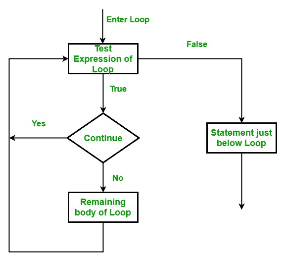

# c#–继续声明

> 原文:[https://www.geeksforgeeks.org/c-sharp-continue-statement/](https://www.geeksforgeeks.org/c-sharp-continue-statement/)

在 C# 中，continue 语句用于在特定条件下跳过循环的执行部分(do、while、for 或 foreach)，之后将控制权转移到循环的开始。基本上，它跳过给定的语句，继续循环的下一次迭代。或者换句话说，continue语句用于将 控制转移到它出现的封闭语句的下一个迭代(while、do、for 或 foreach ) 。

**语法:**

```cs
continue;

```

**流程图:**



**例 1:**

## C#

```cs
// C# program to illustrate the use
// of continue statement in for loop
using System;

class GFG{

static public void Main ()
{

    // Here, in this for loop start from 2 to 12, 
    // due to the continue statement, when x = 8
    // it skip the further execution of the statements
    // and transfer the controls back to the 
    // next iteration of the for loop
    for(int x = 2; x <= 12; x++)
    {
        if (x == 8)
        {
            continue;
        }
        Console.WriteLine(x);
    }
}
}
```

**输出:**

```cs
2
3
4
5
6
7
9
10
11
12

```

**例 2:**

## C#

```cs
// C# program to illustrate the use
// of continue statement in while loop
using System;

class GFG{

static public void Main ()
{
    int x = 0;

    // Here, using continue statement
    // whenever the value of x<2, it
    // skips the further execution of the
    // statements and the control transfer
    // to the next iteration of while loop
    while (x < 8)
    {
        x++;

        if (x < 2)
            continue;

        Console.WriteLine(x);
    }
}
}
```

**输出:**

```cs
2
3
4
5
6
7
8

```