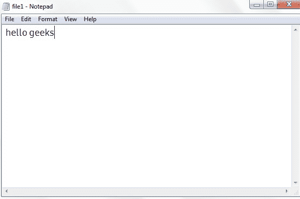
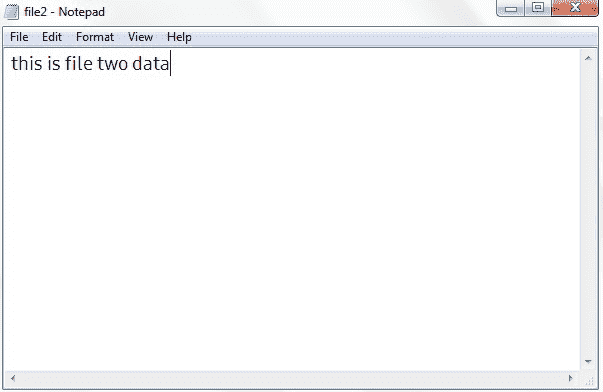
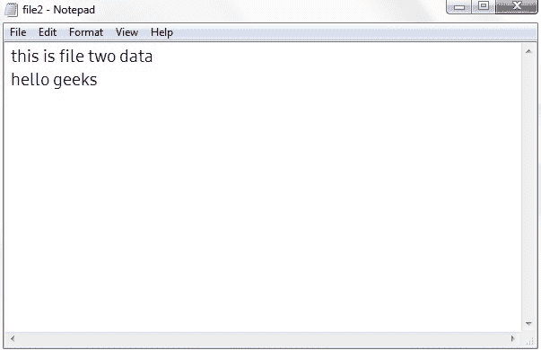

# c#–将内容从一个文件复制到另一个文件

> 原文:[https://www . geesforgeks . org/c-sharp-将内容从一个文件复制到另一个文件/](https://www.geeksforgeeks.org/c-sharp-copying-the-contents-from-one-file-to-another-file/)

给定一个文件，现在我们的任务是使用 C#将数据从一个文件复制到另一个文件。因此，为了完成这个任务，我们使用了系统中文件类的 **Copy()** 方法。IO 命名空间。此功能用于将内容从一个文件复制到一个新文件。它有两种不同类型的重载方法:

**1。** [**【复制(String，String)**](https://www.geeksforgeeks.org/file-copystring-string-method-in-c-sharp-with-examples/?ref=rp) **:** 此功能用于将内容从一个文件复制到新文件。它不支持覆盖同名文件。

**语法:**

```cs
File.Copy(file1, file2);
```

其中*文件 1* 为第一个文件，*文件 2* 为第二个文件。

**异常:**这个方法会抛出以下异常:

*   **unauthorizedcessexception:**当调用方没有所需的权限时，将出现此异常。
*   **ArgumentException:** 当文件 1 或文件 2 指定目录时，将出现此异常。
*   **ArgumentNullException:** 当文件 1 或文件 2 为空时，将出现此异常。
*   **PathTooLongException:** 当指定的路径、文件名或两者都超过系统定义的最大长度时，将出现此异常。
*   **DirectoryNotFoundException:**当文件 1 或文件 2 中指定的路径无效时，将出现此异常。
*   **文件未找到异常:**当文件 1 未找到时，将出现此异常。
*   **IOException:** 当文件 2 存在时，将出现此异常。
*   **notSupportDexception:**当文件 1 或文件 2 的格式无效时，将出现此异常。

**2。** [**Copy(String、String、Boolean)**](https://www.geeksforgeeks.org/file-copystring-string-boolean-method-in-c-sharp-with-examples/?ref=rp) **:** 此功能用于将内容从一个文件复制到新文件。它不支持覆盖同名文件。

**语法:**

```cs
File.Copy(file1, file2, owrite);
```

其中*文件 1* 是第一个文件，*文件 2* 是第二个文件，write 是一个布尔变量，如果目标文件可以被覆盖，则设置为 true，否则设置为 false。

**异常:**这个方法会抛出以下异常:

*   **unauthorizedcessexception:**当调用方没有所需的权限时，将出现此异常。或者文件 2 是只读的，或者 write 设置为 true，文件 to 隐藏，但文件 1 不隐藏。
*   **ArgumentException:** 当文件 1 或文件 2 指定目录时，将出现此异常。
*   **ArgumentNullException:** 当文件 1 或文件 2 为空时，将出现此异常。
*   **PathTooLongException:** 当指定的路径、文件名或两者都超过系统定义的最大长度时，将出现此异常。
*   **DirectoryNotFoundException:**当文件 1 或文件 2 中指定的路径无效时，将出现此异常。
*   **文件未找到异常:**当文件 1 未找到时，将出现此异常。
*   **IOException:** 当 file2 存在且 owrite 为 false 时，将出现此异常。
*   **notSupportDexception:**当文件 1 或文件 2 的格式无效时，将出现此异常。

**示例:**

让我们考虑两个名为文件 1 和文件 2 的文件。现在，file1.txt 包含以下文本:



现在文件 2.txt 包含以下文本:



**进场:**

> 1.  Put the two files in the csharp executable folder of the system.
> 2.  Use documents in the main law. Copy () copies the content from the first file to the second file.
> 3.  Use file to display the text in file 2\. The ReadAllText () method.

## C#

```cs
// C# program to copy data from one file to another
using System;
using System.IO;

class GFG{

static void Main()
{

    // Copy contents from file1 to file2
    File.Copy("file1.txt", "file2.txt");

    // Display file2 contents
    Console.WriteLine(File.ReadAllText("file2.txt"));
}
}
```

**输出:**

现在，file2.txt 是:

