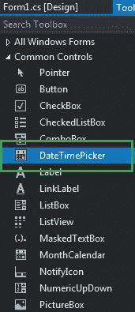
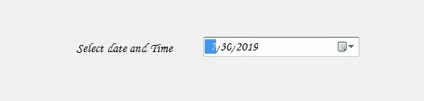
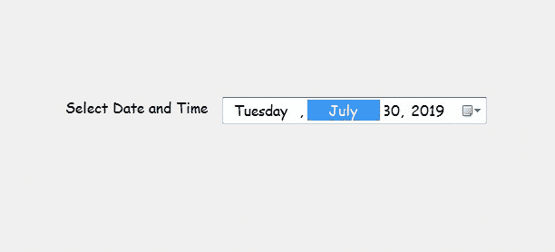

# c # | date picker 类

> 原文:[https://www.geeksforgeeks.org/c-sharp-datetimepicker-class/](https://www.geeksforgeeks.org/c-sharp-datetimepicker-class/)

在 Windows 窗体中，DateTimePicker 控件用于选择和显示窗体中特定格式的日期/时间。FlowLayoutPanel 类用于表示窗口日期选择器控件，还提供不同类型的属性、方法和事件。在**系统下定义。Windows.Forms** 命名空间。您可以创建两种不同类型的日期选择器，一种是用文本表示日期的下拉列表，另一种是单击给定列表旁边的向下箭头时出现的日历。在 C# 中，您可以使用两种不同的方法在 windows 窗体中创建日期时间选择器:

**1。设计时:**创建日期时间选择器控件是最简单的方法，如以下步骤所示:

*   **Step 1:** Create a windows form as shown in the below image:
    **Visual Studio -> File -> New -> Project -> WindowsFormApp**

    

*   **Step 2:** Next, drag and drop the DateTimePicker control from the toolbox to the form as shown in the below image:

    

*   **Step 3:** After drag and drop you will go to the properties of the DateTimePicker to modify DateTimePicker according to your requirement.

    **输出:**

    

**2。运行时:**比上面的方法稍微复杂一点。在此方法中，您可以借助 DateTimePicker 类提供的语法，以编程方式创建一个 DateTimePicker。以下步骤显示了如何动态设置创建日期时间选择器:

*   **步骤 1:** 使用 **DateTimePicker()** 构造函数创建一个 DateTimePicker，该构造函数由 DateTimePicker 类提供。

    ```cs
    // Creating a DateTimePicker
    DateTimePicker d = new DateTimePicker();

    ```

*   **步骤 2:** 创建日期时间选择器后，设置由日期时间选择器类提供的日期时间选择器的属性。

    ```cs
    // Setting the location of the DateTimePicker
    d.Location = new Point(360, 162); 

    // Setting the size of the DateTimePicker
    d.Size = new Size(292, 26); 

    // Setting the maximum date of the DateTimePicker
    d.MaxDate = new DateTime(2500, 12, 20); 

    // Setting the minimum date of the DateTimePicker
    d.MinDate = new DateTime(1753, 1, 1); 

    // Setting the format of the DateTimePicker
    d.Format = DateTimePickerFormat.Long; 

    // Setting the name of the DateTimePicker
    d.Name = "MyPicker"; 

    // Setting the font of the DateTimePicker
    d.Font = new Font("Comic Sans MS", 12);

    // Setting the visibility of the DateTimePicker 
    d.Visible = true; 

    // Setting the value of the DateTimePicker
    d.Value = DateTime.Today; 

    ```

*   **Step 3:** And last add this DateTimePicker control to the form and also add other controls on the DateTimePicker using the following statements:

    ```cs
    // Adding this control 
    // to the form 
    this.Controls.Add(d); 

    ```

    **示例:**

    ```cs
    using System;
    using System.Collections.Generic;
    using System.ComponentModel;
    using System.Data;
    using System.Drawing;
    using System.Linq;
    using System.Text;
    using System.Threading.Tasks;
    using System.Windows.Forms;

    namespace WindowsFormsApp48 {

    public partial class Form1 : Form {

        public Form1()
        {
            InitializeComponent();
        }

        private void Form1_Load(object sender, EventArgs e)
        {
            // Creating and setting the
            // properties of the Label
            Label l = new Label();
            l.Location = new Point(183, 162);
            l.Size = new Size(172, 20);
            l.Text = "Select Date and Time";
            l.Font = new Font("Comic Sans MS", 12);

            // Adding this control
            // to the form
            this.Controls.Add(l);

            // Creating and setting the
            // properties of the DateTimePicker
            DateTimePicker d = new DateTimePicker();
            d.Location = new Point(360, 162);
            d.Size = new Size(292, 26);
            d.MaxDate = new DateTime(2500, 12, 20);
            d.MinDate = new DateTime(1753, 1, 1);
            d.Format = DateTimePickerFormat.Long;
            d.Name = "MyPicker";
            d.Font = new Font("Comic Sans MS", 12);
            d.Visible = true;
            d.Value = DateTime.Today;

            // Adding this control
            // to the form
            this.Controls.Add(d);
        }
    }
    }
    ```

    **输出:**

    

#### 构造器

| 构造器 | 描述 |
| **DateTimePicker()** | 此构造函数用于初始化 DateTimePicker 类的新实例。 |

#### 菲尔茨

| 菲尔茨 | 描述 |
| **DefaultMonthBackColor** | 此字段指定 DateTimePicker 控件的默认月份背景色。此字段是只读的。 |
| **默认标题背色** | 此字段指定 DateTimePicker 控件的默认标题背景色。此字段是只读的。 |
| **默认标题以前颜色** | 此字段指定 DateTimePicker 控件的默认标题前景色。此字段是只读的。 |
| **默认拖链前颜色** | 此字段指定 DateTimePicker 控件的默认尾随前景色。此字段是只读的。 |
| **最大日期时间** | 此字段指定 DateTimePicker 控件的最大日期值。此字段是只读的。 |
| **阵亡时间** | 此字段获取 DateTimePicker 控件的最小日期值。 |

#### 性能

| 财产 | 描述 |
| **自动化** | 此属性用于获取或设置一个值，该值指示控件是否根据其内容调整大小。 |
| 自动模式 | 此属性指示控件的自动调整大小行为。 |
| **背景色** | 此属性用于获取或设置控件的背景色。 |
| 边框样式 | 此属性指示控件的边框样式。 |
| **日历字体** | 此属性用于获取或设置应用于日历的字体样式。 |
| **日历格式 Color** | 此属性用于获取或设置日历的前景色。 |
| **日历背景** | 此属性用于获取或设置日历月的背景色。 |
| **日历标题背色** | 此属性用于获取或设置日历标题的背景色。 |
| **日历标题前颜色** | 此属性用于获取或设置日历标题的前景色。 |
| **日历色彩** | 此属性用于获取或设置日历结尾日期的前景色。 |
| **[字体](https://www.geeksforgeeks.org/how-to-set-the-font-of-the-datetimepicker-in-c-sharp/)** | 此属性用于获取或设置控件显示的文本的字体。 |
| **前颜色** | 此属性用于获取或设置控件的前景色。 |
| **[格式](https://www.geeksforgeeks.org/how-to-set-the-format-of-the-datetimepicker-in-c-sharp/)** | 此属性用于获取或设置控件中显示的日期和时间的格式。 |
| **高度** | 此属性用于获取或设置控件的高度。 |
| **[地点](https://www.geeksforgeeks.org/how-to-set-the-location-of-the-datetimepicker-in-c-sharp/)** | 此属性用于获取或设置 DateTimePicker 控件左上角相对于其窗体左上角的坐标。 |
| **[【max date】](https://www.geeksforgeeks.org/how-to-set-maximum-date-in-the-datetimepicker-in-c-sharp/)** | 此属性用于获取或设置控件中可以选择的最大日期和时间。 |
| 最大化时间 | 此属性用于获取 DateTimePicker 控件允许的最大日期值。 |
|  | 此属性用于获取或设置控件中可以选择的最小日期和时间。 |
| **最短时间** | 此属性用于设置 DateTimePicker 控件允许的最小日期值。 |
| **[名称](https://www.geeksforgeeks.org/how-to-set-the-name-of-the-datetimepicker-in-c-sharp/)** | 此属性用于获取或设置控件的名称。 |
| **[显示下降](https://www.geeksforgeeks.org/how-to-set-up-and-down-button-in-datetimepicker-in-c-sharp/)** | 此属性用于获取或设置一个值，该值指示旋转按钮控件(也称为上下控件)是否用于调整日期/时间值。 |
| **[显示复选框](https://www.geeksforgeeks.org/how-to-set-a-check-box-in-the-datetimepicker-in-c-sharp/)** | 此属性用于获取或设置一个值，该值指示复选框是否显示在选定日期的左侧。 |
| **[大小](https://www.geeksforgeeks.org/how-to-set-the-size-of-the-datetimepicker-in-c-sharp/)** | 此属性用于获取或设置控件的高度和宽度。 |
| **[可见](https://www.geeksforgeeks.org/how-to-set-the-visibility-of-datetimepicker-in-c-sharp/)** | 此属性用于获取或设置一个值，该值指示是否显示控件及其所有子控件。 |
| **[值](https://www.geeksforgeeks.org/how-to-display-current-date-time-in-the-datetimepicker-in-c-sharp/)** | 此属性用于获取或设置分配给控件的日期/时间值。 |
| **宽度** | 此属性用于获取或设置控件的宽度。 |