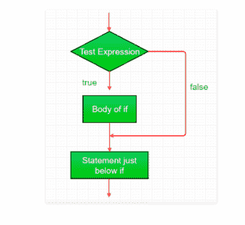
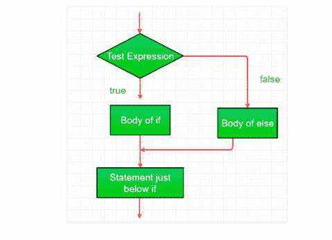
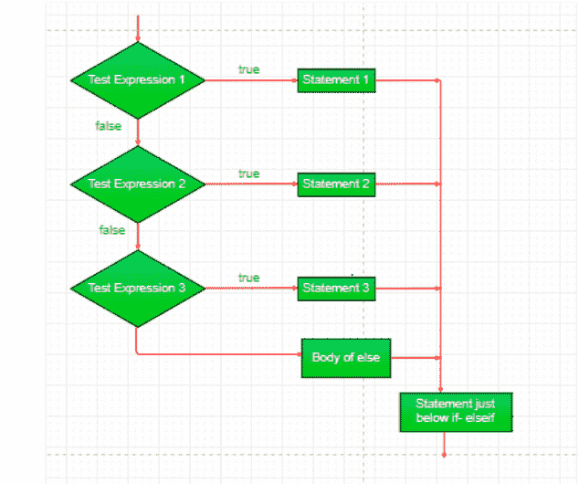
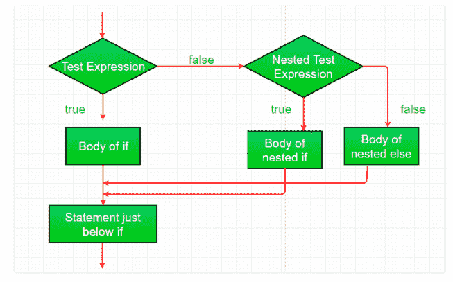
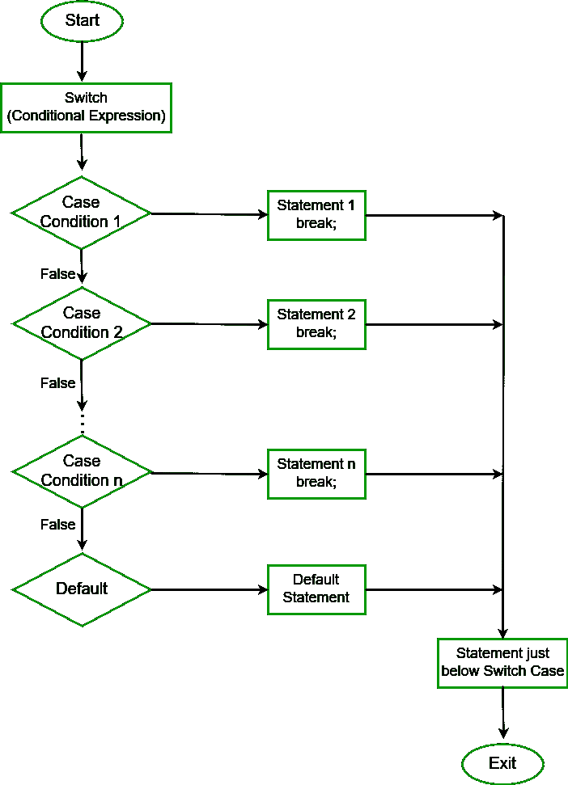

# C#决策(if，if-else，if-else-if 阶梯，嵌套 if，开关，嵌套开关)

> 原文:[https://www . geesforgeks . org/c-sharp-决策-else-else-梯形-嵌套-开关-嵌套-开关/](https://www.geeksforgeeks.org/c-sharp-decision-making-else-else-ladder-nested-switch-nested-switch/)

编程中的决策类似于现实生活中的决策。同样在编程中，当某些条件得到满足时，需要执行特定的代码块。
一种编程语言根据一定的条件，使用控制语句来控制程序的执行流程。这些用于使执行流程前进，并根据程序状态的变化进行转移。
**c#的条件语句:**

*   [如果](#if)
*   [如果-否则](#ifelse)
*   [if-else-if](#ifelseif)
*   [嵌套 if](#nested)
*   [开关](#switch)
*   [嵌套开关](#nestedswitch)

**IF 语句**
IF 语句检查给定的条件。如果条件评估为真，则代码/语句块将执行，否则不执行。
**语法:**

```
if(condition)
     {  
         //code to be executed  
     }  
```

**注意:**如果花括号{ }不与 if 语句一起使用，则仅将其旁边的语句视为与 If 语句相关联。
**例:**

```
if (condition)
   statement 1;
statement 2;
```

在本例中，只有语句 1 被认为与 if 语句相关联。
**流程图:**



**例:**

## c sharp . c sharp . c sharp . c sharp

```
// C# program to illustrate if statement
using System;

public class GFG {

    public static void Main(string[] args)
    {
        string name = "Geek";
        if (name == "Geek") {
            Console.WriteLine("GeeksForGeeks");
        }
    }
}
```

**输出:**

```
GeeksForGeeks
```

**IF–else 语句**
IF 语句在条件为真的情况下评估代码，但是如果条件不为真，该怎么办呢，else 语句来了。它告诉代码当 if 条件为假时该做什么。
**语法:**

```
    if(condition)
    {  
      // code if condition is true  
    }
    else
    {  
      // code if condition is false  
    }  

```

**流程图:**



**例:**

## c sharp . c sharp . c sharp . c sharp

```
// C# program to illustrate
// if-else statement
using System;

public class GFG {

    public static void Main(string[] args)
    {
        string name = "Geek";
        if (name == "Geeks") {
            Console.WriteLine("GeeksForGeeksr");
        }
        else {
            Console.WriteLine("Geeks");
        }
    }
}
```

**输出:**

```
Geeks
```

**If-else-If 梯形语句**
If-else-If 梯形语句执行多个语句中的一个条件。执行从顶部开始，并检查每个 if 条件。将执行 if 块的语句，该语句的计算结果为真。如果 If 条件都不为真，则计算最后一个 else 块。
**语法:**

```
        if(condition1)
        {  
            // code to be executed if condition1 is true  
        }
        else if(condition2)
        {  
            // code to be executed if condition2 is true  
        }  
        else if(condition3)
        {  
            // code to be executed if condition3 is true  
        }  
        ... 
        else
        {
            // code to be executed if all the conditions are false  
        }  

```

**流程图:**



**例:**

## c sharp . c sharp . c sharp . c sharp

```
// C# program to illustrate
// if-else-if ladder
using System;

class GFG {

    public static void Main(String[] args)
    {
        int i = 20;

        if (i == 10)
            Console.WriteLine("i is 10");
        else if (i == 15)
            Console.WriteLine("i is 15");
        else if (i == 20)
            Console.WriteLine("i is 20");
        else
            Console.WriteLine("i is not present");
    }
}
```

**输出:**

```
i is 20
```

**嵌套–if 语句**
**if 语句在 If 语句**中被称为嵌套 If。在这种情况下，if 语句是另一个 if 或 else 语句的目标。当不止一个条件需要为真并且其中一个条件是父条件的子条件时，可以使用嵌套 if。
**语法:**

```
        if (condition1) 
        {
             // code to be executed 
             // if condition2 is true 
             if (condition2) 
             {
                 // code to be executed 
                 // if condition2 is true 
             }
        }
```

**流程图:**



**例:**

## c sharp . c sharp . c sharp . c sharp

```
// C# program to illustrate
// nested-if statement
using System;

class GFG {

    public static void Main(String[] args)
    {
        int i = 10;

        if (i == 10) {

            // Nested - if statement
            // Will only be executed if statement
            // above it is true
            if (i < 12)
                Console.WriteLine("i is smaller than 12 too");
            else
                Console.WriteLine("i is greater than 15");
        }
    }
}
```

**输出:**

```
i is smaller than 12 too
```

**Switch 语句**
Switch 语句是长 if-else-if 梯子的替代语句。检查表达式的不同情况，并执行一个匹配。 **break** 语句用于移出开关。如果不使用中断，控制将流向其下的所有情况，直到找到中断或切换结束。切换结束时有**默认案例(可选)**，如果没有匹配的案例，则执行默认案例。
**语法:**

```
switch (expression)
 {
case value1: // statement sequence
             break;
case value2: // statement sequence
             break;
.
.
.
case valueN: // statement sequence
             break;
default: // default statement sequence
}
```

**交换机流程图–案例:**



**例:**

## c sharp . c sharp . c sharp . c sharp

```
// C# example for switch case
using System;

public class GFG
{
    public static void Main(String[] args)
    {
        int number = 30;
        switch(number)
        {
        case 10: Console.WriteLine("case 10");
                 break;
        case 20: Console.WriteLine("case 20");
                 break;
        case 30: Console.WriteLine("case 30");
                 break;
        default: Console.WriteLine("None matches");
                 break;
        }
    }
}
```

**输出:**

```
case 30
```

**嵌套开关**
嵌套开关在 C#中是允许的。在这种情况下，开关存在于其他开关盒内。内部开关出现在父开关的一种情况下。
**例:**

## c sharp . c sharp . c sharp . c sharp

```
// C# example for nested switch case
using System;

public class GFG
{
    public static void Main(String[] args)
    {
        int j = 5;

        switch (j)
        {
            case 5: Console.WriteLine(5);
                    switch (j - 1)
                   {
                    case 4: Console.WriteLine(4);
                            switch (j - 2)
                          {
                            case 3: Console.WriteLine(3);
                                    break;
                         }
                    break;
                }
                break;
            case 10: Console.WriteLine(10);
                     break;
            case 15: Console.WriteLine(15);
                     break;
            default: Console.WriteLine(100);
                     break;
        }

    }
}
```

**输出:**

```
5
4
3
```