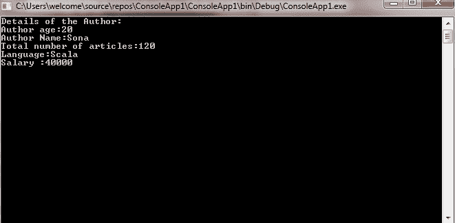
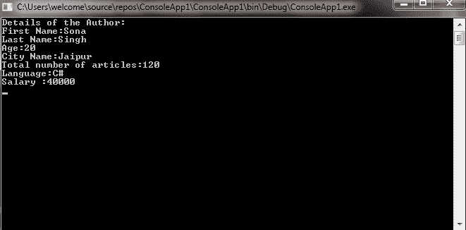

# C# |带有类的解构器

> 原文:[https://www . geesforgeks . org/c-sharp-解构器-带类/](https://www.geeksforgeeks.org/c-sharp-deconstructor-with-classes/)

在类中，解构器以方法的形式使用，通过将类变量赋给新变量来访问类外的类变量。这是通过使用[输出](https://www.geeksforgeeks.org/out-parameter-with-examples-in-c-sharp/)参数来实现的，因为使用输出参数，不同的值可以有多个重载。此外，您可以在同一个程序中使用多个解构器方法，这些方法具有相同数量的 out 参数或相同数量和类型的 out 参数，但顺序不同，但是要小心这种类型的多个解构器方法，因为它们会造成很多混乱。

**语法:**

```cs
// Creating a deconstructor method
  public void Deconstruct( out T var1, out T var2, ..., out T varN)
        {
            // Code..
        }
// Deconstructor assignment
(T var1, ..., T varN) = obj

// Using discards
var(_, var2, _, var4) = obj

```

这里 **T** 是变量的类型。让我们借助给出的例子来理解解构主义者的概念:

**例 1:**

```cs
// C# program to illustrate the concept
// of deconstruction with class
using System;
using System.Collections.Generic;
using System.Linq;
using System.Text;
using System.Threading.Tasks;

namespace ConsoleApp1
{
    // Geeks class
    public class Geeks
    {
        // Creating variables
        string Aname;
        int age;
        int Tarticals;
        string language;
        double salary;

        // Method
        public Geeks( string _AuthorName, int _Age, int _TotalArticals, 
                                      string _Language, double _Salary)
        {
            age = _Age;
            Aname = _AuthorName;
            Tarticals = _TotalArticals;
            language = _Language;
            salary = _Salary;
        }

        // Deconstructor 
        public void Deconstruct( out string _AuthorName, out int _Age,
                         out int _TotalArticals, out string _Language, 
                                                   out double _Salary)
        {

            _AuthorName = Aname;
            _Age = age;
            _TotalArticals = Tarticals;
            _Language = language;
            _Salary = salary;
        }
    }

public class GFG
{
    // Main method
    static public void Main()
    {
        // Creating object of Geeks class
        Geeks obj = new Geeks( "Sona", 20, 120, "Scala", 40000.0);

        // Deconstruct the instance of 
        // the Geeks class named as obj
        (string AuthorName, int Age, int TotalArticals, 
                 string Language, double Salary) = obj;

        // Displayin the values
        Console.WriteLine("Details of the Author:");
        Console.WriteLine("Author age:{0}", Age);
        Console.WriteLine("Author Name:{0}", AuthorName);
        Console.WriteLine("Total number of articles:{0}", TotalArticals);
        Console.WriteLine("Language:{0}", Language);
        Console.WriteLine("Salary :{0}", Salary);
        Console.ReadLine();
    }
}

}
```

**输出:**



**例 2:**

```cs
// C# program to illustrate the concept of
// multiple deconstruction with class
using System;
using System.Collections.Generic;
using System.Linq;
using System.Text;
using System.Threading.Tasks;

namespace ConsoleApp1
{
    // Geeks class
    public class Geeks
    {
        // Creating variables
        string Afname;
        string Alname;
        string city;
        int age;
        int Tarticals;
        string language;
        double salary;

        // Method
        public Geeks( string _AuthorFirstName, string _AuthorLastName,
                          string _City,  int _Age, int _TotalArticals,
                                     string _Language, double _Salary)
        {
            age = _Age;
            Afname = _AuthorFirstName;
            Alname = _AuthorLastName;
            city = _City;
            Tarticals = _TotalArticals;
            language = _Language;
            salary = _Salary;
        }

        // Deconstructor 1
        public void Deconstruct(out string _AuthorFirstName, 
               out string _AuthorLastName, out string _City)
        {

            _AuthorFirstName = Afname;
            _AuthorLastName = Alname;
            _City = city;
        }

        // Deconstructor 2
        public void Deconstruct(  out int _Age, out int _TotalArticals, 
                              out string _Language, out double _Salary)
        {
            _Age = age;
            _TotalArticals = Tarticals;
            _Language = language;
            _Salary = salary;
        }
    }

public class GFG
{
    // Main method
    static public void Main()
    {
        // Creating object of Geeks class
        Geeks obj = new Geeks( "Sona", "Singh", 
             "Jaipur", 20, 120, "C#", 40000.0);

        // Deconstruct the instance of
        // the Geeks class named as obj
        ( int Age, int TotalArticals, string Language, double Salary) = obj;
        (string AuthorFirstName, string AuthorLastName, string City) = obj;

        // Displaying the values
        Console.WriteLine("Details of the Author:");
        Console.WriteLine("First Name:{0}", AuthorFirstName);
        Console.WriteLine("Last Name:{0}", AuthorLastName);
        Console.WriteLine("Age:{0}", Age);
        Console.WriteLine("City Name:{0}", City);
        Console.WriteLine("Total number of articles:{0}", TotalArticals);
        Console.WriteLine("Language:{0}", Language);
        Console.WriteLine("Salary :{0}", Salary);
        Console.ReadLine();
    }
}

}
```

**输出:**

