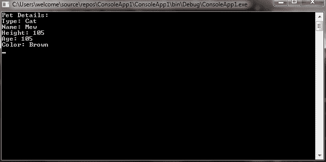
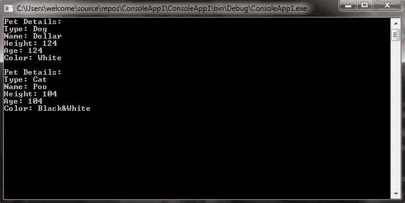

# C# |带有元组的解构器

> 原文:[https://www . geeksforgeeks . org/c-sharp-解构器-带元组/](https://www.geeksforgeeks.org/c-sharp-deconstructors-with-tuples/)

[元组](https://www.geeksforgeeks.org/c-sharp-tuple/)是一种数据结构，它为您提供了最简单的方式来表示具有多个值的数据集，这些值可能彼此相关，也可能彼此不相关。但是如果您试图从元组中检索多个字段或属性值就比较困难了。所以，为了克服这个问题，解构器在 C# 7.0 中被引入。它用于将变量值或元组分成多个部分，并将这些值分配给新变量。它也用于类和结构。这里我们只讨论解构器对元组的处理。

在元组中，解构器用于将元组分成多个部分，并将这些部分分别分配到新的变量中。因此，您可以访问单个字段或属性值。您可以通过四种不同的方式 解构一个元组:

**1。**您可以通过显式声明括号内每个字段的类型来解构元组。但是不允许在括号外指定特定的类型，即使元组中的每个字段都是相同的类型。如果你试图这样做，那么你会得到一个错误。

**示例:**

```cs
// C# program to illustrate the concept 
// of deconstruction with the tuple
using System;
using System.Collections.Generic;
using System.Linq;
using System.Text;
using System.Threading.Tasks;

namespace ConsoleApp1 {

class GFG {

    // This method returns the Pet details
    public(string, string, int, int, string) PetDetails(string type, 
                     string name, int height, int age, string color)
    {
        string p_type = type;
        string p_name = name;
        int p_height = height;
        int p_age = age;
        string p_color = color;
        return (p_type, p_name, p_height, p_height, p_color);
    }

    // Main method
    static void Main(string[] args)
    {

        // Creating object of GFG class
        GFG g = new GFG();

        // Deconstruct the given tuple
        // So that we can directly access individual fields
        // By explicitly declaring types
        (string type, string name, int height, int age, string color) = g.PetDetails("Dog", 
                                                                "Dollar", 124, 3, "White");
        Console.WriteLine("Pet Details:");
        Console.WriteLine("Type: " + type);
        Console.WriteLine("Name: " + name);
        Console.WriteLine("Height: " + height);
        Console.WriteLine("Age: " + age);
        Console.WriteLine("Color: " + color);
        Console.ReadLine();
    }
}
}
```

**输出:**



**2。**可以使用 var 关键字解构元组，这样 C#就可以推断出每个变量的类型。您可以通过两种不同的方式使用 var 关键字:

*   您可以将 var 关键字放在括号外。
*   您可以将 var 关键字单独放在带有部分或全部变量的括号内。

**示例:**

```cs
// C# program to illustrate the concept 
// of deconstruction with the tuple
using System;
using System.Collections.Generic;
using System.Linq;
using System.Text;
using System.Threading.Tasks;

namespace ConsoleApp1 {

class GFG {

    // This method returns the Pet details
    public(string, string, int, int, string) PetDetails(string type, 
                     string name, int height, int age, string color)
    {
        string p_type = type;
        string p_name = name;
        int p_height = height;
        int p_age = age;
        string p_color = color;
        return (p_type, p_name, p_height, p_height, p_color);
    }

    // Main method
    static void Main(string[] args)
    {

        // Creating object of GFG class
        GFG g = new GFG();

        // Deconstruct the given tuple
        // So that we can directly 
        // access individual fields
        // Using var keyword
        var(type1, name1, height1, age1, color1) = g.PetDetails("Dog",
                                           "Dollar", 124, 3, "White");
        Console.WriteLine("Pet Details:");
        Console.WriteLine("Type: " + type1);
        Console.WriteLine("Name: " + name1);
        Console.WriteLine("Height: " + height1);
        Console.WriteLine("Age: " + age1);
        Console.WriteLine("Color: " + color1);

        (var type2, var name2, var height2, var age2, var color2) = g.PetDetails("Cat", 
                                                         "Poo", 104, 1, "Black&White");
        Console.WriteLine("\nPet Details:");
        Console.WriteLine("Type: " + type2);
        Console.WriteLine("Name: " + name2);
        Console.WriteLine("Height: " + height2);
        Console.WriteLine("Age: " + age2);
        Console.WriteLine("Color: " + color2);
        Console.ReadLine();
    }
}
}
```

**输出:**



**3。**您可以将元组解构为已经声明的变量。如下例所示:

**示例:**

```cs
// C# program to illustrate the concept 
// of deconstruction with the tuple
using System;
using System.Collections.Generic;
using System.Linq;
using System.Text;
using System.Threading.Tasks;

namespace ConsoleApp1 {

class GFG {

    // This method returns the Pet details
    public(string, string, int, int, string) PetDetails(string type, 
                     string name, int height, int age, string color)
    {
        string p_type = type;
        string p_name = name;
        int p_height = height;
        int p_age = age;
        string p_color = color;
        return (p_type, p_name, p_height, p_height, p_color);
    }

    // Main method
    static void Main(string[] args)
    {

        // Creating object of GFG class
        GFG g = new GFG();

        // Declaring and initializing variables
        string type = "Cow";
        string name = "BooBoo";
        int height = 234;
        int age = 4;
        string color = "Black&white";

        // Deconstruct the given tuple
        // So that we can directly 
        // access individual fields
        // By declaring variables
        (type, name, height, age, color) = g.PetDetails("Cat", 
                                      "Mew", 105, 2, "Brown");
        Console.WriteLine("Pet Details:");
        Console.WriteLine("Type: " + type);
        Console.WriteLine("Name: " + name);
        Console.WriteLine("Height: " + height);
        Console.WriteLine("Age: " + age);
        Console.WriteLine("Color: " + color);
        Console.ReadLine();
    }
}
}
```

**输出:**


**4。**你也可以在解构中使用丢弃。丢弃是只写变量，其值应该被忽略。和丢弃是通过在赋值中使用下划线字符(“_”)来指定的。您可以根据需要丢弃任意多个值，所有值都由单个丢弃表示。

**语法:**

> (var1，_，var3，_，var5) = method_name(var1_values，var2_values，var3_value，var4_values，var5 _ value)；

**示例:**

```cs
// C# program to illustrate the concept
// of deconstruction with tuple
using System;
using System.Collections.Generic;
using System.Linq;
using System.Text;
using System.Threading.Tasks;

namespace ConsoleApp1 {

class GFG {

    // This method returns 
    // the Pet details
    public(string, string, int, int, string) PetDetails(string type,
                     string name, int height, int age, string color)
    {
        string p_type = type;
        string p_name = name;
        int p_height = height;
        int p_age = age;
        string p_color = color;
        return (p_type, p_name, p_height, p_height, p_color);
    }

    // Main method
    static void Main(string[] args)
    {

        // Creating object of GFG class
        GFG g = new GFG();

        // Discarding field values
        // in deconstruction

        (string type, _, int height, _, string color) = g.PetDetails("Dog",
                                                "Dollar", 124, 3, "White");
        Console.WriteLine("Pet Details:");
        Console.WriteLine("Type: " + type);
        Console.WriteLine("Height: " + height);
        Console.WriteLine("Color: " + color);
        Console.ReadLine();
    }
}
}
```

**输出:**

**注意:**在解构中，需要将每个元素赋给一个变量，如果去掉任何一个元素，那么编译器就会给出一个错误。不允许将声明和赋值混合到解构左侧的现有变量中。如果您删除任何元素，编译器会给出一个错误。