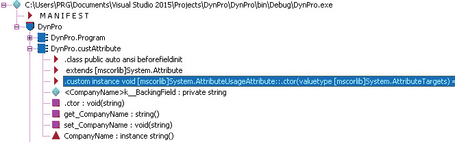

# C#动态编码–深度属性

> 原文:[https://www . geesforgeks . org/c-sharp-dynamic-coding-attributes-in-deep/](https://www.geeksforgeeks.org/c-sharp-dynamic-coding-attributes-in-depth/)

那个。NET 公共语言通过引入属性提供了运行时动态编码实践的实现，这些属性允许将编译时生成并嵌入到。带程序元素的. NET 程序集。此外，通过使用。NET 机制称为反射。因此，本文对。NET 属性。

### 属性

[属性](https://www.geeksforgeeks.org/attributes-in-c-sharp/)来源于系统。属性类。属性可以被定位在任何启示上，然而，一个特定的特征可能会限制它所基于的呈现的种类。英寸 NET 代码中，我们可以通过将包含在方形部分([])中的属性的名称放在它所应用的元素的声明上来确定属性。此外，我们可以将额外的元数据整合到一个利用质量的聚会中。更重要的是，属性类似于描述性的词语，用于元数据解释，比如可以应用于给定种类的组件、集合、模块、技术等等。以下是中属性的语法。NET 编程如下；

```
[type: attributeName(parameter1, parameter2, ………n)]
```

那个。NET 构造为属性的使用指定了两种类型的属性:预定义属性和自定义属性。属性通常可以有零个或多个参数。因此，下面的 C#代码提出了属性的执行，其中使用过时的 as 将方法声明为不推荐使用；

## C#

```
using System;

namespace attributes {
class Program {
    static void Main(string[] args)
    {
        Console.WriteLine("C# Dynamic code sample");
        // Deprecated method call
        TestMethod();
        Console.ReadKey();
    }
    // "declaring the TestMethod() as Obsolete by attribute"
    [Obsolete("Deprecated function", false)] public static void TestMethod()
    {
        Console.WriteLine("geeksForGeeks");
    }
}
}
```

的 ILDASM 实用程序。NET 框架可以用来验证相应的前述代码的生成的 MSIL 代码中的过时属性的条目，如下所示；


ILDASM 实用程序将 IL 代码后面的代码生成为. NET 程序集，因此，双击过时的方法 myFun()条目，它将过时属性的条目反映如下；


属性用于信息定义、反射、web 服务、序列化、设置类蓝图以及在运行时指定第三方库。总的来说，从文档的角度来看，在元数据表中做一个条目是很有帮助的。此外，编译器会在调试期间自动发现属性条目的存在。那个。NET 框架在源代码中规定了客户和预定义属性。下一节将描述代码中一些预定义属性的实现。

#### 序列化

让我们看看下面的类代码，它具有如下的序列化属性内涵和非序列化字段；

## C#

```
// Serialization class declaration with attribute
[Serializable] public class xyz {
    public xyz() {}

    string custName;
    string Address;
    // Non- serialized method attribute
    [NonSerialized] int MobPhone;
}
```

我们可以再次适当地检查序列化和非序列化属性项在 IL 代码中的输入，如下所示；


### dl lim port(dl lim port)-dl lim port(dl lim port)-dl lim port(dl lim port)(dl lim port)(dl lim port)(dl lim port)(dl lim port)(dl lim port)(dl lim port)(dl lim port)(dl lim port

下面的代码示例说明了[DllIport]属性的功能，该属性调用非托管 dll user32.dll 来填充消息框，如下所示；

## C#

```
public class xyz {
    // Dll Import API call for MessageBox display
    [DllImport("user32.dll", EntryPoint = "MessageBox")]
        // MessageBox property configuration
        public static extern int
        ShowMessageBox(int hWnd, string text, string caption, uint type);
}
class Program {
    static void Main(string[] args)
    {
        // Property value initialized
        string caption = "geeksForGeeks";
        string text = "[DLLImport] Attribute";
        // Calling static method of xyz class
        xyz.ShowMessageBox(0, text, caption, 0);
        Console.ReadKey();
    }
}
```

到目前为止，我们已经体验了预定义的属性，在本系列中，我们还可以进一步开发自己的自定义属性，并在其他代码中利用它。为此，该类必须以属性为前缀，并派生为系统。属性类如下；

## C#

```
class Program {
    static void Main(string[] args)
    {
        xyz obj = new xyz("GeeksforGeeks", "Hyderabad");
        Console.WriteLine(obj.FullDetails());
        Console.ReadKey();
    }
}
public class xyz {
    public xyz(string name, string country)
    {
        this.Name = name;
        this.City = country;
    }
    public string FullDetails()
    {
        string str = Name + "-" + City;
        return str;
    }

    private string Name;
    private string City;
}
// Custom Attribute Class
[AttributeUsage(AttributeTargets.Class)] public class custAttribute : Attribute {
    // Constructor
    public custAttribute(string s)
    {
        this.CompanyName = s;
    }
    public string CompanyName
    {
        get;
        set;
    }
}
```

编译完上述代码后，我们可以使用 ildasm.exe 观察到自定义属性注释发生在元数据级别，如下所示:

