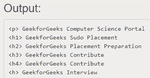

# C# | EndsWith()方法

> 原文:[https://www.geeksforgeeks.org/c-sharp-endswith-method/](https://www.geeksforgeeks.org/c-sharp-endswith-method/)

在 C#中， ***EndsWith()*** 是一个字符串方法。此方法用于检查当前字符串实例的结尾是否与指定的字符串匹配。如果匹配，则返回字符串，否则返回 false。使用“ *foreach* ”循环，可以检查许多字符串。通过向该方法传递不同类型和数量的参数，可以重载该方法。

*   **弦。用(字符串)方法结束**
*   **弦。EndsWith(字符串、布尔值、文化信息)方法**
*   **弦。用(字符串，字符串比较)方法结束**

#### 字符串。用(字符串)方法结束

此方法用于检查字符串对象的结尾是否与特定字符串匹配。如果匹配，则返回字符串，否则返回 false。
**语法:**

```cs
public bool EndsWith(string input_string)
```

**参数:**

> **输入 _ 字符串**:需要比较的字符串，该参数类型为*系统。弦*。

**返回类型:**该函数返回*布尔*值，即**真**如果找到匹配，否则返回**假**。返回类型为*系统。布尔*。
以下是演示**字符串使用的程序。EndsWith(String)** 方法:

*   **程序 1:**

## c sharp . c sharp . c sharp . c sharp

```cs
// C# program to illustrate the
// String.EndsWith(String) Method
using System;

public class GFG {

    // Main Method
    static public void Main()
    {

        // Input two string
        string str1 = "Sudo Placement++";
        string str2 = "Sudo Placement++";
        bool x, y;

        // Implement EndsWith() method
        x = str1.EndsWith("++");
        y = str2.EndsWith("--");

        // Return  match string "True"
        Console.WriteLine(x.ToString());

        // Return no match string "False"
        Console.WriteLine(y.ToString());
    }
}
```

**Output:** 

```cs
True
False
```

*   **节目 2:**

## c sharp . c sharp . c sharp . c sharp

```cs
// C# program to illustrate the
// String.EndsWith (String) Method
using System;

public class GFG {

    // Main method
    static public void Main()
    {

        // Html ending  tag (</) will be remove
        // then print the result
        string[] input_str = {
            "

<p> GeekforGeeks Computer Science Portal </p>

",
            "<h1> GeekforGeeks Sudo Placement </h1>",
            "<h2> GeekforGeeks Placement Preparation </h2>",
            "<h3> GeekforGeeks Contribute </h3>",
            "<h4> GeekforGeeks Contribute ",
            "<h> GeekforGeeks Interview </h>",
        };

        // Display result after implementation EndsWith()
        // method in strings  ending tag  to be  removed.
        foreach(var n in input_str)
            Console.WriteLine(htmlEndTags(n));
    }

    private static string htmlEndTags(string str)
    {

        // set found false
        bool found = false;

        // To check ending tag to be found or not
        if (str.Trim().EndsWith(">")) {

            // To search  opening tag
            int end = str.LastIndexOf("</");

            // if got ending tag then remove
            if (end >= 0) {

                // found set become True
                found = true;

                // update string
                str = str.Substring(0, end);
            }
        }

        // if found to be true then
        // return after removing string
        if (found)
            str = htmlEndTags(str);

        return str;
    }
}
```



**注:**

*   如果*输入 _ 字符串*为空，则该方法将给出**参数空异常**。
*   该方法还通过使用当前区域性执行区分大小写的*和区分 T2 区域性的比较。*

#### *字符串。结束开关(字符串、布尔值、文化信息)方法*

*当使用指定的区域性进行比较时，此方法用于检查当前字符串实例的结尾是否与指定的字符串匹配。如果找到匹配，则返回字符串，否则返回 false。
**语法:*** 

```cs
*public bool EndsWith(string str,
                   bool case,
                   CultureInfo cul)*
```

***参数:*** 

> ***字符串:**是要比较的字符串，该参数的类型为*系统。弦*。
> **格:**比较时置真忽略格，否则置假，此参数类型为*系统。布尔*。
> **剔除:**是文化信息检查*当前字符串*和*字符串*是如何比较的。如果区域性为空，则使用当前区域性，该参数的类型为*系统。全球化文化信息*。*

***返回值:**该函数返回类型*系统的值。布尔型*，如果*字符串*与当前字符串的结尾匹配，则评估*为真*，否则评估为假。
**异常:**如果*字符串*的值为空，则该方法将给出 *ArgumentNullException* 。
**例:*** 

## *c sharp . c sharp . c sharp . c sharp*

```cs
*// C# program to illustrate the
// String. Endswith()h (string,
// bool, CultureInfo) Method
using System.Threading;
using System.Globalization;
using System;

class StringStartWith {

    // Main Method
    public static void Main(string[] args)
    {

        // Input string
        string str1 = "Geeksforgeeks";
        string str2 = "SudoPlacement ";

        // Implementation of Endswith() function
        // test for original string
        bool result_a = str1.EndsWith("Geeks", false,
                       CultureInfo.InvariantCulture);

        // test for small letter string
        bool result_b = str1.EndsWith("geeks", false,
                        CultureInfo.InvariantCulture);

        // test for capital letter string
        bool result_c = str1.EndsWith("GEEKS", false,
                       CultureInfo.InvariantCulture);

        // test in no string parameter
        bool result_d = str1.EndsWith(" ", false,
                    CultureInfo.InvariantCulture);

        // test for strin2 argument .
        bool result_x = str2.EndsWith("Sudo", false,
                       CultureInfo.InvariantCulture);

        // Display result
        Console.WriteLine(result_a);
        Console.WriteLine(result_b);
        Console.WriteLine(result_c);
        Console.WriteLine(result_d);
        Console.WriteLine(result_x);
    }
}*
```

***Output:** 

```cs
False
True
False
False
False
```* 

#### *字符串。用方法结束(字符串，字符串比较)*

*使用指定的比较选项进行比较时，此方法用于检查当前字符串实例的结尾是否与指定的字符串匹配。如果找到匹配，则返回字符串，否则返回 false。
**语法:*** 

```cs
*bool EndsWith(String str, StringComparison cType)*
```

***参数:*** 

> ***字符串:**是需要比较的字符串，该参数类型为*系统。弦*。
> **cType:** 它是决定当前字符串和*字符串*如何比较的枚举值之一。该参数类型为*系统。字符串比较*。*

***返回值:**该函数返回*布尔*值，即**真**如果找到匹配，否则返回**假**。返回类型为*系统。布尔*。
**例外:*** 

*   *如果 *str* 的值为空，则该方法将给出 *ArgumentNullException* 。*
*   *如果 *cType* 的值不是 *StringComparison* 值，则此方法将给出 *ArgumentException* 。*

***例:*** 

## *c sharp . c sharp . c sharp . c sharp*

```cs
*// C# program to illustrate the
// EndsWith(String, StringComparison)
// method
using System;

class Sudo {

    // Main Method
    public static void Main(string[] args)
    {

        // Input two string
        string str1 = "GeeksforGeeks";
        string str2 = "Sudo Placement";
        string str3 = "Geeks Article";

        // Implementation of startswith() function
        // test for original string1 value.
        bool result_a = str1.EndsWith("Geek",
            StringComparison.CurrentCulture);

        // test for small letter string1 value .
        bool result_b = str1.EndsWith("geek",
            StringComparison.CurrentCulture);

        // test for string2 value .
        bool result_tt = str2.EndsWith("Placement",
                    StringComparison.CurrentCulture);

        bool result_t = str2.EndsWith("Sudo",
            StringComparison.CurrentCulture);

        // test for string3 value .
        bool result_x = str3.EndsWith("Article",
                StringComparison.CurrentCulture);

        bool result_xx = str3.EndsWith("Geeks",
               StringComparison.CurrentCulture);

        // Display result
        Console.WriteLine(result_a);
        Console.WriteLine(result_b);
        Console.WriteLine(result_tt);
        Console.WriteLine(result_t);
        Console.WriteLine(result_x);
        Console.WriteLine(result_xx);
    }
}*
```

***Output:** 

```cs
False
False
True
False
True
False
```* 

***参考:**[https://docs . Microsoft . com/en-us/dotnet/API/system . string . end with？视图=netframework-4.7.2](https://docs.microsoft.com/en-us/dotnet/api/system.string.endswith?view=netframework-4.7.2)*