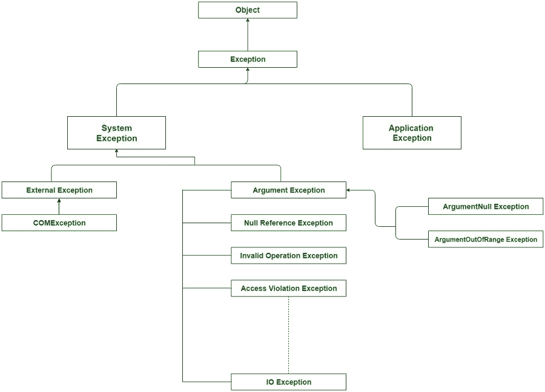

# C# |异常

> 原文:[https://www.geeksforgeeks.org/c-sharp-exception/](https://www.geeksforgeeks.org/c-sharp-exception/)

异常是指在程序执行期间(即运行时)发生的不必要或意外的事件，它会中断程序指令的正常流动。有时在程序执行过程中，用户可能会面临程序在运行时执行过程中崩溃或显示意外事件的可能性。这种不想要的事件被称为异常，它通常给出代码中错误的指示。

**示例:**显示除零操作期间异常的发生，如下所示:

```cs
// C# program to illustrate the exception
using System;
class Geeks {

        // Main Method
        static void Main(string[] args)
        {

            // taking two integer value
            int A = 12;
            int B = 0;

            // divide by zero error
            int c = A / B;

            Console.Write("Value of C is " + c);

        }
}
```

**运行时错误:**

> 未处理异常:
> 系统。DivideByZeroException:试图除以零。
> 在极客。主(系统。字符串[]参数)<filename unknown="">中的<0x 4068 cd50+0x 0000 c>:0
> 【错误】致命未处理异常:系统。DivideByZeroException:试图除以零。
> 在极客。主(系统。字符串[]args)<0x 4068 cd50+0x 0000 c<filename unknown="">中的>:0</filename>0x 4068 cd50></filename>0x 4068 cd50>

#### 

错误和异常的区别

**错误:**

*   错误是计算机程序执行过程中可能出现的意外问题。
*   错误无法处理。
*   所有错误都是例外。

**异常:**

*   异常是运行时可能出现的意外事件。
*   可以使用 try-catch 机制处理异常。
*   所有的异常都不是错误。

#### 

异常层次结构

在 C#中，所有的异常都是从基类**异常**派生出来的，基类又进一步分为两个分支**应用异常**和另一个分支**系统异常**。 *SystemException* 是所有 CLR 或程序代码生成错误的基类。*应用异常*是所有应用相关异常的基类。所有异常类都是直接或间接从异常类派生的。在*应用异常*的情况下，用户可以创建自己的异常类型和类。但是 SystemException 包含所有已知的异常类型，如 *DivideByZeroException* 或 *NullReferenceException* 等。

[](https://media.geeksforgeeks.org/wp-content/uploads/ExceptionClassHierarchy-1.jpg)

**不同的异常类:**c#程序中可以生成不同种类的异常:

*   **除零异常**:用户尝试除零时出现
*   **内存不足异常**:当程序试图使用过多内存时出现
*   **索引越界异常**:访问数组中不存在的数组元素或索引。
*   **Stackoverflow 异常**:主要是由于无限递归过程造成的
*   **Null Reference Exception** : Occurs when the user attempts to reference an object which is of NULL type.

    …..还有更多。

**异常类的属性:**异常类有很多属性，可以帮助用户在异常期间获取关于异常的信息。

*   **数据:**该属性有助于获取该属性在键值对中保存的任意数据的信息。
*   **TargetSite:** 这个属性有助于获取异常将抛出的方法的名称。
*   **消息:**该属性有助于提供异常发生的主要原因的详细信息。
*   **帮助链接:**该属性有助于保存特定异常的网址。
*   **StackTrace:** 该属性有助于提供有关错误发生位置的信息。
*   **InnerException:** 该属性有助于提供可能已经发生的一系列异常的信息。