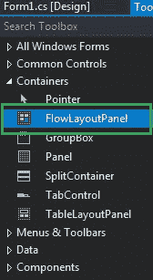
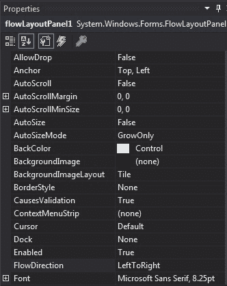
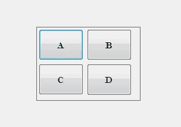
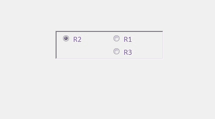

# C# | FlowLayoutPanel 类

> 原文:[https://www . geesforgeks . org/c-sharp-flowlayoutpanel-class/](https://www.geeksforgeeks.org/c-sharp-flowlayoutpanel-class/)

在 Windows 窗体中，FlowLayoutPanel 控件用于在水平或垂直流动方向上排列其子控件。或者换句话说，FlowLayoutPanel 是一个容器，用于在其中水平或垂直组织不同或相同类型的控件。FlowLayoutPanel 类用于表示窗口流布局面板，还提供不同类型的属性、方法和事件。在**系统下定义。Windows.Forms** 命名空间。在 C# 中，您可以使用两种不同的方法在 windows 窗体中创建一个 FlowLayoutPanel:

**1。设计时:**创建 FlowLayoutPanel 控件的最简单方法如下所示:

*   **第一步:**创建如下图所示的窗口表单:
    **Visual Studio->File->New->Project->windows formpp**
    
*   **步骤 2:** 接下来，将 FlowLayoutPanel 控件从工具箱拖放到如下图所示的表单中:
    
*   **Step 3:** After drag and drop you will go to the properties of the FlowLayoutPanel to modify FlowLayoutPanel according to your requirement.
    

    **输出:**
    

**2。运行时:**比上面的方法稍微复杂一点。在这个方法中，您可以借助 FlowLayoutPanel 类提供的语法，以编程方式创建一个 FlowLayoutPanel。以下步骤显示了如何动态设置创建 FlowLayoutPanel:

*   **步骤 1:** 使用由 FlowLayoutPanel 类提供的 **FlowLayoutPanel()** 构造函数创建 FlowLayoutPanel。

    ```cs
    // Creating a FlowLayoutPanel
    FlowLayoutPanel fl = new FlowLayoutPanel(); 

    ```

*   **步骤 2:** 创建完 FlowLayoutPanel 后，设置 FlowLayoutPanel 类提供的 FlowLayoutPanel 的属性。

    ```cs
    // Setting the location of the FlowLayoutPanel
     fl.Location = new Point(380, 124); 

    // Setting the size of the FlowLayoutPanel
            fl.Size = new Size(216, 57); 

    // Setting the name of the FlowLayoutPanel
            fl.Name = "Mycontainer"; 

    // Setting the font of the FlowLayoutPanel
            fl.Font = new Font("Calibri", 12); 

    // Setting the flow direction of the FlowLayoutPanel
            fl.FlowDirection = FlowDirection.RightToLeft; 

    // Setting the border style of the FlowLayoutPanel
            fl.BorderStyle = BorderStyle.Fixed3D; 

    // Setting the foreground color of the FlowLayoutPanel
            fl.ForeColor = Color.BlueViolet; 

    // Setting the visibility of the FlowLayoutPanel
            fl.Visible = true; 

    ```

*   **Step 3:** And last add this FlowLayoutPanel control to the form and also add other controls on the FlowLayoutPanel using the following statements:

    ```cs
    // Adding a FlowLayoutPanel
    // control to the form
    this.Controls.Add(fl);
    and 

    // Adding child controls 
    // to the FlowLayoutPanel
    fl.Controls.Add(f1);

    ```

    **示例:**

    ```cs
    using System;
    using System.Collections.Generic;
    using System.ComponentModel;
    using System.Data;
    using System.Drawing;
    using System.Linq;
    using System.Text;
    using System.Threading.Tasks;
    using System.Windows.Forms;

    namespace WindowsFormsApp50 {

    public partial class Form1 : Form {

        public Form1()
        {
            InitializeComponent();
        }

        private void Form1_Load(object sender, EventArgs e)
        {
            // Creating and setting the
            // properties of FlowLayoutPanel
            FlowLayoutPanel fl = new FlowLayoutPanel();
            fl.Location = new Point(380, 124);
            fl.Size = new Size(216, 57);
            fl.Name = "Myflowpanel";
            fl.Font = new Font("Calibri", 12);
            fl.FlowDirection = FlowDirection.RightToLeft;
            fl.BorderStyle = BorderStyle.Fixed3D;
            fl.ForeColor = Color.BlueViolet;
            fl.Visible = true;

            // Adding this control to the form
            this.Controls.Add(fl);

            // Creating and setting the
            // properties of radio buttons
            RadioButton f1 = new RadioButton();
            f1.Location = new Point(3, 3);
            f1.Size = new Size(95, 20);
            f1.Text = "R1";

            // Adding this control
            // to the FlowLayoutPanel
            fl.Controls.Add(f1);

            RadioButton f2 = new RadioButton();
            f2.Location = new Point(94, 3);
            f2.Size = new Size(95, 20);
            f2.Text = "R2";

            // Adding this control
            // to the FlowLayoutPanel
            fl.Controls.Add(f2);

            RadioButton f3 = new RadioButton();
            f3.Location = new Point(3, 26);
            f3.Size = new Size(95, 20);
            f3.Text = "R3";

            // Adding this control
            // to the FlowLayoutPanel
            fl.Controls.Add(f3);
        }
    }
    }
    ```

    **输出:**

    

    #### 构造器

    | 构造器 | 描述 |
    | **流程布局面板()** | 此构造函数用于初始化 FlowLayoutPanel 类的新实例。 |

    #### 性能

    | 财产 | 描述 |
    | **自动滚动** | 此属性用于获取或设置一个值，该值指示容器是否允许用户滚动到位于其可见边界之外的任何控件。 |
    | **自动化** | 此属性用于获取或设置一个值，该值指示控件是否根据其内容调整大小。 |
    | **[【自动模式】](https://www.geeksforgeeks.org/how-to-set-the-auto-size-mode-of-flowlayoutpanel-in-c-sharp/)** | 此属性指示控件的自动调整大小行为。 |
    | **[后场](https://www.geeksforgeeks.org/how-to-set-background-color-of-the-flowlayoutpanel-in-c-sharp/)** | 此属性用于获取或设置控件的背景色。 |
    | **[边框样式](https://www.geeksforgeeks.org/how-to-style-the-border-of-the-flowlayoutpanel-in-c-sharp/)** | 此属性指示控件的边框样式。 |
    | **[【流动方向】](https://www.geeksforgeeks.org/how-to-set-the-flow-direction-of-flowlayoutpanel-in-c-sharp/)** | 此属性用于获取或设置一个值，该值指示 FlowLayoutPanel 控件的流向。 |
    | **[字体](https://www.geeksforgeeks.org/how-to-set-font-in-flowlayoutpanel-in-c-sharp/)** | 此属性用于获取或设置控件显示的文本的字体。 |
    | **[前景](https://www.geeksforgeeks.org/how-to-set-foreground-color-of-flowlayoutpanel-in-c-sharp/)** | 此属性用于获取或设置控件的前景色。 |
    | **高度** | 此属性用于获取或设置控件的高度。 |
    | **[地点](https://www.geeksforgeeks.org/how-to-set-the-location-of-the-flowlayoutpanel-in-c-sharp/)** | 此属性用于获取或设置 FlowLayoutPanel 控件左上角相对于其窗体左上角的坐标。 |
    | **[名称](https://www.geeksforgeeks.org/how-to-set-the-name-of-flowlayoutpanel-in-c-sharp/)** | 此属性用于获取或设置控件的名称。 |
    | **填充** | 此属性用于获取或设置控件内的填充。 |
    | **[大小](https://www.geeksforgeeks.org/how-to-set-the-size-of-the-flowlayoutpanel-in-c-sharp/)** | 此属性用于获取或设置控件的高度和宽度。 |
    | **[可见](https://www.geeksforgeeks.org/how-to-set-the-visibility-of-the-flowlayoutpanel-in-c-sharp/)** | 此属性用于获取或设置一个值，该值指示是否显示控件及其所有子控件。 |
    | **宽度** | 此属性用于获取或设置控件的宽度。 |
    | **包装内容** | 此属性用于获取或设置一个值，该值指示 FlowLayoutPanel 控件应该包装其内容还是让内容被剪辑。 |