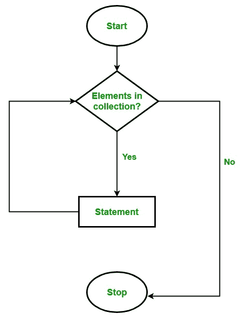

# C# | foreach 循环

> 原文:[https://www.geeksforgeeks.org/c-sharp-foreach-loop/](https://www.geeksforgeeks.org/c-sharp-foreach-loop/)

**先决条件:*[c#中的循环](https://www.geeksforgeeks.org/loops-in-c-sharp/)*T5】**

编程语言中的循环是一种根据要评估的条件的结果多次执行一条语句或一组语句的方法。结果条件应该为真，以便在循环中执行语句。 **foreach 循环**用于迭代集合的元素。集合可以是数组或列表。它对数组中的每个元素执行。

*   有必要将 foreach 循环的语句用花括号{}括起来。
*   您不是声明和初始化循环计数器变量，而是声明一个与数组的基类型相同的变量，后跟一个冒号，再跟一个数组名。
*   在循环体中，可以使用创建的循环变量，而不是使用索引数组元素。

**语法:**

```cs
foreach(data_type var_name in collection_variable)
{
     // statements to be executed
}

```

**流程图:**



**例 1:**

```cs
// C# program to illustrate the
// use of foreach loop
using System;

class GFG {

    // Main Method
    static public void Main()
    {

        Console.WriteLine("Print array:");

        // creating an array
        int[] a_array = new int[] { 1, 2, 3, 4, 5, 6, 7 };

        // foreach loop begin
        // it will run till the
        // last element of the array
        foreach(int items in a_array)
        {
            Console.WriteLine(items);
        }
    }
}
```

**Output:**

```cs
Print array:
1
2
3
4
5
6
7

```

**说明:**上述程序中的 foreach 循环相当于:

```cs
for(int items = 0; items < a_array.Length; items++)
{
    Console.WriteLine(a_array[items]);
}

```

**例 2:**

```cs
// C# program to illustrate 
// foreach loop 
using System;

class For_Each     
{

    // Main Method
    public static void Main(String[] arg) 
    { 
        { 
            int[] marks = { 125, 132, 95, 116, 110 }; 

            int highest_marks = maximum(marks); 

            Console.WriteLine("The highest score is " + highest_marks); 
        } 
    } 

    // method to find maximum
    public static int maximum(int[] numbers) 
    { 
        int maxSoFar = numbers[0]; 

        // for each loop 
        foreach (int num in numbers) 
        { 
            if (num > maxSoFar) 
            { 
                maxSoFar = num; 
            } 
        } 
    return maxSoFar; 
    } 
} 
```

**Output:**

```cs
The highest score is 132

```

**foreach 循环的限制:**

1.  当您想要修改数组 :

    ```cs
    foreach(int num in marks) 
    {
        // only changes num not
        // the array element
        num = num * 2; 
    }

    ```

    时，Foreach 循环**不合适**
2.  Foreach 循环**不跟踪索引**。所以我们不能使用 ForEach 循环

    ```cs
    foreach (int num in numbers) 
    { 
        if (num == target) 
        {
            return ???;   // do not know the index of num
        }
    }

    ```

    获得数组索引
3.  Foreach **只在数组中单步向前迭代**

    ```cs
    // cannot be converted to a foreach loop
    for (int i = numbers.Length - 1; i > 0; i--) 
    {
         Console.WriteLine(numbers[i]);
    }

    ```

**for 循环和 foreach 循环之间的差异:**

*   for 循环执行一条语句或一个语句块，直到给定条件为假。而 *foreach* 循环为数组中的每个元素执行一个语句或语句块，不需要定义最小或最大限制。
*   在循环的*中，我们向前和向后迭代数组，例如从索引 0 到 9 和从索引 9 到 0。但是在 foreach 循环中，我们只向前迭代数组，而不是向后迭代。*
*   就变量声明而言，foreach 循环有五个变量声明，而 for 循环只有三个变量声明。
*   foreach 循环复制数组，并将该副本放入新数组中进行操作。而 for 循环不行。