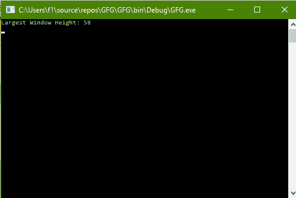

# C# |获取控制台最大窗口高度

> 原文:[https://www . geeksforgeeks . org/c-sharp-get-最大窗口-控制台高度/](https://www.geeksforgeeks.org/c-sharp-getting-the-largest-window-height-of-the-console/)

给定 C#中的正常控制台，任务是找到控制台的最大可能窗口高度。

**方法:**这可以使用 C#中系统包的**控制台**类中的**大窗口**属性来完成。根据当前字体和屏幕分辨率，此属性获取控制台窗口的最大可能行数。

**程序:**寻找最大窗高

```cs
// C# program to illustrate the
// Console.LargestWindowHeight Property
using System;
using System.Collections.Generic;
using System.Linq;
using System.Text;
using System.Threading.Tasks;

namespace GFG {

class Program {

    static void Main(string[] args)
    {

        // Display Largest Window Height
        Console.WriteLine("Largest Window Height: {0}",
                          Console.LargestWindowHeight);
    }
}
}
```

**输出:**

