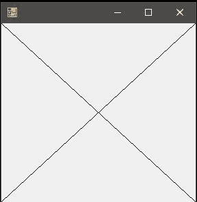
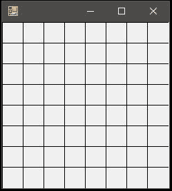

# C# |图形。画线()方法|设置–1

> 原文:[https://www . geesforgeks . org/c-sharp-graphics-draw line-method-set-1/](https://www.geeksforgeeks.org/c-sharp-graphics-drawline-method-set-1/)

**图形。画线()方法**用于画一条线，连接坐标对指定的两点。该方法的重载列表中有以下 4 种方法:

*   **画线(笔，点，点)法***   **画线(钢笔，Int32，Int32，Int32，Int32)方法***   **画线(钢笔、单、单、单、单)方法***   **DrawLine(Pen, Point, Point) Method

    在这里，我们将讨论前两种方法。

    #### 画线(笔，点，点)法

    这种方法用于从指定的一组点画线到指定的一组点。它需要一个由(x，y)点组成的 PointF 变量。

    **语法:**

    > 公共作废图纸(系统。绘图。钢笔，系统。图纸点 pt1，系统。图纸. PointF pt2)；

    **参数:**

    *   **笔:**笔决定线条的颜色、宽度和样式。
    *   **pt1:** 将(x，y)坐标定义为初始点的点 f 变量。
    *   **pt2:** 将(x，y)坐标定义为最终点的点 f 变量。

    **异常:**如果*笔*为空，此方法将给出 *ArgumentNullexception* 。

    **示例:**

    ```
    // C# program to demonstrate the 
    // DrawLine(Pen, PointF, PointF) Method
    using System;
    using System.Drawing;
    using System.Drawing.Printing;
    using System.Windows.Forms;

    namespace GFG {

    class PrintableForm : Form {

        public static void Main()
        {
            Application.Run(new PrintableForm());
        }

        public PrintableForm()
        {
            ResizeRedraw = true;
        }
        protected override void OnPaint(PaintEventArgs pea)
        {
            // Defines pen
            Pen pen = new Pen(ForeColor);

            // Defines the both points to connect
            // pt1 is (30.0, 30.0) which represents (x1, y1)
            PointF pt1 = new PointF(30.0F, 30.0F);

            // pt2 is (200.0, 300.0) which represents (x2, y2)
            PointF pt2 = new PointF(200.0F, 300.0F);

            // Draws the line
            pea.Graphics.DrawLine(pen, pt1, pt2);
        }
    }
    }
    ```

    **输出:**

    

    #### 画线(钢笔，Int32，Int32，Int32，Int32)方法

    这种方法用于从指定的一组坐标中画线，给定的形式 x1，y1，x2，y2 全部离散。

    **语法:**

    > 公共作废图纸(系统。Drawing.Pen pen，int x1，int y1，int x2，int y2)；

    **参数:**

    *   **笔**:笔决定线条的颜色、宽度和样式。
    *   **x1** :第一点横坐标。
    *   **y1** :第一点的纵坐标。
    *   **x2** :第二点横坐标。
    *   **y2** :第二点的纵坐标。

    **异常:**如果*笔*为空，此方法将给出 *ArgumentNullexception* 。

    **例 1:**

    ```
    // C# program to draw a cross using the
    // DrawLine(Pen, Int32, Int32, Int32,
    // Int32) Method
    using System;
    using System.Drawing;
    using System.Drawing.Printing;
    using System.Windows.Forms;

    namespace GFG {

    class PrintableForm : Form {

        public static void Main()
        {
            Application.Run(new PrintableForm());
        }

        public PrintableForm()
        {
            ResizeRedraw = true;
        }

        protected override void OnPaint(PaintEventArgs pea)
        {
            // Defines the pen
            Pen pen = new Pen(ForeColor);

            // To draw a cross we need to make 2 
            // diagonals from top-left to the 
            // bottom-right and top-right to the 
            // bottom-left to calculate these 
            // coordinates we would take help of 
            // our screen size top-left = (0, 0)
            // bottom-right = (ClientSize.Width - 1,
            // ClientSize.Height - 1)
            // top-right = (ClientSize.Width - 1, 0)
            // bottom-left = (0, ClientSize.Height - 1)
            pea.Graphics.DrawLine(pen, 0, 0, ClientSize.Width - 1,
                                           ClientSize.Height - 1);

            pea.Graphics.DrawLine(pen, ClientSize.Width - 1, 0, 0,
                                           ClientSize.Height - 1);
        }
    }
    }
    ```

    **输出:**

    

    **例 2:**

    ```
    // C# program to Create a 8x8 square board
    // using // DrawLine(Pen, Int32, Int32, Int32,
    // Int32) Method
    using System;
    using System.Drawing;
    using System.Drawing.Printing;
    using System.Windows.Forms;

    namespace GFG {

    class PrintableForm : Form {

        public static void Main()
        {
            Application.Run(new PrintableForm());
        }

        public PrintableForm()
        {
            ResizeRedraw = true;
        }

        protected override void OnPaint(PaintEventArgs pea)
        {
            // Define Pen
            Pen pen = new Pen(ForeColor);

            // loop for all 7 horizontal lines to draw
            for (int i = 0; i < 7; i++) 
            {
                // Taking Block size to be 30x30
                // So width and height will be 30*8=240
                pea.Graphics.DrawLine(pen, i * 30, 0, i * 30, 240);
            }

            // loop for all 7 horizontal lines to draw
            for (int i = 0; i < 7; i++) 
            {
                pea.Graphics.DrawLine(pen, 0, i * 30,
                                        240, i * 30);
            }
        }
    }
    }
    ```

    **输出:**

    **