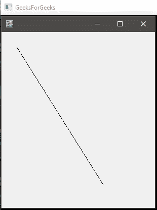

# C# |图形。画线()方法|设置–2

> 原文:[https://www . geesforgeks . org/c-sharp-graphics-draw line-method-set-2/](https://www.geeksforgeeks.org/c-sharp-graphics-drawline-method-set-2/)

**图形。画线()方法**用于画一条线，连接坐标对指定的两点。该方法的重载列表中有以下 4 种方法:

*   **画线(笔，点，点)法***   **画线(钢笔，Int32，Int32，Int32，Int32)方法***   **画线(钢笔、单、单、单、单)方法***   **DrawLine(Pen, Point, Point) Method

    首先， **[集合–1](https://www.geeksforgeeks.org/c-sharp-graphics-drawline-method-set-1/)**中已经讨论了两种方法。在这里，我们将讨论最后两种方法。

    #### 画线(钢笔、单、单、单、单)方法

    这种方法用于从指定的一组坐标中画线，给定的形式 x1，y1，x2，y2 全部离散。

    **语法:**

    > 公共作废图纸(系统。Drawing.Pen 笔，float x1，float y1，float x2，float y2)；

    **参数:**

    *   **笔**:笔决定线条的颜色、宽度和样式。
    *   **x1** :第一点横坐标。
    *   **y1** :第一点的纵坐标。
    *   **x2** :第二点横坐标。
    *   **y2** :第二点的纵坐标。

    **异常:**如果笔为*空*，这个方法会给出 *ArgumentNullException* 。

    **示例:**

    ```
    // C# program to illustrate the use of 
    using System;
    using System.Drawing;
    using System.Drawing.Printing;
    using System.Windows.Forms;

    namespace GFG {

    class PrintableForm : Form {

        // Main Method
        public static void Main()
        {
            Application.Run(new PrintableForm());
        }

        public PrintableForm()
        {
            ResizeRedraw = true;
        }

        protected override void OnPaint(PaintEventArgs pea)
        {
            // Defines the Pen
            Pen pen = new Pen(ForeColor);

            // x1 = 30
            // y1 = 30
            // x2 = 200
            // y2 = 300

            // using the Method
            pea.Graphics.DrawLine(pen, 30.0F, 30.0F, 200.0f, 300.0f);
        }
    }
    }
    ```

    **输出:**

    

    #### 画线(笔、点、点)

    此方法用于从指定的一组点到指定的一组点绘制一条线。它需要一个由(x，y)点组成的点变量。

    **语法:**

    > 公共作废图纸(系统。绘图。钢笔，系统。图纸点 pt1，系统。图纸. PointF pt2)；

    **参数:**

    *   **笔**:笔决定线条的颜色、宽度和样式。
    *   **pt1** :将(x，y)坐标定义为初始点的点变量。
    *   **pt2** :将(x，y)坐标定义为最终点的点变量。

    **异常:**如果笔为*空*，这个方法会给出 *ArgumentNullException* 。

    **示例:**

    ```
    // C# program to demonstrate the use of
    // DrawLine(Pen, Point, Point) Method
    using System;
    using System.Drawing;
    using System.Drawing.Printing;
    using System.Windows.Forms;

    namespace GFG {

    class PrintableForm : Form {

        // Main Method
        public static void Main()
        {
            Application.Run(new PrintableForm());
        }

        public PrintableForm()
        {
            ResizeRedraw = true;
        }

        protected override void OnPaint(PaintEventArgs pea)
        {
            // Defines pen
            Pen pen = new Pen(ForeColor);

            // Defines the both points to connect
            // pt1 is (30, 30) which represents (x1, y1)
            Point pt1 = new Point(30, 30);

            // pt1 is (200, 300) which represents (x2, y2)
            Point pt2 = new Point(200, 300);

            // Draws the line
            pea.Graphics.DrawLine(pen, pt1, pt2);
        }
    }
    }
    ```

    **输出:**

    **