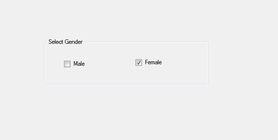

# C# |群盒类

> 原文:[https://www.geeksforgeeks.org/c-sharp-groupbox-class/](https://www.geeksforgeeks.org/c-sharp-groupbox-class/)

在 Windows 窗体中，GroupBox 是一个包含多个控件的容器，这些控件相互关联。或者换句话说，GroupBox 是一组控件周围的框架显示，带有合适的可选标题。或者使用一个组框对一个组中的相关控件进行分类。GroupBox 类用于表示 windows 组框，还提供不同类型的属性、方法和事件。在*系统下定义。Windows.Forms* 命名空间。分组框的主要用途是保存一组逻辑的单选按钮控件。

在 C#中，您可以使用两种不同的方法在 windows 窗体中创建一个 GroupBox:

**1。设计时:**创建分组框最简单的方法如下所示:

*   **第一步:**创建如下图所示的窗口表单:
    **Visual Studio->File->New->Project->windows formpp**
    
*   **Step 2:** Next, drag and drop the GroupBox from the toolbox on the form.

    

*   **Step 3:** After drag and drop you will go to the properties of the GroupBox to modify GroupBox according to your requirement.

    

    **输出:**

    

**2。运行时:**比上面的方法稍微复杂一点。在此方法中，您可以借助 GroupBox 类提供的语法以编程方式创建一个 GroupBox。以下步骤显示了如何动态设置创建组框:

*   **步骤 1:** 使用 *GroupBox()* 构造函数创建一个 GroupBox，该构造函数由 GroupBox 类提供。

    ```
    // Creating a GroupBox
    GroupBox box = new GroupBox(); 

    ```

*   **第二步:**创建完 GroupBox 后，设置 GroupBox 类提供的 GroupBox 的属性。

    ```
    // Setting the location of the GroupBox
    box.Location = new Point(179, 145);

    // Setting the size of the GroupBox
    box.Size = new Size(329, 94);

    // Setting text the GroupBox
    box.Text = "Select Gender";

    // Setting the name of the GroupBox
    box.Name = "MyGroupbox";

    ```

*   **Step 3:** And last add this GroupBox control to the form and also add other controls on the GroupBox using the following statements:

    ```
    // Adding groupbox in the form
    this.Controls.Add(box);

    and 

    // Adding this control to the GroupBox
    box.Controls.Add(b2);

    ```

    **示例:**

    ```
    using System;
    using System.Collections.Generic;
    using System.ComponentModel;
    using System.Data;
    using System.Drawing;
    using System.Linq;
    using System.Text;
    using System.Threading.Tasks;
    using System.Windows.Forms;

    namespace WindowsFormsApp45 {

    public partial class Form1 : Form {

        public Form1()
        {
            InitializeComponent();
        }

        private void Form1_Load(object sender, EventArgs e)
        {
            // Creating and setting 
            // properties of the GroupBox
            GroupBox box = new GroupBox();
            box.Location = new Point(179, 145);
            box.Size = new Size(329, 94);
            box.Text = "Select Gender";
            box.Name = "MyGroupbox";

            // Adding groupbox in the form
            this.Controls.Add(box);

            // Creating and setting 
            // properties of the CheckBox
            CheckBox b1 = new CheckBox();
            b1.Location = new Point(40, 42);
            b1.Size = new Size(49, 20);
            b1.Text = "Male";

            // Adding this control 
            // to the GroupBox
            gbox.Controls.Add(b1);

            // Creating and setting 
            // properties of the CheckBox
            CheckBox b2 = new CheckBox();
            b2.Location = new Point(183, 39);
            b2.Size = new Size(69, 20);
            b2.Text = "Female";

            // Adding this control
            // to the GroupBox
            box.Controls.Add(b2);
        }
    }
    }
    ```

    **输出:**
    

#### 构造器

| 构造器 | 描述 |
| **群盒()** | 此构造函数用于初始化 GroupBox 类的新实例。 |

#### 性能

| 财产 | 描述 |
| **自动化** | 此属性用于获取或设置一个值，该值指示控件是否根据其内容调整大小。 |
| 自动模式 | 此属性指示当启用其自动调整属性时，组框的行为。 |
| **背景色** | 此属性用于获取或设置控件的背景色。 |
| 边框样式 | 此属性指示控件的边框样式。 |
| **显示矩形** | 此属性用于获取一个表示 GroupBox 维度的矩形。 |
| 字体 | 此属性用于获取或设置控件显示的文本的字体。 |
| **前颜色** | 此属性用于获取或设置控件的前景色。 |
| **高度** | 此属性用于获取或设置控件的高度。 |
| **位置** | 此属性用于获取或设置 GroupBox 控件左上角相对于其窗体左上角的坐标。 |
| **名称** | 此属性用于获取或设置控件的名称。 |
| **tab top** | 此属性用于获取或设置一个值，该值显示用户是否可以按 TAB 键将焦点提供给组框。 |
| **尺寸** | 此属性用于获取或设置控件的高度和宽度。 |
| **可见** | 此属性用于获取或设置一个值，该值指示是否显示控件及其所有子控件。 |
| **宽度** | 此属性用于获取或设置控件的宽度。 |