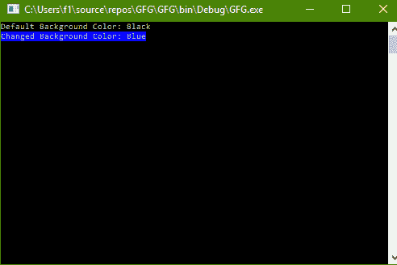

# C# |如何在控制台中更改文本的背景色

> 原文:[https://www . geesforgeks . org/c-sharp-如何更改-控制台中文本的背景颜色/](https://www.geeksforgeeks.org/c-sharp-how-to-change-background-color-of-text-in-console/)

给定 C#中的普通控制台，文本背景的默认颜色是“黑色”。任务是将这种颜色改为其他颜色。

**方法:**这可以使用 C#中系统包的**控制台**类中的 **BackgroundColor** 属性来完成。

**程序 1:** 将控制台背景颜色更改为蓝色。

```
// C# program to illustrate the 
// BackgroundColor Property
using System;
using System.Collections.Generic;
using System.Linq;
using System.Text;
using System.Threading.Tasks;

namespace GFG {
class Program {
    static void Main(string[] args)
    {

        // Display current Background color
        Console.WriteLine("Default Background Color: {0}",
                          Console.BackgroundColor);

        // Set the Background color to blue
        Console.BackgroundColor
            = ConsoleColor.Blue;

        // Display current Background color
        Console.WriteLine("Changed Background Color: {0}",
                          Console.BackgroundColor);
    }
}
}
```

**输出:**



**程序 2:** 可以更改背景颜色的可用颜色列表如下

```
// C# program to get the
// list of available colors
using System;
using System.Collections.Generic;
using System.Linq;
using System.Text;
using System.Threading.Tasks;

namespace GFG {
class Program {
    static void Main(string[] args)
    {

        // Get the list of available colors
        // that can be changed
        ConsoleColor[] consoleColors
            = (ConsoleColor[])ConsoleColor
                  .GetValues(typeof(ConsoleColor));

        // Display the list
        // of available console colors
        Console.WriteLine("List of available "
                          + "Console Colors:");
        foreach(var color in consoleColors)
            Console.WriteLine(color);
    }
}
}
```

**输出:**

