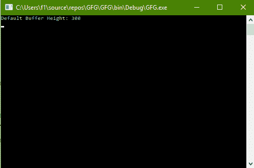
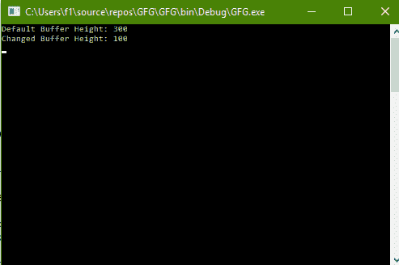

# C# |如何更改控制台的 buffer h8

> 原文:[https://www . geeksforgeeks . org/c-sharp-how-to-change-buffer-of-the-console/](https://www.geeksforgeeks.org/c-sharp-how-to-change-bufferheight-of-the-console/)

给定 C# 中的正常控制台，任务是找到缓冲区高度的默认值，并将其更改为其他值。

**缓冲高度**是指控制台缓冲区的当前高度，以行为单位。

**方法:**这可以使用 C# 中系统包的**控制台**类中的**buffer h8**属性来完成。

**程序 1:** 查找默认缓冲高度

```cs
// C# program to illustrate the
// BufferHeight Property
using System;
using System.Collections.Generic;
using System.Linq;
using System.Text;
using System.Threading.Tasks;

namespace GFG {

class Program {

    static void Main(string[] args)
    {

        // Display current Buffer Height
        Console.WriteLine("Default Buffer Height: {0}",
                                Console.BufferHeight);
    }
}
}
```

**输出:**



**程序 2:** 将缓冲高度改为 100

```cs
// C# program to illustrate the
// BufferHeight Property
using System;
using System.Collections.Generic;
using System.Linq;
using System.Text;
using System.Threading.Tasks;

namespace GFG {

class Program {

    static void Main(string[] args)
    {

        // Display current Buffer Height
        Console.WriteLine("Default Buffer Height: {0}",
                                 Console.BufferHeight);

        // Set the Buffer Height to 100
        Console.BufferHeight = 100;

        // Display current Buffer Height
        Console.WriteLine("Changed Buffer Height: {0}",
                                 Console.BufferHeight);
    }
}
}
```

**输出:**



**注意:**查看两个图像中右侧的垂直滚动条是如何变化的。