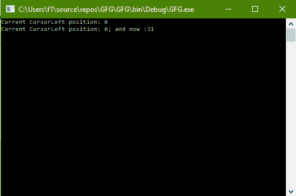
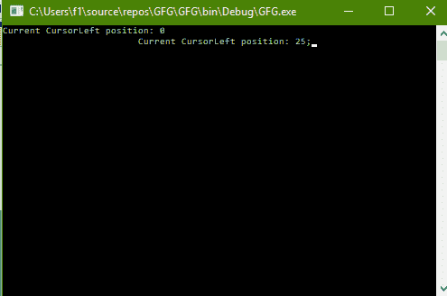

# C# |如何更改控制台的光标

> 原文:[https://www . geesforgeks . org/c-sharp-如何改变控制台的光标/](https://www.geeksforgeeks.org/c-sharp-how-to-change-the-cursorleft-of-the-console/)

给定 C#中的普通控制台，任务是更改控制台的光标。

**方法:**这可以使用 C#中系统包的**控制台**类中的**光标**属性来完成。这将改变光标的水平位置。基本上，它获取或设置光标在缓冲区内的列位置。

**程序 1:** 获取 CursorLeft 的值

```
// C# program to illustrate the
// Console.CursorLeft Property
using System;
using System.Collections.Generic;
using System.Linq;
using System.Text;
using System.Threading.Tasks;

namespace GFG {

class Program {

    static void Main(string[] args)
    {

        // Get the CursorLeft position
        Console.WriteLine("Current CursorLeft position: {0}",
                                         Console.CursorLeft);

        // Get the CursorLeft position
        Console.Write("Current CursorLeft position: {0};",
                                      Console.CursorLeft);

        Console.WriteLine(" and now :{0}",
                      Console.CursorLeft);
    }
}
}
```

**输出:**



**程序 2:** 设置 CursorLeft 的值

```
// C# program to illustrate the
// Console.CursorLeft Property
using System;
using System.Collections.Generic;
using System.Linq;
using System.Text;
using System.Threading.Tasks;

namespace GFG {

class Program {

    static void Main(string[] args)
    {

        // Get the CursorLeft position
        Console.WriteLine("Current CursorLeft position: {0}",
                                         Console.CursorLeft);

        // Set the CursorLeft position
        Console.CursorLeft = 25;

        // Get the CursorLeft position
        Console.Write("Current CursorLeft position: {0};",
                                      Console.CursorLeft);
    }
}
}
```

**输出:**

