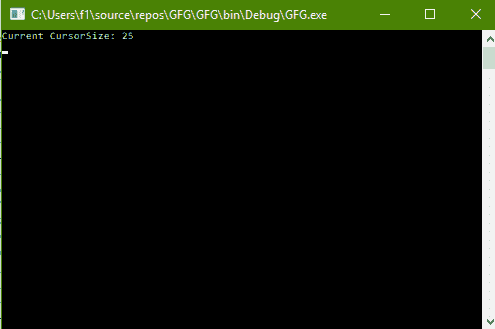
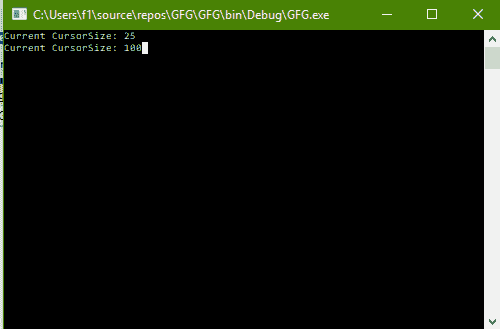

# C# |如何更改控制台的光标大小

> 原文:[https://www . geeksforgeeks . org/c-sharp-如何改变控制台的大小/](https://www.geeksforgeeks.org/c-sharp-how-to-change-the-cursorsize-of-the-console/)

给定 C# 中的正常控制台，任务是更改控制台的光标大小。

**方法:**这可以使用 C# 中系统包的**控制台**类中的 **CursorSize** 属性来完成。它获取或设置字符单元格内光标的高度(百分比)。

**程序 1:** 获取 CursorSize 的值

```cs
// C# program to illustrate the
// Console.CursorSize Property
using System;
using System.Collections.Generic;
using System.Linq;
using System.Text;
using System.Threading.Tasks;

namespace GFG {

class Program {

    static void Main(string[] args)
    {

        // Get the CursorSize
        Console.WriteLine("Current CursorSize: {0}",
                                Console.CursorSize);
    }
}
}
```

**输出:**



**程序 2:** 设置 CursorSize 的值

```cs
// C# program to illustrate the
// Console.CursorSize Property
using System;
using System.Collections.Generic;
using System.Linq;
using System.Text;
using System.Threading.Tasks;

namespace GFG {

class Program {

    // Main Method
    static void Main(string[] args)
    {

        // Get the CursorSize
        Console.WriteLine("Current CursorSize: {0}",
                                Console.CursorSize);

        // Set the CursorSize
        Console.CursorSize = 100;

        // Get the CursorSize
        Console.Write("Current CursorSize: {0}",
                            Console.CursorSize);
    }
}
}
```

**输出:**



**注意:**查看两幅图像中光标的宽度。