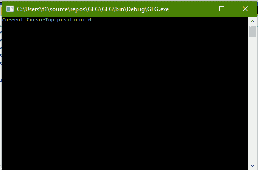
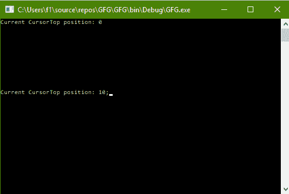

# C# |如何更改控制台的光标位置

> 原文:[https://www . geesforgeks . org/c-sharp-如何更改控制台的光标/](https://www.geeksforgeeks.org/c-sharp-how-to-change-the-cursortop-of-the-console/)

给定 C# 中的正常控制台，任务是更改控制台的光标操作。

**方法:**这可以使用 C# 中系统包的**控制台**类中的**光标**属性来完成。这将改变光标的垂直位置。基本上，它获取或设置光标在缓冲区内的行位置。

**程序 1:** 获取 CursorTop 的值

```cs
// C# program to illustrate the
// Console.CursorTop Property
using System;
using System.Collections.Generic;
using System.Linq;
using System.Text;
using System.Threading.Tasks;

namespace GFG {

class Program {

    static void Main(string[] args)
    {

        // Get the CursorTop position
        Console.WriteLine("Current CursorTop position: {0}",
                                         Console.CursorTop);

        // Get the CursorTop position
        Console.Write("Current CursorTop position: {0};",
                                      Console.CursorTop);

        Console.WriteLine(" and now :{0}",
                       Console.CursorTop);
    }
}
}
```

**输出:**



**程序 2:** 设置光标位置值

```cs
// C# program to illustrate the
// Console.CursorTop Property
using System;
using System.Collections.Generic;
using System.Linq;
using System.Text;
using System.Threading.Tasks;

namespace GFG {

class Program {

    static void Main(string[] args)
    {

        // Get the CursorTop position
        Console.WriteLine("Current CursorTop position: {0}",
                                         Console.CursorTop);

        // Set the CursorTop position
        Console.CursorTop = 10;

        // Get the CursorTop position
        Console.Write("Current CursorTop position: {0};",
                                      Console.CursorTop);
    }
}
}
```

**输出:**

