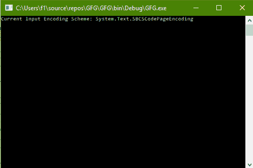
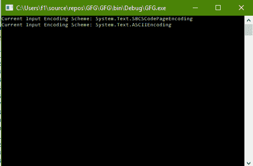

# C# |如何更改控制台的输入编码方案

> 原文:[https://www . geesforgeks . org/c-sharp-如何更改控制台的输入编码方案/](https://www.geeksforgeeks.org/c-sharp-how-to-change-the-input-encoding-scheme-of-the-console/)

给定 C#中的正常控制台，任务是更改控制台的输入编码方案。

**方法:**这可以使用 C#中系统包的**控制台**类中的**输入编码**属性来完成。控制台。InputEncoding 属性获取或设置控制台用来读取输入的编码。

**程序 1:** 获取输入编码方案的值

```
// C# program to illustrate the
// Console.InputEncoding Property
using System;
using System.Collections.Generic;
using System.Linq;
using System.Text;
using System.Threading.Tasks;

namespace GFG {

class Program {

    static void Main(string[] args)
    {

        // Get the Input Encoding Scheme
        Console.WriteLine("Current Input Encoding Scheme: {0}",
                                       Console.InputEncoding);
    }
}
}
```

**输出:**



**程序 2:** 设置输入编码方案的值

```
// C# program to illustrate the
// Console.InputEncoding Property
using System;
using System.Collections.Generic;
using System.Linq;
using System.Text;
using System.Threading.Tasks;

namespace GFG {

class Program {

    static void Main(string[] args)
    {

        // Get the Input Encoding Scheme
        Console.WriteLine("Current Input Encoding Scheme: {0}",
                                       Console.InputEncoding);

        // Set the Input Encoding Scheme to ASCII
        Console.InputEncoding = Encoding.ASCII;

        // Get the Input Encoding Scheme
        Console.WriteLine("Current Input Encoding Scheme: {0}",
                                        Console.InputEncoding);
    }
}
}
```

**输出:**

