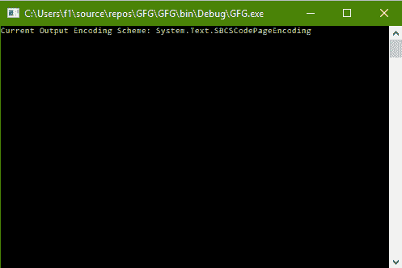
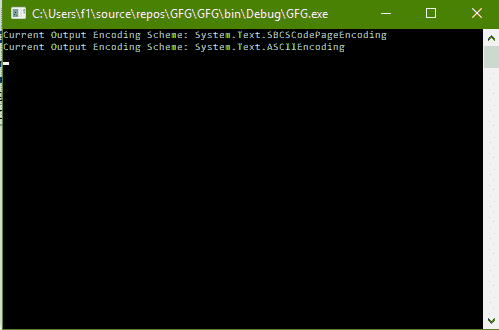

# C# |如何更改控制台的输出编码方案

> 原文:[https://www . geesforgeks . org/c-sharp-如何更改控制台的输出编码方案/](https://www.geeksforgeeks.org/c-sharp-how-to-change-the-output-encoding-scheme-of-the-console/)

给定 C# 中的正常控制台，任务是更改控制台的输出编码方案。

**方法:**这可以使用 C# 中系统包的**控制台**类中的**输出编码**属性来完成。

**程序 1:** 获取输出编码方案的值

```cs
// C# program to illustrate the
// Console.OutputEncoding Property
using System;
using System.Collections.Generic;
using System.Linq;
using System.Text;
using System.Threading.Tasks;

namespace GFG {

class Program {

    static void Main(string[] args)
    {

        // Get the Output Encoding Scheme
        Console.WriteLine("Current Output Encoding Scheme: {0}",
                                        Console.OutputEncoding);
    }
}
}
```

**输出:**



**程序 2:** 设置输出编码方案的值

```cs
// C# program to illustrate the
// Console.OutputEncoding Property
using System;
using System.Collections.Generic;
using System.Linq;
using System.Text;
using System.Threading.Tasks;

namespace GFG {

class Program {

    static void Main(string[] args)
    {

        // Get the Output Encoding Scheme
        Console.WriteLine("Current Output Encoding Scheme: {0}",
                                        Console.OutputEncoding);

        // Set the Output Encoding Scheme to ASCII
        Console.OutputEncoding = Encoding.ASCII;

        // Get the Output Encoding Scheme
        Console.WriteLine("Current Output Encoding Scheme: {0}",
                                        Console.OutputEncoding);
    }
}
}
```

**输出:**

