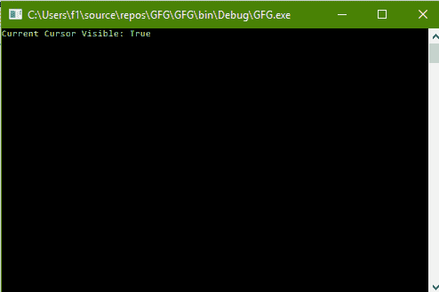
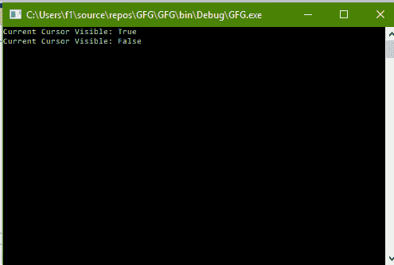

# C# |如何更改控制台光标的可见性

> 原文:[https://www . geesforgeks . org/c-sharp-如何改变控制台光标的可见性/](https://www.geeksforgeeks.org/c-sharp-how-to-change-the-visibility-of-the-cursor-of-console/)

给定 C#中的普通控制台，任务是更改控制台光标的可见性。

**方法:**这可以使用 C#中系统包的**控制台**类中的 **CursorVisible** 属性来完成。它获取或设置一个值，该值指示光标是否可见。

**程序 1:** 获取 CursorVisible 的值

```cs
// C# program to illustrate the
// Console.CursorVisible Property
using System;
using System.Collections.Generic;
using System.Linq;
using System.Text;
using System.Threading.Tasks;

namespace GFG {

class Program {

    static void Main(string[] args)
    {

        // Get the default CursorVisible
        Console.WriteLine("Current Cursor Visible: {0}",
                                 Console.CursorVisible);
    }
}
}
```

**输出:**



**程序 2:** 设置光标可见值

```cs
// C# program to illustrate the
// Console.CursorVisible Property
using System;
using System.Collections.Generic;
using System.Linq;
using System.Text;
using System.Threading.Tasks;

namespace GFG {

class Program {

    static void Main(string[] args)
    {

        // Get the CursorVisible
        Console.WriteLine("Current Cursor Visible: {0}",
                                 Console.CursorVisible);

        // Set the CursorVisible
        Console.CursorVisible = false;

        // Get the CursorVisible
        Console.Write("Current Cursor Visible: {0}",
                             Console.CursorVisible);
    }
}
}
```

**输出:**

