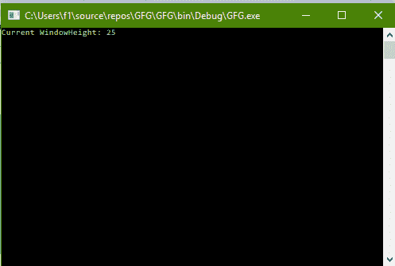
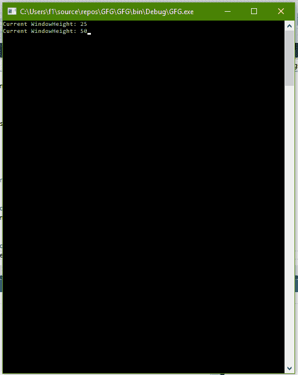

# C# |如何更改控制台的窗口高度

> 原文:[https://www . geesforgeks . org/c-sharp-如何改变控制台的窗口高度/](https://www.geeksforgeeks.org/c-sharp-how-to-change-the-windowheight-of-the-console/)

给定 C# 中的普通控制台，任务是更改控制台的窗口高度。

**方法:**这可以使用 C# 中系统包的**控制台**类中的**窗口高度**属性来完成。**窗口高度**是指控制台窗口的高度，单位为行。

**程序 1:** 获取窗口高度值

```cs
// C# program to illustrate the
// Console.WindowHeight Property 
using System;
using System.Collections.Generic;
using System.Linq;
using System.Text;
using System.Threading.Tasks;

namespace GFG {

class Program {

    static void Main(string[] args)
    {

        // Get the WindowHeight
        Console.WriteLine("Current WindowHeight: {0}",
                                Console.WindowHeight);
    }
}
}
```

**输出:**



**程序 2:** 设置窗口高度值

```cs
// C# program to illustrate the
// Console.WindowHeight Property 
using System;
using System.Collections.Generic;
using System.Linq;
using System.Text;
using System.Threading.Tasks;

namespace GFG {

class Program {

    static void Main(string[] args)
    {

        // Get the WindowHeight
        Console.WriteLine("Current WindowHeight: {0}",
                                Console.WindowHeight);

        // Set the WindowHeight
        Console.WindowHeight = 50;

        // Get the WindowHeight
        Console.Write("Current WindowHeight: {0}",
                            Console.WindowHeight);
    }
}
}
```

**输出:**



**注意:**查看两幅图像中窗口的高度。