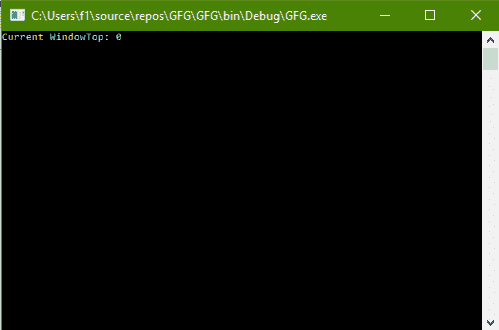
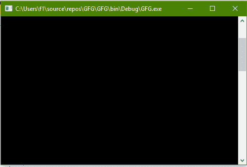

# C# |如何更改控制台的窗口顶部

> 原文:[https://www . geeksforgeeks . org/c-sharp-如何更改控制台窗口顶部/](https://www.geeksforgeeks.org/c-sharp-how-to-change-the-windowtop-of-the-console/)

给定 C#中的普通控制台，任务是更改控制台的窗口顶部。

**方法:**这可以使用 C#中系统包的**控制台**类中的**窗口顶部**属性来完成。**窗口顶部**获取或设置控制台窗口区域相对于屏幕缓冲区的顶部位置。

**程序 1:** 获取窗口顶部的值

```
// C# program to illustrate the
// Console.WindowTop Property
using System;
using System.Collections.Generic;
using System.Linq;
using System.Text;
using System.Threading.Tasks;

namespace GFG {

class Program {

    static void Main(string[] args)
    {

        // Get the WindowTop
        Console.WriteLine("Current WindowTop: {0}",
                               Console.WindowTop);
    }
}
}
```

**输出:**



**程序 2:** 设置窗口顶部的值

```
// C# program to illustrate the
// Console.WindowTop Property
using System;
using System.Collections.Generic;
using System.Linq;
using System.Text;
using System.Threading.Tasks;

namespace GFG {

class Program {

    static void Main(string[] args)
    {

        // Get the WindowWidth
        Console.WriteLine("Current WindowTop: {0}",
                               Console.WindowTop);

        // Set the WindowWidth
        Console.BufferHeight = 100;
        Console.WindowTop = 10;

        // Get the WindowWidth
        Console.Write("Current WindowTop: {0}",
                            Console.WindowTop);
    }
}
}
```

**输出:**



**注意:**在两幅图像中都可以看到窗口右侧的垂直滚动条。