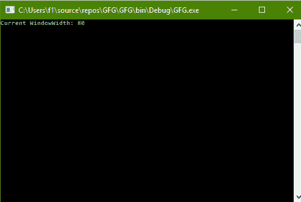
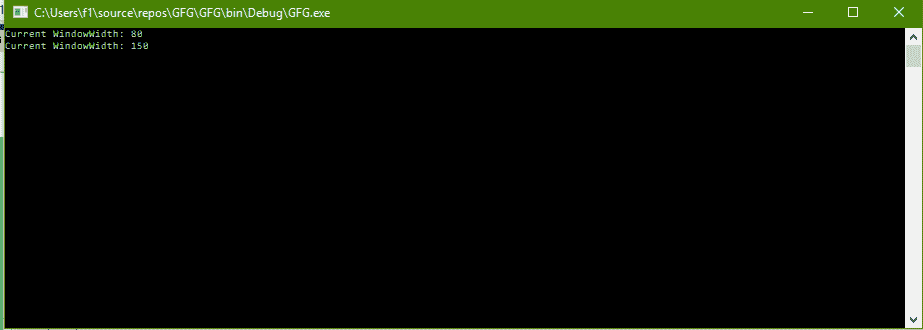

# C# |如何更改控制台的窗宽

> 原文:[https://www . geeksforgeeks . org/c-sharp-如何更改控制台的窗口宽度/](https://www.geeksforgeeks.org/c-sharp-how-to-change-the-windowwidth-of-the-console/)

给定 C#中的普通控制台，任务是更改控制台的窗口宽度。

**方法:**这可以使用 C#中系统包的**控制台**类中的**窗口宽度**属性来完成。**窗口宽度**是指控制台窗口的宽度，以列为单位。

**程序 1:** 获取窗口宽度的值

```cs
// C# program to illustrate the
// Console.WindowWidth Property
using System;
using System.Collections.Generic;
using System.Linq;
using System.Text;
using System.Threading.Tasks;

namespace GFG {

class Program {

    static void Main(string[] args)
    {

        // Get the WindowWidth
        Console.WriteLine("Current WindowWidth: {0}",
                                Console.WindowWidth);
    }
}
}
```

**输出:**



**程序 2:** 设置窗口宽度的值

```cs
// C# program to illustrate the
// Console.WindowWidth Property
using System;
using System.Collections.Generic;
using System.Linq;
using System.Text;
using System.Threading.Tasks;

namespace GFG {

class Program {

    static void Main(string[] args)
    {

        // Get the WindowWidth
        Console.WriteLine("Current WindowWidth: {0}",
                                Console.WindowWidth);

        // Set the WindowWidth
        Console.WindowWidth = 150;

        // Get the WindowWidth
        Console.Write("Current WindowWidth: {0}",
                            Console.WindowWidth);
    }
}
}
```

**输出:**



**注意:**请参见两幅图像中的窗口宽度。