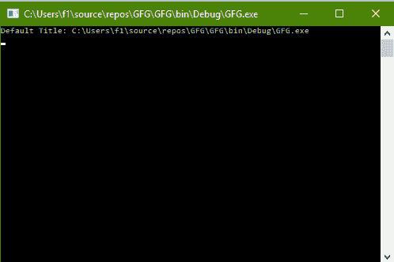
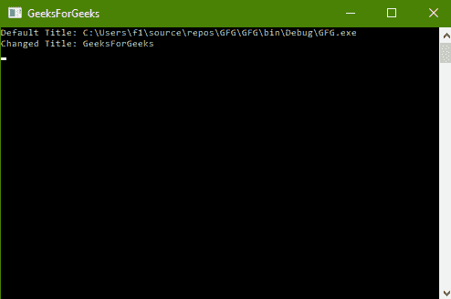

# C# |如何更改控制台标题

> 原文:[https://www . geesforgeks . org/c-sharp-如何更改控制台标题/](https://www.geeksforgeeks.org/c-sharp-how-to-change-title-of-the-console/)

给定 C# 中的正常控制台，任务是找到 Title 的默认值并将其更改为其他值。

**方法:**这可以使用 C# 中系统包的**控制台**类中的**标题**属性来完成。标题是指要显示在控制台标题栏中的字符串。标题字符串的最大长度为 24500 个字符。如果在获取操作中检索到的标题长于 24500 个字符，则它将给出*invalid operationexception*，如果在设置操作中检索到的标题长于 24500 个字符，则它将给出*argumentout of range exception*。

**程序 1:** 查找默认标题

```cs
// C# program to illustrate the
// Console.Title Property
using System;
using System.Collections.Generic;
using System.Linq;
using System.Text;
using System.Threading.Tasks;

namespace GFG {

class Program {

    static void Main(string[] args)
    {

        // Display current Title
        Console.WriteLine("Default Title: {0}",
                          Console.Title);
    }
}
}
```

**输出:**



**程序 2:** 将标题改为 100

```cs
// C# program to illustrate the
// Console.Title Property
using System;
using System.Collections.Generic;
using System.Linq;
using System.Text;
using System.Threading.Tasks;

namespace GFG {

class Program {

    static void Main(string[] args)
    {

        // Display current Title
        Console.WriteLine("Default Title: {0}",
                               Console.Title);

        // Set the Title to GeeksForGeeks
        Console.Title = "GeeksForGeeks";

        // Display current Title
        Console.WriteLine("Changed Title: {0}",
                               Console.Title);
    }
}
}
```

**输出:**

