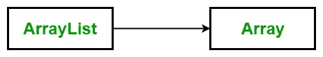

# C# |如何将数组列表转换为数组

> 原文:[https://www . geesforgeks . org/c-sharp-如何将数组列表转换为数组/](https://www.geeksforgeeks.org/c-sharp-how-to-convert-an-arraylist-to-array/)

在 C# 中， [**数组**](https://www.geeksforgeeks.org/c-sharp-arrays/) 是一组相似类型的变量，用一个共同的名字来指代。每个数据项被称为数组的一个元素。元素的数据类型可以是任何有效的数据类型，如 char、int、float 等。并且元素被存储在连续的位置。
[**数组列表**](https://www.geeksforgeeks.org/c-arraylist-class/) 表示可以单独索引的对象的有序集合。它基本上是数组的替代。它允许动态内存分配，添加，搜索和排序列表中的项目。



以下是将数组列表转换为数组的两种方法:
**方法 1:** 将数组列表转换为对象数组
**语法:**

```cs
public virtual object[] ToArray ();
```

**说明:**

*   它将数组列表的元素复制到一个新的对象数组中。
*   它返回一个包含数组列表元素副本的对象数组。

**示例:**在下面的程序中， *mylist* 是 ArrayList，我们在其中添加了 7 个项目，它们是工作日的名称。然后我们创建一个对象数组 *obj1* 并使用*将*方法与 mylist 进行排列，我们将数组列表元素分配给对象数组。最后，使用 *foreach loop* 可以打印所需的转换数组。

## c sharp . c sharp . c sharp . c sharp

```cs
// C# program to illustrate ToArray() Method
using System;
using System.Collections;

class GFG {

    // Main Method
    public static void Main()
    {

        // Create and initializing ArrayList
        ArrayList mylist = new ArrayList(7);

        mylist.Add("Monday");
        mylist.Add("Tuesday");
        mylist.Add("Wednesday");
        mylist.Add("Thursday");
        mylist.Add("Friday");
        mylist.Add("Saturday");
        mylist.Add("Sunday");

        // Copy the data of Arraylist into
        // the object Array Using ToArray()
        // method
        object[] obj1 = mylist.ToArray();

        foreach(string st in obj1)
        {
            Console.WriteLine(st);
        }
    }
}
```

**Output:** 

```cs
Monday
Tuesday
Wednesday
Thursday
Friday
Saturday
Sunday
```

**方法 2:** 将数组列表转换为指定类型的数组
**语法:**

```cs
public virtual Array ToArray (Type t);
```

这里，t 是创建和复制元素的目标数组的元素类型。
**解说:**

*   它将数组列表的元素复制到指定元素类型的新数组中。
*   它返回一个指定元素类型的数组，该数组包含数组列表元素的副本。
*   如果 t 的值为空，则抛出 *ArgumentNullException* 。
*   如果源数组列表的类型不能自动转换为指定的类型，它将抛出 *InvalidCastException* 。

**例 1:**

## c sharp . c sharp . c sharp . c sharp

```cs
// C# program to illustrate the use
// of ToArray(Type) Method in the
// conversion of ArrayList to Array
using System;
using System.Collections;

class GFG {

    // Main Method
    public static void Main()
    {

        // Create and initialize new array
        ArrayList mylist = new ArrayList(5);

        mylist.Add("Ruby");
        mylist.Add("C#");
        mylist.Add("C++");
        mylist.Add("Java");
        mylist.Add("Perl");

        // Copy the data of Arraylist into
        // the string Array Using
        // ToArray(Type) method
        string[] str = (string[])mylist.ToArray(typeof(string));

        // Display the data of str string
        foreach(string j in str)
        {
            Console.WriteLine(j);
        }
    }
}
```

**Output:** 

```cs
Ruby
C#
C++
Java
Perl
```

**代码说明:**这里，我们将数组列表转换为指定类型的数组，即字符串类型。要进行转换，您必须使用*来排列(类型)*方法以及关键字的*类型。然后必须显式地将其转换为指定的类型。这里可以看到代码行，*string[]str =(string[])my list。ToArray(字符串的类型)；*。**(字符串[])** 用于 mylist 将其转换为字符串数组类型。这一行代码还有另一种选择，如下例所示。
**例 2:*** 

## c sharp . c sharp . c sharp . c sharp

```cs
// C# program to illustrate the use
// of ToArray(Type) Method in the
// conversion of ArrayList to Array
using System;
using System.Collections;

class GFG {

    // Main Method
    public static void Main()
    {

        // Create and initialize new array
        ArrayList mylist = new ArrayList(5);

        mylist.Add("Ruby");
        mylist.Add("C#");
        mylist.Add("C++");
        mylist.Add("Java");
        mylist.Add("Perl");

        // Copy the data of Arraylist into
        // the string Array Using
        // ToArray(Type) method
        // see this clearly as here we
        // are using as keyword
        string[] str = mylist.ToArray(typeof(string)) as string[];

        // Display the data of str string
        foreach(string j in str)
        {
            Console.WriteLine(j);
        }
    }
}
```

**Output:** 

```cs
Ruby
C#
C++
Java
Perl
```

#### 如果数组列表不包含相同类型的所有元素，会发生什么？

如果数组列表不包含相同类型的元素，那么您的转换(数组列表到数组)将抛出 **InvalidCastException** 。
**例:**

## c sharp . c sharp . c sharp . c sharp

```cs
// C# program to illustrate the use
// of ToArray(Type) Method in the
// conversion of ArrayList to Array
using System;
using System.Collections;

class GFG {

    // Main Method
    public static void Main()
    {

        // Create and initialize new array
        ArrayList mylist = new ArrayList(5);

        mylist.Add("Ruby");
        mylist.Add(5);
        mylist.Add("C++");
        mylist.Add(7);
        mylist.Add("Perl");

        // It will throw the InvalidCastException
        // Copy the data of Arraylist into
        // the string Array Using
        // ToArray(Type) method
        string[] str = mylist.ToArray(typeof(string)) as string[];

        // Display the data of str string
        foreach(string j in str)
        {
            Console.WriteLine(j);
        }
    }
}
```

**运行时错误:**

> 未处理异常:
> 系统。InvalidCastException:指定的转换无效。