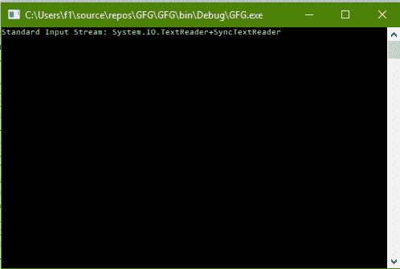

# C# |如何通过控制台

获取标准输入流

> 原文:[https://www . geesforgeks . org/c-sharp-如何通过控制台获取标准输入流/](https://www.geeksforgeeks.org/c-sharp-how-to-get-the-standard-input-stream-through-console/)

给定一个普通的控制台，任务是在 C# 中通过这个控制台获取标准输入流。

**方法:**这可以使用 C# 中系统包的**控制台**类中的 **In** 属性来完成。

**程序:**获取标准输入流

```cs
// C# program to illustrate the
// Console.In Property
using System;
using System.Collections.Generic;
using System.Linq;
using System.Text;
using System.Threading.Tasks;

namespace GFG {

class Program {

    static void Main(string[] args)
    {

        // Get the Standard Input Stream
        Console.WriteLine("Standard Input Stream: {0}",
                                          Console.In);
    } 
}
}
```

**输出:**



**注:****文本阅读器**代表可以阅读一系列连续字符的阅读器。