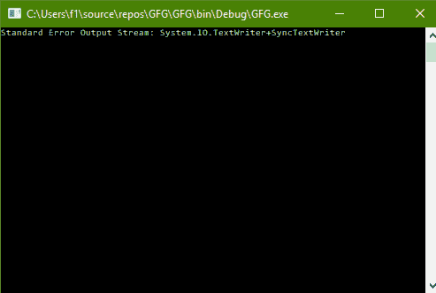

# C# |如何通过控制台

获取标准输出流

> 原文:[https://www . geesforgeks . org/c-sharp-如何通过控制台获取标准输出流/](https://www.geeksforgeeks.org/c-sharp-how-to-get-the-standard-output-stream-through-console/)

给定一个普通的控制台，任务是在 C# 中通过这个控制台获取标准输出流。

**方法:**这可以使用 C# 中系统包的**控制台**类中的 **Out** 属性来完成。

**程序:**获取标准输出流

```cs
// C# program to illustrate the
// Console.Out Property
using System;
using System.Collections.Generic;
using System.Linq;
using System.Text;
using System.Threading.Tasks;

namespace GFG {

class Program {

    static void Main(string[] args)
    {

        // Get the Standard Output Stream
        Console.WriteLine("Standard Output Stream: {0}",
                                          Console.Out);
    }
}
}
```

**输出:**

[](https://media.geeksforgeeks.org/wp-content/uploads/error-output-stream.png)

**注意:****文本编写器**代表标准输出流。